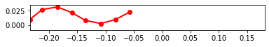

```python
%matplotlib inline
```


```python
#Set script to run optimization
run_fit = True
```

# Importing Libraries

Importing libraries for script


```python
import pynamics
from pynamics.frame import Frame
from pynamics.variable_types import Differentiable,Constant
from pynamics.system import System
from pynamics.body import Body
from pynamics.dyadic import Dyadic
from pynamics.output import Output,PointsOutput
from pynamics.output_points_3d import PointsOutput3D
from pynamics.constraint import AccelerationConstraint,KinematicConstraint
from pynamics.particle import Particle
import pynamics.integration
import numpy
import matplotlib.pyplot as plt
plt.ion()
from math import pi,sin
import sympy
from sympy import sqrt
import math
import logging
import scipy.optimize
import pynamics.integration
import pynamics.system
import numpy.random
import scipy.interpolate
import scipy.optimize
import cma
import pandas as pd
import idealab_tools.units
from matplotlib import animation, rc
from IPython.display import HTML


system = System()
pynamics.set_system(__name__,system)
```

# Constants of System

In this block of code we are defining all the constants of our system that we will use for our simulation


```python
#seg = segment, t = tail
seg_l = 0.02759581
t_l = 0.02
seg_h = 0.01
len_factor = 5.5

#Set segment lengths
l = Constant(seg_l,'l',system) #Segment Length, Formula:seg_len
lT = Constant(seg_l,'tail',system) #Tail Length, Formula:tail_len
lP = Constant(seg_l*len_factor,'lP',system) #Constrained length, Forumla:seg_len*constrainted_length_factor

#Set masses, 666.7 is density of laminate structure
m = Constant(666.7*seg_l*seg_h*0.001,'m',system) #Segment Mass, Formula:666.7*seg_len*seg_h*seg_th
mT = Constant(666.7*t_l*seg_h*0.001,'mT',system) #Tail Mass, Formula:666.7*tail_len*seg_h*seg_th

b = Constant(2.148e-6,'b',system)
k = Constant(1.599e-4,'k',system)
rho = Constant(998,'rho',system)
area_p = Constant(seg_l*seg_h,'area_p',system) #area of flat plates
area_f = Constant(seg_h*0.001,'area_f',system)

freq = Constant(1,'freq',system) #frequency of head oscilation
amp = Constant(40*pi/180,'amp',system) #maximum pitch angle of servo 

Ixx = Constant(1/12*(666.7*seg_l*seg_h*0.001)*(seg_h**2 + 0.001**2),'Ixx',system) #Formula: 1/12*666.7*seg_len*seg_h*seg_th*(seg_h**2 + seg_th**2
Iyy = Constant(1/12*(666.7*seg_l*seg_h*0.001)*(seg_h**2 + seg_l**2),'Iyy',system) #Formula: 1/12*(666.7*seg_len*seg_h*seg_th)*(seg_h**2 + seg_len**2)
Izz = Constant(1/12*(666.7*seg_l*seg_h*0.001)*(seg_l**2 + 0.001**2),'Izz',system) #Formula: 1/12*(666.7*seg_len*seg_h*seg_th)*(seg_len**2 + seg_th**2)
Ixx_T = Constant(1/12*(666.7*t_l*seg_h*0.001)*(seg_h*2 + 0.001**2),'Ixx_T',system) #Formula: 1/12*(666.7*tail_len*seg_h*seg_th)*(seg_h*2 + seg_th**2) 
Iyy_T = Constant(1/12*(666.7*t_l*seg_h*0.001)*(seg_h**2 + t_l**2),'Iyy_T',system) #Formula: 1/12*(666.7*tail_len*seg_h*seg_th)*(seg_h**2 + tail_len**2)
Izz_T = Constant(1/12*(666.7*t_l*seg_h*0.001)*(t_l**2 + 0.001**2),'Izz_T',system) #Formula: 1/12*(666.7*tail_len*seg_h*seg_th)*(tail_len**2 + seg_th**2)

```


```python
#Set integration tolerance
tol = 1e-12
```


```python
#Set simulation run time
fps = 30
tinitial = 0
tfinal = 2
tstep = 1/fps
t = numpy.r_[tinitial:tfinal:tstep]
```


```python
#Define derivatives of frames
qA,qA_d,qA_dd = Differentiable('qA',system)
qB,qB_d,qB_dd = Differentiable('qB',system)
qC,qC_d,qC_dd = Differentiable('qC',system)
qD,qD_d,qD_dd = Differentiable('qD',system)
qE,qE_d,qE_dd = Differentiable('qE',system)
qF,qF_d,qF_dd = Differentiable('qF',system)
qT,qT_d,qT_dd = Differentiable('qT',system)

x,x_d,x_dd = Differentiable('x',system)
y,y_d,y_dd = Differentiable('y',system)
```


```python
#set initial conditions
initialvalues = {}
initialvalues[qA]=40*pi/180
initialvalues[qA_d]=0*pi/180
initialvalues[qB]=20*pi/180
initialvalues[qB_d]=0*pi/180
initialvalues[qC]=10*pi/180
initialvalues[qC_d]=0*pi/180
initialvalues[qD]=0*pi/180
initialvalues[qD_d]=0*pi/180
initialvalues[qE]=-10*pi/180
initialvalues[qE_d]=0*pi/180
initialvalues[qF]=-40*pi/180
initialvalues[qF_d]=0*pi/180
initialvalues[qT]=0*pi/180
initialvalues[qT_d]=0*pi/180

initialvalues[x]=0*pi/180
initialvalues[x_d]=0*pi/180
initialvalues[y]=0*pi/180
initialvalues[y_d]=0*pi/180

statevariables = system.get_state_variables()
ini0 = [initialvalues[item] for item in statevariables]
```


```python
#Frames
N = Frame('N',system)
A = Frame('A',system)
B = Frame('B',system)
C = Frame('C',system)
D = Frame('D',system)
E = Frame('E',system)
F = Frame('F',system)
T = Frame('T',system)

system.set_newtonian(N)

A.rotate_fixed_axis(N,[0,0,1],qA,system)
B.rotate_fixed_axis(N,[0,0,1],qB,system)
C.rotate_fixed_axis(N,[0,0,1],qC,system)
D.rotate_fixed_axis(N,[0,0,1],qD,system)
E.rotate_fixed_axis(N,[0,0,1],qE,system)
F.rotate_fixed_axis(N,[0,0,1],qF,system)
T.rotate_fixed_axis(N,[0,0,1],qT,system)
```

# Defining Vectors

In this section of code we are defining all the position and center of mass vecotors. Additionally we are calculating angular velocity of each frame and the respective linear velocities at the center of mass. We also build each body of the system in this section.


```python
#Vectors

pNA=x*N.x + y*N.y + 0*N.z
pP = lP*N.x + pNA
    
pAB= pNA + l*A.x
pBC = pAB + l*B.x
pCD = pBC + l*C.x
pDE = pCD + l*D.x
pEF = pDE + l*E.x
pFT = pEF + l*F.x
pTtip = pFT + lT*T.x

#Center of Mass
pAcm=pNA+l/2*A.x
pBcm=pAB+l/2*B.x
pCcm=pBC+l/2*C.x
pDcm=pCD+l/2*D.x
pEcm=pDE+l/2*E.x
pFcm=pEF+l/2*F.x
pTcm=pFT+lT/2*T.x

#Angular Velocity
wNA = N.get_w_to(A)
wAB = A.get_w_to(B) 
wBC = B.get_w_to(C)
wCD = C.get_w_to(D) 
wDE = D.get_w_to(E)
wEF = E.get_w_to(F)
wFT = F.get_w_to(T)

#Velocities 
vA=pAcm.time_derivative()
vB=pBcm.time_derivative()
vC=pCcm.time_derivative()
vD=pDcm.time_derivative()
vE=pEcm.time_derivative()
vF=pFcm.time_derivative()
vTtip=pTtip.time_derivative()

#Interia and Bodys
IA = Dyadic.build(A,Ixx,Iyy,Izz)
IB = Dyadic.build(B,Ixx,Iyy,Izz)
IC = Dyadic.build(C,Ixx,Iyy,Izz)
ID = Dyadic.build(D,Ixx,Iyy,Izz)
IE = Dyadic.build(E,Ixx,Iyy,Izz)
IF = Dyadic.build(F,Ixx,Iyy,Izz)
IT = Dyadic.build(T,Ixx_T,Iyy_T,Izz_T)

BodyA = Body('BodyA',A,pAcm,m,IA,system)
BodyB = Body('BodyB',B,pBcm,m,IB,system)
BodyC = Body('BodyC',C,pCcm,m,IC,system)
BodyD = Body('BodyD',D,pDcm,m,ID,system)
BodyE = Body('BodyE',E,pEcm,m,IE,system)
BodyF = Body('BodyF',F,pFcm,m,IF,system)
BodyT = Body('BodyT',T,pTcm,mT,IT,system)
```

# Adding Forces

In this section of code we are adding the aerodynamic, spring, and damping forces in the system. The damping and spring values will be calculated experimentally.


```python
#Forces
#system.addforce(-torque*sympy.sin(freq*2*pi*system.t)*A.z,wNA) #setting motor parameter

#Aerodynamic Forces orthogonal to flat plates
f_aero_Ay = rho * vA.length()*(vA.dot(A.y)) * area_p * A.y
f_aero_By = rho * vB.length()*(vB.dot(B.y)) * area_p * B.y
f_aero_Cy = rho * vC.length()*(vC.dot(C.y)) * area_p * C.y
f_aero_Dy = rho * vD.length()*(vD.dot(D.y)) * area_p * D.y
f_aero_Ey = rho * vE.length()*(vE.dot(E.y)) * area_p * E.y
f_aero_Fy = rho * vF.length()*(vF.dot(F.y)) * area_p * F.y
f_aero_Ty = rho * vTtip.length()*(vTtip.dot(T.y)) * area_p * T.y

system.addforce(-f_aero_Ay,vA)
system.addforce(-f_aero_By,vB)
system.addforce(-f_aero_Cy,vC)
system.addforce(-f_aero_Dy,vD)
system.addforce(-f_aero_Ey,vE)
system.addforce(-f_aero_Fy,vF)
system.addforce(-f_aero_Ty,vTtip)

#Aerodynamic Forces against front of device
f_aero_Ax = rho * vA.length()*(vA.dot(A.x)) * area_f * A.x
system.addforce(-f_aero_Ax,vA)

#Damping Forces
system.addforce(-b*wAB,wAB)
system.addforce(-b*wBC,wBC)
system.addforce(-b*wCD,wCD)
system.addforce(-b*wDE,wDE)
system.addforce(-b*wEF,wEF)
system.addforce(-b*wFT,wFT)

#Spring Force (Torsion)
system.add_spring_force1(k,(qB-qA)*N.z,wAB)
system.add_spring_force1(k,(qC-qB)*N.z,wBC)
system.add_spring_force1(k,(qD-qC)*N.z,wCD) 
system.add_spring_force1(k,(qE-qD)*N.z,wDE)
system.add_spring_force1(k,(qF-qE)*N.z,wEF)
system.add_spring_force1(k,(qT-qF)*N.z,wFT)
```


    (<pynamics.force.Force at 0x7fd0ee261d10>,
     <pynamics.spring.Spring at 0x7fd0ee261d50>)


# Initial Condition

Solving for initial condition constraints and using scipy to solve for initial states and setting initial states to system initial states.


```python
#Constraints for initial condition

eq = []

eq.append(pFT-pP)
    
eq_scalar = []
eq_scalar.append(eq[0].dot(N.x))
eq_scalar.append(eq[0].dot(N.y))
```


```python
#Solve for Intial Conditions

qi = [qA,x,y]

qd = [qB,qC,qD,qE,qF,qT]

eq_scalar_c = [item.subs(system.constant_values) for item in eq_scalar]
defined = dict([(item,initialvalues[item]) for item in qi])
eq_scalar_c = [item.subs(defined) for item in eq_scalar_c]

error = (numpy.array(eq_scalar_c)**2).sum()

f = sympy.lambdify(qd,error)

def function(args):
    return f(*args)

guess = [initialvalues[item] for item in qd]

result = scipy.optimize.minimize(function,guess)
if result.fun>1e-3:
    raise(Exception("out of tolerance"))
    
ini = []
for item in system.get_state_variables():
    if item in qd:
        ini.append(result.x[qd.index(item)])
    else:
        ini.append(initialvalues[item])
```

# Setting Dynamic Constraints

Solving for dynamic constraints of system to run simulation.


```python
#Adding Dynamic Constraints

#Position of motor limits
pos = amp*sympy.cos(freq*2*pi*system.t)

eq = []

eq.append(pFT-pP)
eq.append(pos*N.z-qA*A.z)

eq_d = []
eq_d = [item.time_derivative() for item in eq]

eq_dd = []
eq_dd = [item.time_derivative() for item in eq_d]

eq_dd_scalar = []
eq_dd_scalar.append(eq_dd[0].dot(N.x))
eq_dd_scalar.append(eq_dd[0].dot(N.y))
eq_dd_scalar.append(eq_dd[1].dot(N.z))

system.add_constraint(AccelerationConstraint(eq_dd_scalar))
```

# Solving for Simulation

Code to run simulation and plot motion, states, and total energy in system.


```python
#Solve model and plot angles

#Constraints and Plots

f,ma = system.getdynamics();

tol = 1e-12
points = [pNA,pAB,pBC,pCD,pDE,pEF,pFT,pTtip]

def run_sim(args):
    new_lf = args[0] #Set to variables that optimizing
    
    #updating constant values affected by changing optimized values
    new_lP = new_lf*0.02759581
    
    #Populate constants with new values, in case for optimizing length and height, all constants get updated
    constants = system.constant_values.copy()
    constants[lP] = new_lP
    
    states=pynamics.integration.integrate(func1,ini,t,rtol=tol,atol=tol,hmin=tol, args=({'constants':constants},))
    return states

def measured_perf(args):
    print(args)
    try:
        states = run_sim(args)
        linear_disp = abs(states[-1,7])/seg_l #linear displacement relative to segment length, default seg_len = .02
        perf = (1/linear_disp)**2 #desired result is largest propulsion relative to size of device
        return perf
    except scipy.linalg.LinAlgError:
        return 1000


pynamics.system.logger.setLevel(logging.ERROR)

if run_fit:

    func1 = system.state_space_post_invert(f,ma)
    
    guess = [5.5] #Change depending on what factor you are optimizing 

    pynamics.system.logger.setLevel(logging.ERROR)
    
    sol = scipy.optimize.minimize(measured_perf,guess,bounds=[(4.5,5.75)]) #Change bounds depending on optimization parameter
    print(sol.fun)
    result = sol.x
```

    2022-05-02 02:44:15,209 - pynamics.system - INFO - getting dynamic equations
    2022-05-02 02:44:49,437 - pynamics.integration - INFO - beginning integration
    

    [5.5]
    

    2022-05-02 02:47:35,096 - pynamics.integration - INFO - finished integration
    2022-05-02 02:47:35,106 - pynamics.integration - INFO - beginning integration
    

    [5.50000001]
    

    2022-05-02 02:50:19,550 - pynamics.integration - INFO - finished integration
    

    0.01395791625236906
    


```python
#Constraint Forces
if run_fit:
    states2 = run_sim(result)
    points_output = PointsOutput(points,system)
    y2 = points_output.calc(states2,t)

    fig = plt.figure()
    ax1 = plt.subplot(2,1,2)
    ax1.plot(t,states2[:,:7])
    ax1.legend(['qA','qB','qC','qD','qE','qF','qT'])
    ax1.set_title('State Positions')
    ax1.set_xlabel('Time (s)')
    ax1.set_ylabel('Position (mm)')

    ax2 = plt.subplot(2,1,1)
    ax2.plot(y2[:,0,0],y2[:,0,1])
    ax2.axis('equal')
    ax2.set_title('Position of Head')
    ax2.set_xlabel('Position X (m)')
    ax2.set_ylabel('Position Y (m)')

    fig.tight_layout()

    print(result)
    
    
else:
    
    func1,lambda1 = system.state_space_post_invert(f,ma,return_lambda = True)
    states=pynamics.integration.integrate(func1,ini,t,rtol=tol,atol=tol,hmin=tol, args=({'constants':system.constant_values},))

    points_output = PointsOutput(points,system) 
    y = points_output.calc(states,t)

    fig = plt.figure(figsize=(8, 6), dpi=80)

    ax1 = plt.subplot(2,1,1)
    ax1.plot(y[:,7,0],y[:,7,1])
    ax1.axis('equal')
    ax1.set_title('Position of Tail Tip')
    ax1.set_xlabel('Position X (m)')
    ax1.set_ylabel('Position Y (m)')

    ax2 = plt.subplot(2,1,2)
    ax2.plot(y[:,0,0],y[:,0,1])
    ax2.axis('equal')
    ax2.set_title('Position of Head')
    ax2.set_xlabel('Position X (m)')
    ax2.set_ylabel('Position Y (m)')
    
    
    fig.tight_layout()
    
    lambda2 = numpy.array([lambda1(item1,item2,system.constant_values) for item1,item2 in zip(t,states)])
    plt.figure()
    plt.plot(t, lambda2)
    
    points_output = PointsOutput(points,system)
    y = points_output.calc(states,t)
    points_output.plot_time(20)
```

    2022-05-02 02:50:19,655 - pynamics.integration - INFO - beginning integration
    2022-05-02 02:52:14,735 - pynamics.integration - INFO - finished integration
    2022-05-02 02:52:14,787 - pynamics.output - INFO - calculating outputs
    2022-05-02 02:52:14,796 - pynamics.output - INFO - done calculating outputs
    

    [5.5]
    


```python
points_output.animate(fps = fps,movie_name = 'dynamics_free_swimming_opt.mp4',lw=2,marker='o',color=(1,0,0,1),linestyle='-')
    
HTML(points_output.anim.to_html5_video())
```


<video width="432" height="288" controls autoplay loop>
  <source type="video/mp4" src="data:video/mp4;base64,AAAAHGZ0eXBNNFYgAAACAGlzb21pc28yYXZjMQAAAAhmcmVlAABQuG1kYXQAAAKuBgX//6rcRem9
5tlIt5Ys2CDZI+7veDI2NCAtIGNvcmUgMTUyIHIyODU0IGU5YTU5MDMgLSBILjI2NC9NUEVHLTQg
QVZDIGNvZGVjIC0gQ29weWxlZnQgMjAwMy0yMDE3IC0gaHR0cDovL3d3dy52aWRlb2xhbi5vcmcv
eDI2NC5odG1sIC0gb3B0aW9uczogY2FiYWM9MSByZWY9MyBkZWJsb2NrPTE6MDowIGFuYWx5c2U9
MHgzOjB4MTEzIG1lPWhleCBzdWJtZT03IHBzeT0xIHBzeV9yZD0xLjAwOjAuMDAgbWl4ZWRfcmVm
PTEgbWVfcmFuZ2U9MTYgY2hyb21hX21lPTEgdHJlbGxpcz0xIDh4OGRjdD0xIGNxbT0wIGRlYWR6
b25lPTIxLDExIGZhc3RfcHNraXA9MSBjaHJvbWFfcXBfb2Zmc2V0PS0yIHRocmVhZHM9MyBsb29r
YWhlYWRfdGhyZWFkcz0xIHNsaWNlZF90aHJlYWRzPTAgbnI9MCBkZWNpbWF0ZT0xIGludGVybGFj
ZWQ9MCBibHVyYXlfY29tcGF0PTAgY29uc3RyYWluZWRfaW50cmE9MCBiZnJhbWVzPTMgYl9weXJh
bWlkPTIgYl9hZGFwdD0xIGJfYmlhcz0wIGRpcmVjdD0xIHdlaWdodGI9MSBvcGVuX2dvcD0wIHdl
aWdodHA9MiBrZXlpbnQ9MjUwIGtleWludF9taW49MjUgc2NlbmVjdXQ9NDAgaW50cmFfcmVmcmVz
aD0wIHJjX2xvb2thaGVhZD00MCByYz1jcmYgbWJ0cmVlPTEgY3JmPTIzLjAgcWNvbXA9MC42MCBx
cG1pbj0wIHFwbWF4PTY5IHFwc3RlcD00IGlwX3JhdGlvPTEuNDAgYXE9MToxLjAwAIAAAAm7ZYiE
ADP//vbsvgU1/Z/QlxEsxdpKcD4qpICAdzTAAAADAAB4HShe6DhKq9DAABtwAG/LI3114zf4PEZ+
YCjbjPoKa+qM8eMOI1FwD1Mb5HAF8UdXuopUxhueHQ1u3pEKm6LIOYpNHamWaPrORqm1c2vpDO12
S+TwRcKxZ4rGEwFVxEiW6RcG7nB91HnqvDCFoYDsEQq7wOgMN4FPgvFx06If2+2drUvA0Uvvbs8S
FtV9mVj1rXWOvIVt4w498BOk2YiCa9RK0K0IxYTkP2j+tzzgrXZjJbLV7tydEHDqw2Vx4oN+FmJd
jO3IE86BpLZAmEOhce9J98U1x6Sr1S8aQYXs9SyHrFV3dHbdAq/KB+wiOu/+GminOtTL1G8aijHO
tdCI6UWPsBguN3g4a0B2Ct/aqR/DecPCaq2Q9FAjsLBgJ1qm//+4ldfqXDFD6EvgI9eqjOwpDqLo
vwnei4ZGoA9m9Qx3vBegv9KG+jNieooMReWu6vJbCSzvK1QMtGYvfOBvrs7adzpvLgPQDmEs1p8x
gOomv+EACxqJF+wgHAILtoIG0MZ0f9lOwcM/JvwmnHQuhALAvyVHBJmsDzVxa88DM5ko21hEvFqg
IJOWj8tK53duMkRy2azmtwRhmUSbD6b4bzdQTw9+5AUL5o8jMo8CyrurnYzD0BuyDOXx9vMyneCL
n/UhzhF1QeXqoL/RwLQ12QgNi12vzXgOcB32VU230ULgVd398Mv2iHYrCZftzscP+btWfKS5/NVd
4VGRsgU+umzFy8uzA3WxSI4+2X7G+XAjCxsYXMC1HxFSzlXaFQLO87ND2+LfzynWjk+qW1NA/x2E
kdxxH2oPGUFYd3ET10N/ct8ezdXL7ukz3YVjV4u6ztioMb1bg2Z9X2yiQcPZ4P8CB/HaHoM3lAzS
kiP7QSoVEwkURlbDRrnyck5SDSkyXdrfVsdOm95TIEYwdCtAIV2TS1RcnvrUJMfoGGUTGs8EqC7r
1DRtYfQplEb8oammWnZR4T+vZOgvS54EIVG0P663n7agmB+e1KnV+UvSBx/xKXm6vz9xb+iLetRW
QiIewwWrcdULemGOgdt1bwOFsliGQ+LmNyPzENVFJVSCqdk9c4tssGWuX/5tokLSpTSOzh7lLMrW
B1qxbz1YZ7HmzMsoM1YFAwjt7FFY8DkC/0M+1b6o+0MKrOUcEmOI53P+G292VTw6fpL4YWWQ4E9U
1uc2PqA1CSX7oMu8F1N9lSb3jY+TFJt7C7+wKYS3cDMmiN2smfPRbsJyLQT5QDKioOkIH84sZllb
vF5KALjDdb3XjvvgQwcEwLS5i+LHNaPAiJF1xSZQ4gPQPS6LoSzLqMeuVLNKOtAQ2MRXhnD4kQc6
O+M4lqiC0lV/5t/Me6tMiWO62LsFTTX+40KQJBLboMXLHOfLBKce97RFamzwiJ/Q2DrX4DmA9pFY
JcSfxN0sfsmYh1bpI4qvStVyuHLkY8lN65dN7D16NvuVnj85m4SPrdq9u+YVAqmeMvDca+PjTGvV
RAbL5yLFqneQPdzsknuohYoDN/jkRxwP4zaNwzqmiI6CD49S59A0wX3ZbhYvbnGIBSvhv9UrXrYK
KqxCXe8F4jtz6HIc62IiXyq4uYsj1jU3Y5Ay5eerqsN/OnR/iWsimTbi2rkWNDvv6hYlE50d6to2
IHZworPh5G7Bp8dC9dafRIvmyT0+z4eEq6rT9DK8HdBjIzND7QXovMNVamObOHd146C4L9wvvwKf
ytX8WsgnHHXgpdz4GVrKwveeO5ZHi+5ALeasAmh4RDto4VrpFEd5GGtybZosFMiAHiZmfm9NhmmR
ixoiTdb13mWgEMTyCEOtJzoHE+0UITKonGRj7c/SRYA6ZKew8RUfGMllh8Eh3nzTEH02CszL0YLG
bljjJXLya4ViO3lJ3xdFQos/JMTnZN6yDLVM6TSTinU2D7gsA9K3/Qb4Vc2APZ1URVDQm5fcD4NV
JIYyAZW2V0ZscqFNJYPud13NXHjX35UVZArxwvZ9Mg6+clvQOHZrcI2aVg8DhL56apcXGWG6HOcO
v9na5eYw4KQ6e9VERapXbrdQ0feoKFW5I6UDegXgLfT31ZBxS7YRsowLqBogTk5GEyrdB2QChAQu
jjF098C/JTudcTMnS9mMEvhCk4BQ6Gy0hbT3D/UjOz/a+3cqsVkuShzbdslm0bn7PQgYVZwU8Zr2
kqvXtHgXi+kJ9unjIPyZVxahMzh1+TzuVtjfBfjnQlvTbwlPUnaUkCzKBG5OFvm+QjC80hKt56Xw
KVArQnnhQpI8PdACaQjBQ52XW7ZV8QJNfBylCU9khU4a59khN2BND4nTjrdiEKpBSHgJoP0340Bc
maKjiCnlnFpJ4SHQs/arN1Of4pszSIdULZwlCUWRW1+7TXBqeQnBXWK13IBD9FUk3NB5hwxpbWrm
Q3cuRvT5t9WSXAzgrqnTL5IKUx3jyilkRpnfLGFt2811rFw+F04CRaBEDJ9tvaaMwtkoiJ729iac
L1ZO9/2nz19rdqrPWkh7l8Mc34Ni2X+4i+f2uvdvVyWlmPupFjSbuv/+iDSIb0JcmC6QEWG1qWNG
S42dlJ4EZJBX8ToHs/bJPFk6bdHOJtdwMUO35HG6mjn/qhlKV+ziyg7M+/+ae35+1jrvnaurX5eQ
5uu96uzcGd8jQ7vn69ot+FPb1olBZ2UlqYQj/YmBdOSr1Owf/2d4RN+N8JwuD34dxl8XTbc6cxHw
z2hnGFcEvLM96GiKl0zk6mDmZKF63iXIrPsx8rbDcWLdfrNIk+ZXnbl3VUMGbLnfgSr+313TIvg1
QOAISzgrsReHsWx2tC1rcXoB3IcvFMNIUsyQRyU3Uwjd62lk1kGJ76uKKKD1kZwe/Nn2HBLpIZBz
JXrRrBMHCubjJcnvUnpS2HjdRjVv9d/ziL/lHmNyStmWlkvm+0P8wwKU2kSrinhJeAf3IMb6WAAq
0tAIGZTzi1Ov/TqzC1H++IHok9SNAxJuThbKsho7sPjdD8KFVIUMlTRA8ahpzg8Tb4zQOkDwrzvv
rwzjaELaFdFzkD6/ylF1H42DybgvlkvzSmMaylDkUiFw7FV7K2zyctxayEkhYCVUg+uFaP/oRiVI
JJjauZEQKqn0kHKm9GYTOj4btMm44aozSwZTTxA8EKv4jEZbDlmfgi4EQ5ipIC9fZ7bPFvMtsFxL
x4z4cqUGGhXRmBalqTSuhR5PBm0eQGbiqEL9f4XjBNzWOJ15ZxgPsRFXUh6L7SiQ8Z0a8vWPXptW
H4HK9Uu269flp6nk4LoiHXg59KESxFHhcbATIAKwAAADAAAQEQAAAVFBmiFsQz/+nhAAJqmg0EHj
kDCXTru3ppPZ2Makv7RPVfEsYYzPWaJ0X2qrQ9F/fHvx5jJiGNcv6CuFLxIaOWIlq9U5j9PC3/Pg
fQ9aswUKc6TykNNWSTRuO9/9C8GD4AhP94WyoZXyHgvbICftt7s2cxFNUNxa4ji/1bAhiOWHLeFd
WJiU1abTZxCo1O43SasblKAwgok460oi6PA63B5axlbHGHf4a1q1Dv3Ku116zzk4kaga6rsHQMND
fW2BeTOyS4RdNo/6oRefW2lg9rQZOWXASZNeRDJEWI0A/pDdw0+0822wR9gcfSK7jyfE0UQcb9u0
XoO3XKbpiROq3Fvsjgf93/COzLh34T9oMsa2LgVfu3M826U32Ywq6DX0yoQb8TNfFMaGGV3bMVy5
rEmkgdEHzHZje8iF8Kk0V6AKOZaJZ17h7kOs6qsbu3A4JYa0AAABr0GaRDwhkymEL//+jLAAJgkQ
ag8ZNyq6v6whVK9VVpktvlD7YgvbrPYkfUYQXlmo5j4DJCGZ6Qavgm/lAhYnAfJnOhujJWuzc+YV
Tz9MjTC4w39HNstRziG9slRipAmruK+raZU+WWWzIDYylb5UWrxroW2WvvQiHlkbz0niQr5bj1QV
mMCe1f2kvJ9yG2whiP2pDmDcat/3N6tnliFW6PU1ntRs8Z5aNHcVKWM0k66UAt1YUksmrDFco88g
U4Y3Yirp/mqRvK2cP1UhzCsCDfrQwe/UOuswgaxjZZV4uur7triK/G7DLdzFG8HPRET9euTtMnvD
qFNRclfpgDL5UGaAV5/V5ca1mGfxwfVH2pqyxlEBYMCChRA6SQVeNK6KOFsy8kvchxr+V8flfrfi
NLkbQA5IEoeifCKsdC/orxHJzaU1goh3ocBn7QeC45LTktYoiElZ48SxubHOVG/Qm+AAZiOAc0e0
2hJ12k2IhHBx1ItUgmjAF094/XMTM/1Vb0T3qjeteajEVNyoxiTWe1n7l+Q06NC1CeirIe5yNNnZ
bjFX5JIDPuOI+0uSBbPhAAAA1kGeYmpTwr8AB5ePa9gA43dYoTle3zCrgJI/WExX7afdiSajwWQW
iUvhf/5qeEu6RITCMZ5TqrCe4DTQykcfdQH/Iz2+qVf95suoZwe4ckGXQO8T0//kByD/dtNkyJXu
mpJZSqztDrMe6Iy9W9gA5ySp3g4j+3Df+Tk0Fs9tpAaTOYB84JW3SIM5HSZzsAXjfAflpmiut8tT
x/5qPGl2bpoLYWXpW+8k8qCOk8dOpgwvw/dp9zBlAIcgj8D/jPhV6EyFFv6vYNv9iMWCGdLn5pMG
Ci7Qd0AAAACHAZ6DakJ/AAn1bg2Hg0h3rYWA1h6TVbbx1eCPYqEAGb5b9O3K6TrEAdMeHrgB7FmW
4I3g/UOZwdxSpetyiqd6mMhJ2mZuId2ecfqJqdCtXuuLGzk//ia2JbtPMTUDZOomsuhvLHvdifai
XIeUgHlfQz1ARvkgs9zXETZbw5faiT7qspXLIBHxAAABR0GahUmoQWiZTAhf//6MsAAlAWsRgA4p
nDVZfr4fBzeidHjz2ev1FchZjzH+blZOsNuDtwSda9SJWgy20tV2sBHsswTNIvZkYApzlm/i5Q0M
0Ox5z3jtjXiTHbd/RXpnmTezqn2tXgC8PnaTcyreRYWUOnHoxub5Ma8eleu0rZc3tsSpNfDk0g+v
boPgHRmPJMeQoQ6TdZ1ffRR/odAfnUCd6Hke1wQH5DxrKNPvIU24/0F4TNN738W8KWsMdRPAVErQ
x13OP/czXcCJPJjFScAjvtMawEHJyGwYQonDtfrr/VEMOV2JJ52zXd/qfMfjIky2UBgEv1Ru3JMv
17VAM7qxdzGhLpPCCW2pzsG5lrAGbJYHaowdLGqcGgzMkhx0eO3nMQ/1fEKd7xjm3jwN1Z9KN3xH
V0ud+M7KxSmMMgfVjubcsLC2gQAAAURBmqZJ4QpSZTAhn/6eEAAkqkj/+ABOydHLtp0/8g1G1nT/
S0IUeREkTRCeYuXj1giH2sM5OLzzdkR+Ml8hkHyOFyySIrSwXJJjGr9ubJj1xMJ8mCK4baLC34ml
UFxUzJvuQh17RXRXbV/JH0zpJL+Gc6OaQfh3Abf6IUTO2UNMH3lTvBaTAcCB94oIgl4zKLGIFURW
OtBoO1onlz9t27e6M692dvXAFbtcU70gXWYXdynM5+ACDT4X89QNVGTvZQnPb+2mBRRSzTGX1awp
aJeLeVhVHLs0MgN2jQOvKqOTJWeHXRr8UghQcNQBh0A968TUd3p91x7x+M7qtLBckR29GVN+gFPc
jH2qQpDA7mqp5Dpm97dt+mj5JCgSiJw47TtFGuu27TrdEzhyHDZ/gU8KViFnC1KqB4+aVfpXachl
i26G83sAAAFsQZrHSeEOiZTAhn/+nhAAJLRs1IABDrmzsogX9jP1gq8cReSb5uTvm30MfwqnjFcQ
TqQn++//SSEimC35Hw1kNWPNNPJsE9jI0ILE+qgu73P+7TUqESMGntSfR5LrwBiuu/TLP0KqR9e3
x5fEni2KuwhwD+fRqXDSgSzt3q63iLEj2nJXtf+t32HKdo0xINFwZwXoCH9j5xAD8otw7vBLUrjU
suqO8lQO0byWqs0sVsP3VrXRYhmpj15dw6JMW10dpZ321zTZUw/av12GI6fZQDWkQuN9FS43wS43
+CKSCmSS29vPqCKiHkszeEmcrdDxjFFMiTvcD+YEOu7/t66LXVeqlXKz7a7A9S70lmje3t4efBPV
Y6zra35ZbGR1o/mIvonQNRWDSxgjgflSEvbTHpeCHeerPZyuHQGx7rUcl/513aVqqnSKt2IExz3M
51jE8Ccd6PBPgJiZOb3T1RsyUUEAfYDKaOIV/7qekQAAAXdBmuhJ4Q8mUwIZ//6eEAAktFOdqQAc
z1zUVaTVHg5bAcplcUxHzeGerh2KpVBxqMor0nSPB8d3H8YSb5uJ0b/Nc3006q28EN5lgSxf4Ujr
bNjC2Q5E5zD3gvS68grUt+n+KMVOzQEShQkAhlj046WNMXd27eelyiaCWDS31Y1ieZSttEojS7eo
1LfDpLpEslJkLJ9oznBNJrJLihy11dGaVynOpPborw4AljohzmP5HxImwzw6NipTrZf6lJlXZLLB
VqvjTXADtv0VUqvZAjkEua5a5RtTTSq97DRoUpLTtTFf7UTm79CbLIvYi/Fkvvnq4T/HDDOjtolJ
i0cKzTZ1xG9rZvkmNlLYuSfDW8oXK18cPRv6k4oWEW4f/gyRQQuMTJT2UrzXWmuOEKrEYjBrBQUf
e9GHs/TNJLPUyZAWJRonFV5pXNdt2O9PtW3Fi9XFU10o3kpDaCUG1k3F2S8NB8pMlBjgzVMllyc5
S7FZ+mNeH/xuFxwAAAFTQZsJSeEPJlMCG//+p4QACW5EG20QATrWg+Ahit3HuRFCDqmdY5On615c
Zhe/cyvM1ryrZuzHRvBrJWfAAgTaISh3lIA3il7sBNKlYRSOhkDbz4hecTDykJRSxvU3C/6cOPDp
a3tbxyaYs9tPmtW4b35sNJZdZMhX6yLmNUNceLbCLQ3V4Ip8lWhFO2GeYfcaUeiLiggq9igSKXbT
tqEt6d097J9KMXqStyc3PKBCRS49mcHAPst0UWpQu+4XIh6hBalA7BqDdyKRL6nMEvfxbQz5503m
K6l6N3qlfpYVEMHC81vmSrno2q0ZnDjjVHdcwtoJIg3oGUmd2z4SJJX439NKcSl65vpqinRjQ5D6
RCmFEYJfDDU2lDeeOLAJYXoGMb/O+HehKQrzBY8OZAaz5+h9QAD8YhZdLJpyeog86YdidFzoACLC
BSIPY8IBisCRUzSAAAABM0GbLUnhDyZTAhn//p4QACSqRYWgxWXPSAE0zC3Z2yJzMZmv1T8xDb0O
d0m7HWFY+3BbmM8BOrLyyhaMuuN0Aj5pZUmNcHhBq8KOBk06iU1fWoWZGvzOTAKFgr5Xw3EWzSrd
LxjlWmF2Fvu92XmhB+JCMv1TuuTawyW8ge9J6gXHcvhiOyntnWW6Cpsd7BUGRblZimPf7RH3EgjA
k/ah79MYOXEEmk3nDs1Hvq5eMwgtxBcG792EUx+SdojbExNQsXdr21UULQ/NOXrBQ6HL1qJSSYof
o5L1cLzHdfUo1qdsnNGaDNodBas7Gce2T2G3m8ndTc5cXM9+6QOIM1+7Y1Rhm3E9pQnvhVGRU5hp
0CjZSirbJYOU9Lq5c11GT0XG/U0VJyvnlBVzCJH3fC/57+s+oEEAAAFKQZ9LRRE8K/8AB5laBb+7
Z82eAB+mc9uUicSqu3LPzuB1epvwP54OUg32qNIhP18UmAFFfB/EuM34Z1XZGOnzdcRZ7rIv4wSw
28wij87n+/Kj51AkBlX4KySEtrK8TOpeJoqiIJVodpIdM16MIw8vTSPW6ZsSbMIYz7wefzQSXj2C
f5kMvwHbuyMUScB+H1epVosldhhuOZRSNRH+wNwnMRzurO9ltZZCv+P+CstJzR1SGdtp3nvsAxpp
0JcveEIaCWTfB9lL7yPUCsNBcSqerDfSVjkE8UKPuEI++dQ/QBiWn7f/iqm+L91HfzwRACWTmTPk
VO+c8UEdo4htWx8+731XLJ835Ov1QTSKjQvOKxRA9v1jCLBDtPQ3AiZJiA2x9TMf364kBIg5uhUp
v7DLbpncfH5DIYcC+V2+mY0FIQYwRcmqyE8SFQqYAAAAnQGfanRCfwAJ8hbWQGTgAiDshcb9g2rx
fiDfktfR85K39TdewUzV/EzlVCImtQE9s7Ne4klZpyPHqiGWajODBer6y7NsgG+jcWw+tEFYZOoA
FKOc8gyIztE80x8Ml3pE1mrj9jF3cbLOhj7HNcHkrR3QCZ15BBDzyt2XJuSNH6JlJq+TlR9+WJJa
ivcVVddyj7PPl6ceVwU+HMA2SFgAAACPAZ9sakJ/AAn0sdosUc0UggAiBpR6+bAMvg4Bkeq4t5+7
iziytRn0D4hZBgufdYgHOvV8y6doBqqXLS8QwY7sfqnO9Y89V01CuCkd0e+kEO+RlJq7OtxWi2JP
+beJJCD0X6wfT6BCdCL9u8N15giSp99klW6ja78JWbex5nBpN9ehCuRy1Y7IjeiLM2bKbukAAAEH
QZtuSahBaJlMCGf//p4QACSqUtaXFHP8zAB/PUEV3hHXYLi+JWphOYW9XswQv4IV5efgVD2yCu1Y
ZypkABieWD4yvDAga/9oxHrwwFWF55op+MaK0jeeEo6zA8NUgyCCWpW4vm+azOhnWzK1Vbv+LtRW
gXdrTOB0vpjdwfzKzvX3VMJBSiFTw/nOq5yfYC74F3uuK093i+N8eSRdP+NA8e0gkuXdR7IkM/4N
ikqS1VOtA9HECtI7vkB/Eahh56lLlA2VT34QvqVEhKDyncNZcT1OnXTm/FNEA1OoAQ7CBtohAMM/
hCzDKqbedrZ2KsRiVBjQc5Za8lS6NmP1cCfAxycuvlZqZuEAAAEJQZuPSeEKUmUwIZ/+nhAAKyDz
WH9YQzGAG69cOuBevfCCMdxeqjUlq613aWzxRCZEtq0CoCavcxiLXpDL79quDNJ2G1Cl7/n5oCmk
fFE3Qo+FBocIp3smwuYkkNQXG+vfVzGTQrv0833n1PpiR3zhn3OGXC4gF7StVXUJEfiJ+zkmE0MN
XflPau1JWPUvM+ZLcuRSk5kBiLJqZhSB8EXnlh6faItEwOQ4xz5l9lcShnVrf9Yc6YWFg4/KRrRa
7H5CAHobL2YqS9O/KlkdaYxmGAOXNkXlFWovjyGkZMCDMElJ/vtsqzpawmyH9++2Qay+E/cUEhKx
i9Lct6oKnR++cMNiEpAmj3yFgQAAAZ5Bm7FJ4Q6JlMFNEwz//p4QACsY3HAC3j6GgqgTgGgzxOJT
pTumV1OR1Qgo8HET9a+fUspZxUfK32zLs8gKLOcQssTaqleVZRI31EZEwl9dI95JNctnweHcSd0t
gTEzKmujvJybIiq4Cf0W75hHX7EBMj75RDwglYOQDqg5AXWb5582xvSMhfxmZpVgUbam4M37HU7W
Hyx8vHoVqbevD55u8Mpj6TXGVxp3s0kwWMdFByFKhwEDaTFSQvnC/lyTqdNxIFhnNoUTWlvtCv6x
aJDXw5iIHs3SQDpsX401KO9YWp5rprRDM1LlY0nUehtGdnkbAY9dI0is69bzpHbp5L73Fg/2LO8Q
QnYd12MAQy5zBwKOd87clw8seDfynTHYbN/qmZ+xB1UdkYpbrWTzYu47O6ZNLi65nIALhZhthXAL
WxEd1p4FGhUSJZDeCMa0p3SIpnWatOqxMUt9Sq69Dox/4ElcCB9V+TMOBeoNzKNM/N657QSBpu9h
YGJrtsiFM4LKoX0F0AWl7tyx5NUhzbJ2P+/haZsgUujE68gWlsAAAACmAZ/QakJ/AAultxxk24bO
AB+kU1wQlMrekVoi57xTKafAtuVoim5ajhQCIa1P6LElUDBQH8TrOozgFuN9c9VMP7FQzS5Tf6iD
U4/TUfPPFLli7bhMgzVw7m7zlDPGrZwH+iBToRh+D+bvYmHtimFUsJ2cZ/QgnwOod3WFleqtiz/9
q70wqCyl8Tlv8pmwTkpFsj00xl4qJv0tEHwLj70rD8iaszBAwAAAAUhBm9NJ4Q8mUwU8L//+jLAA
K4nzdKc/sAF1Ecd9TqZpq0+c3/xvr3aj+Cvz1fUvoTaDOiqsb1j73sZ+uZZiiN8HjZHj/2xbErLF
NWkTByzw/tHdGEo+b+YzJYrLIj6dO/ZIvjVDZE2BZGMn446AOPmF+c3E0IJ0R7vfUd846PNt85dO
HnkCXMf8Rk0yjErB0MLPrxXLLGva3gEL6ZubYJwuiUC5QY5/2j17KJBL9/EVTgCKi2rKBMV8mg8/
b79bpv0ZhLQuoyvDI5ub7oONgcmA5InsjEHiVf5b7MxzSFi1J8DBsO9SKSjJyhuStTstUuK0H1vb
ToYJaKp2NJuaasa7DJgK/jQ9xKFN+yLsn7N8/S01QyAviYpaDKcWvaf6c5SdlyGWzteE0Do0EHm6
/rWyTThqUsqc3sIWb9eQasNXK2Vxx492eonBAAAAmQGf8mpCfwALoiaCmwKK83+GkTgR4ATS4jk8
vjI7AXGm0GWSnrs7aRmPpCTyODc4iZWE8CPpLe+ewiHM3to7gwVkzHtBnoSyF7LIIGD1+NzCrNY9
4MVQQcBWqvRVfLmo0q1fIM/UMcS17mZvaL+Q9GNjPBQaJ8DqjFVz0QdEKWEr9VuBw+XdmszIrgly
xD/Alir9ebQJ1tDCpgAAAR9Bm/RJ4Q8mUwIX//6MsAAs3x8AgDryBMHqFkp1VqK56eJNURlt7iRq
PUdpIfnL+BPWdKbxDddOrWhL1s6eb/XTr1LQwx21w5o0gtWeIwk2XYBvGRDJ9KpUrNR/92ASecN0
dbU3w6a7iHoziC//7n/4kls2YK6EApxDUgs31GV2TauvOzzZ+nKJz6J9GJmPkLBO79z8SRWq5fGP
m76loeSyyL8+gasxOjC4JqX50ppJUfOuemQMd5fQ2xT4eEbzyEl0c9uiTE+J59byU/V0UdK2cKY3
6kEdovMVwz15WfGvZA/fcX8EfuBPmpBS19TAloOWWiModZKpyrnzz3e9IPSLpWHomkzf8EYFQN31
nlprTWp8/gKZ6jCa3nH2yKMUWAAAARhBmhVJ4Q8mUwIX//6MsAAslQceaQ2kQAmpsVNfWx+DsC/X
ri0OmB/8kLGznZmspy3aErpxWWRgAitvh5U6TEbVBgBO3CGzlhpzOudfOTQiT1USxVLthZcG+LuB
mb/go8vkKOJlqWJUg7zSUivXRctaeQNdz7s2C2eQZDfaKr3ZRRaT+LTyH8x1a7RocOTlEDmuTN9u
Nud+P0ZgTeiVYAV4IL3DAtuMuzeSSoBQpLv/tm9Ak/ChlrmdnNy7A2PmpS6hekELsN49ruV2seY2
Pt5Ots5faYPHhX/jXlsF3f8gACy2a2TwaS4RYd/tnEsKfuVk/dRs6RUITXZ9yZ6lXPMOlNP+4ZHZ
yxWcO3K36JHYUGl1+IdxtkltAAABZkGaNknhDyZTAhn//p4QACw1j40AAaFnJJ3UGRUwtQoT1EH3
Wlefqm86gKs5K+uWFeIfITD0ztdXsbfMSZPKlLgVNni257QO/NZgjD/jooSmtCG2Y+rWTKJSEMlG
BSFDb6xbIhRqaqYF/+zJK7YYglAjcH4MR9l6B44NUatW914Jsq/kEoRWNGXOEypTNDj+A66X5ZBC
yMyhQ4ojNfQr+x9nmL3RxEpJn+R2S9hgr+aoSGF5bWmJB/671AahIXfWgwYKH+GK3do95r1PoW5O
qn7GGE3YWDSs5Bfrgi8M38VZSf5AOf0v6iuISNbPAIfu21lY5tBu1sJz7dxqQk3OyC5gL5hVm2Nj
nKZwYHTbnIBUCvw+pazP/GSAxQL/AE/NZ3D7uuZ3yE2OfEiV3UDaoZD8k924twNcL71wBNsefRgI
NZmS5qrnaleyQZtu+zmC/twBM2o1RUZxbZ5U0Lrp8hvV9sGgqPAAAAFVQZpXSeEPJlMCGf/+nhAA
LH6b1ABm5u0wlqxmogjloZb459g/Fb0kVrLPwxtrvWqL3oirj1pX9+1ZAi2HH6f68HcIMPD5C6O9
Tq7yH/ZH+85YftRW6pEJ63SMV5I0stFUzE2GjLL9fKpmy4kbr/FjgvXRnTIjI0EdV2W7J+D/zfQS
nIM60EaKZvx62KKZBzeCmwLSx/eVq+laBTe8WEXYBEgNJO/F4ckc447kEq1d+S4Zq4OgfJor3r0m
GDMMvSJrQBPiOJ28JOSn4zjSkTMy9f8BWRg3pKY3u3slsF+tzNQuipSfVDNIBuE3zx26Msuf8UvK
neJXID455kxcPjmTG0IlxJdKR9Fr8UWo8kCtVfwRzTI4st0P7v1cK75evAdk07CJdD6EKBAMDNRG
svucNN0YizJP0LJdFS5f2QmOT02t8msn3nHEJ9c2dut2qOzpS9t37uEAAAFTQZp4SeEPJlMCGf/+
nhAALECqyhAAoUGAEtWw7BwZgGFE9w4qTRE4rP48NR3P6lpP5l51ulwGaWssFPk4BOVT7JSDwgck
lrnI/0AcrzsZzyrNxgJh2g1Q8D/DiaJsMzl3GKdr+tI9e13Jftow3BQ18o6LfP6BJoL+3h0fVBho
SrPv24ywrBuVQdDsNmjF6Tk7wHZuT5iuBTpyx/I/ctt5yKRUXgstilstzSRtHl8QE0tZ4kdZW3K3
lXuf1pwAK3ZAOHCMqOTIvut4RRpdFi+68TdZmDIDrDAeFbx74TzdaAKBzlu12x3KNvqzvseG2syu
iPSQcG77n2o4vLCIQZZPdF9HBHCcEikcjczWPaiGx1nWRi630h4iz0dThZ329L4h8njAMCwW/po9
HhAdYEOtQ+g8Gql0SGPZkPSy+G1rghWZVpycQ9xnEe6NP9m7Ptzjc0bvAAABOkGamUnhDyZTAhv/
/qeEAAtW+PwEExuqMA7K/gXtPWV8VWk47uZ7E/HrzeLiRy6LU4+RL+4sIWvsSbhDoW+jEEPvu8Ej
NHblHJ+pmecUHy6eyDnHHUv5hVGjkFcmxruBqE+PRU1NbYYLuzOtlaI9hhWh0rm3kmOByT3VJQ5Y
wSyKEY0Rbakizd1u092R/q97Ac+OGknHerX5taZZqo7b5HA+0AAFDc//fX2xwOMHMtuhNrh1WZ9V
rnyySasg4UJZtwOu0t6Hfs7IWp03fO6bHJQgvKtLqZ1oSDrD5TefrDBHMhVgr8C9JQR2RIJKfPAu
Wqn7lHt4WuN46pN52SPUfZsBDMwQihbSUGnt4q/6lhC5h+LAecOXT7gHLwrX1wd6GH9msc1E4OYS
A4EKimTrIJTxSxp+A32la2BAAAABNEGavUnhDyZTAhn//p4QACsVvYsS+1NAZqC0z1vMPyOM98Az
68FnYCHyakDg8x7aiDZULcv2YpE2Z6xQmE51zVYv/kQGPVvGjFJNULfpRaNI7h1LpFzWC4Gx8YUf
IZCJOuLbM8eW0gKNvj0sIwzC3BefKuEDg1vdbP1RU02X/uzWgDgdbZBgOM6W4GBuz0mDEylPh9M6
yhTWxh07GdKwy/KDsh0LtNMLBEWiILI+KemjP3uGvLHfLlwPk0HOSb1WY8V0+wYukMCtHBs9W/nl
uJjqpN/9+HpNWWapNtvNidwmkIVe+4R1VsFVtDysg1pu8sTvKPk236tQxl0nfyPTSpVOHf/rWPUH
OTQf5GSLkJ6urY5HDx0eHIujhx9wpT2Mj7M8iJJJ1hWp96spEa1cg4xvOloxAAABFUGe20URPCv/
AAkvkKM+KYArIAiQuBZWqCsPCzhkLR2cjcK3bIF79schjQAt0wJKTlKe0HPwTys4CHv4zRdA4R4a
3tBWMp7LJPgA3IL7/r5dVeqitnQIQBjPSrLsnavzaooLqgrd7axH+/yMiQSoPuRkkDAzt4buLS7O
koBPeTwoTyOBeHU04lkG4VB0xBzJIqFrQqXunBc7yeTPS/YAYlCANqFAiY89sl95OgHaq1cxGPuo
0FYLVQ0uwTDunwg5jJcASKx2xnewBnvyOeP9t5B63tMpiQvlsAOY1Z6+0A6M7UljrcHcx4YWppc5
DJm7LP3bALoQAADrL5mfbI+GuQ0LklE0Hjon/KimLPn2i+3SemgodMAAAACyAZ76dEJ/AAvu+++n
dDKFidR0FNhQmQl3nhnSYASIHio268sfl9YgbD48CjR8N/zBhu14F8T+02mRPB/ZMU9MfTU/K5D3
M6I+T0D3RfHX5r4JWTwFbfdQ2wsomDvVYBRUeG7vodJPsKpBf6VLbIWpDAR8gWnz2tjeZAF6gOnB
mcotQcjS2m3RivuXbMhRp8SB+pAnzF+mDnFGe9JzIkT+qk80eEqdO+X/RCNMpKoqFc45YQAAALEB
nvxqQn8AC+KZdIPwAmruGOUtDwDl/p9vS+PvXHptboyR2v/1UgzQt4L1Cy/uXj7DiWh14qt/v58j
MR5rVvs8jzx8YDmGBlVJzme5vA9+zDOOHNrlSmggBScykwb/uQNeO/S3oDu/4LfAQh7D5haj0XwM
iAbaAa85HRPIs6gddvM3RX8qG7hoRVG6uK68mmU5YEJSNrPa5kRIkbkqdwPsLISDkNhVRqe4h2go
Pw+0XcEAAAEZQZr/SahBaJlMFPC//oywACt1MSy6oU6hSyxy5LT7IASu0VQql06/95YOv3S7JTuN
k9AY4vqiePyJGjTieapQcV+xw3/9Lf0ymYlk5rQtK7YHChgCZuCHwfWHI2ld6wcuURsUK4ZxbICX
lCeu1Pm1iCIGWk2hVpBVreLIFf5AkldfFoBtnuzqcCL5Bpi1cqIeLIXTh+EHxcxyIOvA84gnXLY0
+ASnyDJqG+5KnVMDLOBTc9WRAlDljs8hiDUf/xKBOmP+aQot1jkD7spVX408ZF6DXX5yyZW16vlV
jIoOv1KVj35Ja8jmHG9LTxTdM5SQSbg/cCeKkDuOmggMulySYgeWZ28nq8BDo3vbEEiEZepAVeKE
WyScMHgAAACSAZ8eakJ/AAulSdvA85l5W2R0Yid9ftjTt2QAlEwnTlrjS2JN/63vF2Gn3fYkFogo
S6skfyspJPoneAjoURjwyU/m7qBu+Ayncqri+GERnkNtWxR/MUZRU4APTvvUeDHZJxHTJSAsSA5q
/URTXb2JA9+/3+aoE6ikT0mksdvrRV+tky9W8yBzIQxz2Om4ypL0k4AAAAECQZsASeEKUmUwIX/+
jLAALJT4hTuIgBNXqcFhJZUm/j3rrcCxXHxeswJPMx4Vt0zGbD6zZ1rvJCiT20Q4zANRwNQo67Rb
3Q2twXIls+DCdnxhbhFzyBApENLWgpphirKmXbXNg57wJkWxDdV+wtO6xdPGTxYGwXcWite/UxkX
B/Qjztx1+DiROyUaG38pM+u94qPtXRV54nwalcIei/8rQ1drzEeAynbqohSdr+M7Tn3tzwe9AbnG
OWpVnnVhHiwGWjmBRKMxmVRkO9VNSh+rwdODmBkDjWFCfLiwxqhUxirTseh53ndGFwsN1aN4EpqY
adWOIVjvur7nOpw8c4c2IaVtAAABF0GbIUnhDomUwIX//oywACyedYfuAEKekiNevoFiePSpsi/b
1JbrJw1/MjXJjftoqzNGecK94WR/YMU1a+QQQbtwOlV9XY+LYfPzOFHTdxQLhpasu3GxvUDZvAfK
AV8fQnBeikiJIbzL3fJPTY7yPY2g9eSysja4f+Y5c3o+qP0NiXgC8y07wY5u3kTw3ebhr9Tf7iRT
tR4iYLgmMOR69fx+wvwiOSDWsaThO+PrwIEttbSmULx2J1U8LfxKcpA82WdCZoO4nMAQG+JRei3N
STQAG3xlPvggsgickqmUm3+L9pP6vc+UT/4gWR3lhyRKs1089FVzDNlpXYB2uLm2j/4PV55nxBvp
uPGHCQayClm7cDtBhYMTiAAAATFBm0JJ4Q8mUwIX//6MsAAsobhcACH6JyOWerGHwsdD5C+AR/cN
beZnykr8rIu8JgCD+Binb7Hh6QyxpYRCsdG+UIoE2frizbGeq113i2CbZhnmbeaD5rWXxWKM5WfK
T6TkooyuVyF2ZtlPtMbSo3UvJ1nExNfx4YOCUn2wDt78ZkklR4CUb8Qd6J2YDAcZrSvwRI1eSs/Z
yNWW7Z9/MhCEysMZ+XAV/Y7LqH4NsU6mKKmlDoLPx9nl3AwNZiAxpsCiLehc+Soy9Je/KbaFhi/8
iP/FenMWW6aqBh87fZKDNrvVD3fOUOSpUEFrn53XrZLrqHtvsTN1mA1ANBP9DHtrudlh7ecNwHW7
4ynqy6v6L5Co6XNJxlZ3TAPml4ox2skTYnKgepESjjxwXDJoyEILTwAAAVFBm2NJ4Q8mUwIX//6M
sAAslS+hq30Qe2ACHwzOaWNnlq+c62oCKBcFqMShn+1gJIm+I0EpLNPxTFo7UvYStHdsOiB8vq+s
2siklq3Oc7sW2EBCYhdqlgHPUaNy+0Xf6yhqTK0TzMCdjXZXx5FmwgbTxIvP5OJqfrC+YQqh96Y+
GJcXC3bU4vwcEGVk/Qad5ZRh5pRWSFshSbdSQh0I4K6NdYhzalOpSDHNpGNsVPUyjoa53fQjzU1N
iQqTOtVbjngl2tm/UItNjMcbaJ3o6Wu62O6kQso4ilTQtKjuHHvLnAThKU1AYjKCl4llnFhJ+7Oc
U5zVLbO3H555gGWGyLyX4aQl68epxaUdIVbYgLhR1qmIzD4v+cM0hDbtXvNff8phas805b1JSLd+
oEDxcrZgxxnnYbMTwiKEcbqp4DRhWv8/+rU8KWCkXqeQiMyopYQYAAABGkGbhEnhDyZTAhf//oyw
ACyV4RgMPK4ADtCN3BEWn4Hvfcql33sFoB1Qe0V95xHTEMUe2kVKXEZ0fNbkX/Txt4xGhFH63MDN
pWLY8BjxsiZoihn4IV7ttZ7WaeTGTmp2hVt7s+Kam6EVO/CEb33SEmiGLWbnZOeONUJp0gT4dEEC
UEetiDVD6+8ggYeOw4HVbbdlv0VBiN2aIJc4U2+siG0t+dHbnwGgjDjN1k9zMAKxxZ0jioqP3rjs
oC3qR3Oc/5GTQI+sae13ZNIfJA1h5M3+YVFlhjuY/hQWWfv5vVsMvGM79TnX/qVwSGGgxw3DLBeE
gADLeAITDjv38ddrYexML2YjjfsfFPbCw4VGYu9xs/yzr8UIaqfPgQAAAThBm6VJ4Q8mUwIX//6M
sAAslXwtBXZoAL4pQcCInrBP+bRP0nPfsbIzgxGYwKnv+M40EV60U6XZrCfvnoOGqxPp9twOrRA2
eMoIT/F3ejzfl24e3CytdBHmafFJqCbWTnBp/MlNa8I/sns84D7ohfdKj3K2Y1kiFuiZ5Nycj1fT
53Y08t6k+qfm+4DHPv2DdlcTJ8/ATkGDgDAsi1PVFS9r6dnjKT/tK/r2k7AMeGIt02RrlLbpQjax
qenQen7uvOLMckTk0r9SdqpyJbmwE9C6EBgM+xVe6y24P7Ym/cP1olN+Icf+QAOWL6+5C6f8vMoS
tKnEUbxB8lyLAxt+k+EV1BkI4/qEfQUXXablCZVdB/XhCTQ0EPjq+sjid+R9WAgg63EpWSfca2KQ
k0STlAnLQN/qbKcEsWEAAAFOQZvGSeEPJlMCF//+jLAALKwlS5gAh+f1YVWEoWr9YJz14X7fLOJw
qfDbyiyHpzpuPMwePjfxIoHfrR8lv1XdFZ56f7mP+T0EqsKXLVx409Hl7Ni7k/Wh4I/GsK6yHVlw
LPR9oLCPyyYVzifYeriMzHp+4CISQkftvCBj42TVUIEavpv0w/rPIgBkLIjIIQUx+by/0GvMxg/o
PgD3WhvukWRxgaCdHma0kULkrX7HI1jWHpSiCP4pa+dr1OFqiRvQzo5N4kJFQ/kP0D/QYnRGxHZK
f9h442F8N+Gp0gBTN2KbEyKco19YRMDJr6CSQkhrbq5iPXwN2ciTCCtBf1UUisEvIalQhsf/K6Xy
0Im4aF3qIB3Vi8NJVX/ZCiaopNmUjdfdwC4QcORKidFlInd1KOoPWUhBru9fjf2wkN2YbAz3+Pa1
TpnG5MMERZvnwQAAATFBm+dJ4Q8mUwIX//6MsAAsrBtSeABszxSfowHvOdWSx3HqrnVE61dBYe/d
bNcX9ej2ydaWUAPOEVvl33NXvoLTlvd7NyrY8Gu8YVO6VVN8DSLl1iEqNWnqVxW1qvDkZEBDCJUg
Q20VZNqVqKaptEQ2tJtCKxpS9LwLZDyUFP6s8jAus2MihWBMHB+xdYQHX/QvMjXmx8dDJyMAUKoa
o5AnTCMGO3aXEVJigFsZwG0iJfgVp/JdI5sDZXsm8UIwCbt18Ubhg56T/7LHsPCLqHYTKiRhGSzi
zS3cDb0cCgpIL/ViQI3A0QGAA5nKTHf+4caqauiWmpShQQwdPuXQUBknNdPeTOwoBtd1nBvD24Tl
bKlYVk5jZFUlbqkDI2Kw/u/dLlhLkjKuRHO6MqYpQ74N0wAAAVJBmghJ4Q8mUwIX//6MsAAsoVwb
pFM+8gAfuiPpTNWWsoEa8Umvz085P/ZPepX7pLWDDWN7ZJtOCt8qZWAI4WUwCS5MKWngbVdZTSb3
bIEeYEubjki5+rGmWjc8WdmD0BtAUD5huGzcSZQCdab7pVCtD0ARjmynjTFRIoBe/wfgSVeQdj+z
4EmPiga7nQQIOuMnKZpAtzn4dvCdqdE8Fx98oKc5otYx9qnNqhM7eIN+xRnaN0dmiAiL26dnuecM
aiYbDHzehabL+6yYut0yYL8x6WEu2fF2kLYPithp0Xor/OI2/ceJ5cW8YtDZ1MueGZnK+YVCNoJK
CKLIldTk0J+fmBwbi8VWkdCTWRRNVA4DEHnFfyTFjjCb0CqlBYcmE+EbOMiy3FTiWjyBPwRDwT3Y
Wsep1hcLqkYV0IBq85yn3YMs1QHU6sQ57nnY19J+a4R6gQAAAUZBmilJ4Q8mUwIX//6MsAArh0IY
tsAIUzkEfwyEeLycOz9kjEhzFFuuyOq2m82RqlNkdZotSbkE/ndL2wpU/pc8ozpH9xdw8sNAJp/v
oY5rbYCyPLNbtAVmn66WpxH4HK9eFq7T0hPruXNsD5C61KKhal7xNejSrl06/NXdiumJGa/ALtsk
/uKwU5lAvJ1URQB/ZazwOt+AY4F8a6g9cjMcl3qTeA2W8IYIbncizirSxlobKq8H1yyk4LrpqH8h
Y8cLtLei4rkmReaquWpMIjAAKUOZl1GBbr2RokyDIKoTXjz+EbvYOxg/E8IwrI1NnHfpSZVMiaEb
limp+I9imvthOAQ61+5J/7eIwYI0AZA16KwGOSvhAO/7LTxHg9tCQ2Y6zbbk0ZCTxauAH5FngAhn
x19lAE5fh+jeQx8gsXb0bQ03MxCz4AAAAUtBmkpJ4Q8mUwIX//6MsAAsmXIARYuAh7eF9oTvpXe/
WmDoESC8WV8GyORlOGOu/NKUJSI2b5rI478ZrTA4JEzNbtgrGHULjifHbQjBQe9D1k2H9hRED1Bk
dYp6fKsuUMh7h0NrTyT665IxNvGlKSQk/o77gpPzQxOOHbQSdZqNJ/dk13S7v5cUYUfyqB7oc67f
gWEB6xlqQ2AHOF+IQz6l4iU0D2ldykPaMGZqh0FnnOpi1RV4PGO14Bze3nbr6GjezBzmuq6+VsAv
lDXV4cic/9O+fbNDLezZfJAarpjO5WHk1Zc2TMEn+bWwBnZ27JKX0sP8cuAXNkx+yDySGI6ShGft
zrBkXRMwdXDfvb6gqZo7ybcRQwlOXwiUKgUKHXa0TrNA+JNZJkiT56x5e6YIZw8Fnp/wXc3bhRkB
5d0PdfhqY9RO1Of7s6mBAAABRUGaa0nhDyZTAhf//oywACyUsIatH4BIcAJnySouMRS2fojMHVM8
vKxJyP8GnKScKBhyy0ukJmyvgwkE/fjIGnf1qesXHRT2HNYUjd8fp6hDpXiAM4JI27imMDQA6aSH
1lKE1q10KI1jSx0kdI3wulgpr7iKNTB1/WYIXI/zBYot78+k+deE6DidzsCm6bid5ObgnsyLvKzZ
9rXrRkIK5bLwy/YFaAIDh+z4QNYqw4phv4VFHoXz/vty4+/XcUZjRY8je2bsaIkEKwVD48Jiupdj
BCc7Uapi1yuOWYJLgY602Gn/DKU/56Ow44VIEWGYjjX+H3NrJMpwf2TMo8HHnbcjirKl1tpdqnxq
SgDQm+lTNX6JRd7EKZcqYaxJ5pbA503ATDy1keZzJDtszOgxe82IYjgAQZmJSAt/spmorkXQO6p2
TKAAAAE3QZqMSeEPJlMCF//+jLAALKHChgEbhyKkf5h8iogRy7H2IMXpEcw9bVMoAsd5fLVy+R0A
mv22NqQuzorN0pO0CPB/HfXoBaPsAch3l/ghk2fMWcbbFkA07RvNgEX9hvqsL3sLpr6m3wCGNoJt
maw5vadO/f3CDywvrHaFndq2yPTxXiyOdBj+pEfe6IKYgKZ5stERJEpO5z8NvXELUCcWfIddKaCC
fKlElnQL8j8nfZGUP5A8zQm8PsQLDbzijOXs6Y1Tt/KqMSoT9GrZ3VK7LkYC8rF1fIfCC0HgMzY9
Znydoh/WaY/A56qtQ8XzWleqD7h2avaZQFvOSDBBymAeuyTscAqS+qqmnQV6f6GbxKvGHuqrWiqT
sd/nExtojT5NxX5S5Q/cJG82QkQusI5vGducV46iFcQAAAE5QZqtSeEPJlMCF//+jLAANB750Oh1
5vnw6GmT2+GWPbpkyye9cv+E/BwMA+6ldhP7/cnkbWTTXvsaH1icDiXJjQ/Yg4rLwV9bQ3bcKOWe
awEW+QohIpp419vzwuUzXYBE8r1Q4FFdYB3mE3jSOQ/rZL1T2ZV2JKKsjvA2zIsdN+xULdkMuqEp
+ko897t0QXiKZ17IdToOj9k5eL4UFEL+kh7XItVSwn02Z9ujDbUq4NghJMSW12v77bL3BWZXTiMF
7iy14LQJgIPqCjtM8vCgM8QJMB3bsy5yjDOdhZmwY9DrcTCOeHXJew58pyF8S23HEsMIhW6QBptV
ABGmsVyc3CcqsMMtfADFsLptx7TVE18nHkcStCjlX523XF9iHrHVKXG7JQi6LgLhnM2DE+lOcU1+
XQAagpDW0QAAATFBms5J4Q8mUwIZ//6eEAAyP8fCbnACWrXdqTrRIZArvWMn3MUWDUvOKdL12l86
uQlSEiMdmd1dkBscxG+fhhPQzNioRssnr1uPS31OSiwGHf2/cClp4yM2660QXKidGtP64B3hrgi4
C5c9NPZWHGcXvd0Q7AnkZ2kdfCFC96GFCfloQYexxy9O5m8rw19I8Mnzo4j5/i0yl3tQWjRzOGzI
kt6QtpuAo8SC5Fd8k5ZyHJjIoEtju9ttNfi5sfM2A7cLuDk3/GYVhTPiRxSM1eE7lgvw1zlMLvTg
BSxUHOsFTvj+/Fd/i7zs8fgWaqLn469lK+mtAoQTCKsOhDh6/oPYLU8ppEvWp7NtITicnspsXk7G
n4a3f2/b7hj/bjDKbFvQahEotz8dN4AGsLxb9PViwQAAAVRBmu9J4Q8mUwIZ//6eEAAzbtxwBEx9
wJvD2el6coRSLF8UyMUGOKyzbkvBIiKWr1RQtEbJRqFjb6RD+dfz9BnzHPWCfVt8KckCt6hjSLu1
3hljk/l3ztwGBXrbvvM8F9VBrLoxlST6cd0EZ2nCiUWsgLV0v9RhF56C2+CZqbH4L1BEC1Onya9Q
gHJSbcT5nbXKU6bq9IAPWOQvUK9oUtoD+FSAT302+Blbc9PRWiZcDW94eMbDQCGUyw8Q7UWjiips
jMIgl9Q3+BMsx9fkvdggYXkl9UuXyT0te7NL6G4YtxeHb1IieDPjJrkEFk46Czp05OdERjO2v9Ah
w7AsLs7j2LqwvDa3Jt/BwrHs5Ax+qO4JkVpAbTnu9AbR2JGsJCbybZCDiQvVnYqnwVeRMOWakSa/
lbf9BgfEAz2BDiMzSSIrtIBUJz4c7bFMgTwmMN/C0itDAAABb0GbEUnhDyZTBRE8L//+jLAAM+KB
lXGAC59U9XaVytqVuxsg+ZCv2JDrBLPXklVb8M9t3R7VhZkzWRXtK3uKu/03sZdz/jWjyBnwDxKe
0SSK2BBtVYxDDNVQYzsQhQ868UnfDJJijAFb5pLut+2eaQOfqHtmwjFFwki5hsHk09HXteIVJOCv
apoFR50mKTdBV8hg5halLHs2jim61yxep2r7i8SymOnmej4zVKeRpu+xieXK9qbjzF3wtDFCp3k0
GWgT5CVhqlWK3QPsd7i6BMCjt55+ywfykW+xuqLtYZWSc42OYCf07Ur80uVMJ8yW9HxpV72f5NeU
dRK3wapbyvXHBIvm92AfC5baFI1+Afq7ysqhH+CBRD238i7iuOvrQLCctpM7g7s1J62WhZY34hC0
DB+RtncAXd1tAR0+3Lb+DnWPj3qhmmQUDWlxDImiA8aWwXOCjvDGSSzNmwT5rnNO/nXAAVC+ZLfv
gHgYnl4AAACtAZ8wakJ/AA3PkoKa+sDf6qHe7gBM/kB41dpaS7TzoWCrvO0TOMeAQn6cYFCnGbb4
r/KdNR3/IBNiZyq9vD7FmcOJNthT90V1iVTHMjQbTW91a1ZfS2QKaG1ebPxDYNtd5do8d0nLUrwP
yxKuaEPJH95/pYqsZwBs+JaWIhOCTfh3Ot90RrdnD4BLWBAgdJwsUJCA20ICn/BEz8XMqOp7bfft
Pe0S59/dRK7Ab0AAAADmQZsySeEPJlMCF//+jLAAM+AbCmZnGzQAlq0q1NbnWEa+KcyZsDPbgy6o
ErjfHejGzOrn7JMLNOSa67JkgKBg58OHu4hTRrzUCLjgxvCJAqC8NDlq8ZopW3WuRSR2hd2+6PNv
ygps0UxPSh2Z6mJA5cOYqCqSeYDzzFfFxZFiyGRGVYc9ZThRXpIcyTWDWyPktZO4whManPrBwDc3
FU7vR8hY3eRBAnRhuE4UcvKfZzcyMY1hmsK5urWqakuEt4mbNMzya3w4JzyB5p+bzvpkV5wHWvyw
va0Mxd+agUH3eTOuW2NTycEAAAEzQZtTSeEPJlMCF//+jLAAM9diH2qMAF1GlV8uT719a/aTh9yx
gtJ9YLqkDyCmssyt4Od96YR+labZ87KHd2CFJBuGeg439cq4lVb00Vlj6k3gd4S1O0o2UWfP8Lu9
a/lKtL4d0LRN0cG7s2+2yNCAl29tNM+Ju0rez3SbXlyktak37dEt6YQZGbSRcZDtmQg0gJ6TzZzQ
E6kRhw8xaNP8TO0HcU86ikyeYzTQ7YPOlf7Ofcgel21rYL0gy3NqJPEqpKCWSc8adWZz7ob3ZO+N
xF0bZiziw98BpvHe5+aI6ArcUQNlryARCbtSLkje938rsNlCiAORdUaAIQQl/8Ib1WV5Tx47L4k/
HaRSNb5lGzx13xWd1e4VomRkPhL7zsciIHWUVD8DAQJpl3hpxqoptXTAwAAAAUlBm3RJ4Q8mUwIX
//6MsAA1CtRxFz/xOABXzPUpTOOPbpkyye9cqlhlmndr1bmaOFa6OTL3v77V3hk9BQBlVoMzKwnM
1ngO7NTaGjFw+TxSYexualEwEEDOLkQNdVRPcF/+JzJpnrWfVMmMqD86bA/7x4MraSTe7q6KmrPP
rp2nfetViActTvvGRTBfOO8gbkNRWrU4YhNPcVh4yZhDgc5YV+uXbbbpJCBtabdqF0JdSRIGXVbW
lyytLDDyX1W8YV9ZjJDxReF3oFwDokHhWGxwkyrNP6lCa4VZeUTRKU/AiFGdB/Pzynm/oB25trAm
Evpc1UIZiC2ajWYzz58NeaEpB4ogKDR2o1EWzaWO3reXGDa56LTIRx1NploU1rJ3k+jwPKazCh+E
yTbyRYu+Af265BBvA2z1iu0wCRX25qabRW+g+tpWsnmlZQAAAWJBm5VJ4Q8mUwIX//6MsAA1AWLY
1c8ACdTKN/UobNJ/dskXxRDGBPT6Ex5G568GGWl6meueqBgtGMNn4VWWaEcSnYTYyiL7nYjr8nFA
NS9T7Pgnn6kCaPyVhzYTw370N8fJGBfd/r5bjNKteRAjf4gPXq1PbPhXUb6d9ctKxjBhg9cRtpDM
24mhZKrOERY/sJbdZaJSDfZsO+psDkk/iQ44Xi0x8fFq8D3dM45QxzWxZ7DpuCWbo4tyqSy/nEGz
mnxG+vRUJ3AxEZm0NWQ8o9e0MQy9mmoT6Jq3fq2Z00yUKHANqjW/L+evzxsjn3LCB9VhJgcHKMbl
SispFZUZx0CB7dYom8rggGffyWotakDqDcLi2WKRMZPaLjDDIpElL7h99F6T65OOaJoyw180OA8/
ZPhs0TozuaMa3b5VaT4+0TRnoDAQDzNqBuPj02dcBB2PPAxDtKbvdvnZoAgymfgQnk8AAAFpQZu2
SeEPJlMCF//+jLAANRej7wT3CAFtr9QJvHFHnb7Vz4PPyef26BHrzR6S/gIu4Za8d2kEVziDDgZa
/TNuxDvXMIr2RX/kV0xt9DOsvC6uvg0/9kPoSQGU0QaSwprBX/1oLPtJOybU613LGhDjtZXog9du
k5ndl8hJRafjshjsCT2rM1vTbVlyAGf+bl49T+fFSnCo1VtkBRmgBxDUp3++06ullFn27WIZjm7E
6++utI4s/Beny5/W2H/DPQWNWVCIdhX2XqJED51zFHBiF8Evmx/GK6C9DjPe/EqKWWruyn59ga1s
3NTOoCr1UevudOoLZdPWMM8QHTdZG/7c7TmOLtevhPC/ReUvgZF5zoUbp2xXbmILtlc8J/dSUXbs
NaDox7DADPqsUtjuGeaHstrgx22hpgYLs7U9pmpgF5Yv84mQNo1tNoWZlQ9ACMUenm+G48KQg3/8
MKmFyo052y6bb30oUPSytgAAAQNBm9dJ4Q8mUwIX//6MsAAzyw0r1CqOsV137G5vrOryghEAF9sM
MAhtCRXG8QdxOCwtMhcMdT5mzEbJL0Dzm3/1im6wB3I+eTJgmMBVBqb6uGLlJLbUAWLMe3e90MRq
3TimlGWgsMy+GetFT9m8ez5H6Ttv4WrYXMDL8l5CYRrnp7/dGeVkYlZamnt0ptZgRfdG4iPHOLnT
O+8wo8Fy7m2eZiIgmigtfsBzUWeSLe1zM62BL1cgAi92mgBz4JTZh/xxi9tDoLUDn3CZAhn4duHA
eeKZb+GylB1aHAn2dT9c8gjIHUFSoM5rbNx4Zu7Pqip0ucZxRDzIxvKEU5/8+BPDdabhAAABQkGb
+EnhDyZTAhf//oywADPK+es4AJ1ovew2iaojeuCRgx+OFXB7lYr1sTYkBKHe0cxiOoeZCsADzKzW
nlGExrieQfPBEzyWRJfC8wkSiRzhF8lZDTzzYkPHCrXs/kI597+9Oi2poEzKTVwU9Jh2le1ZdI4t
9WLOEwuoHjJMZ/MYkkPssVOuF++lNorEts9dkuWXjdw8MRxZ04E8YZGrWnRl7TLKNIH3VLK9sh3/
ThxCK5QfTygrP1cjQ8ecfarz0NNK8Tpr0dbDSHrD9QUl+76OFWu3yofB6gHl1Y6WrPBHAbDaM92O
DZjVh2IcyPK0McVE1dkzitF92dKic32EEnQSf7XEctiVQCHMYxV35/AybtYdf1c165ZFSJ8ZqCf3
mSzwbAY01bJ9Xv1qRw3gvNmpUiJ3LFslhiqiMzNm75yrNmEAAAEFQZoZSeEPJlMCF//+jLAANQrU
cRJcEdEAKf12ay3EbWSxB/YrME5OWWIQmmw/y9N3Huc/9kFvqItl9tvORSg185q4NhXs6VosZiep
rgPSa2X+56o5lYfeFuLCGgmecOfuZAkKBomufuCZCb5+atirSKZj/VtYepIEP4jArdQhfBA91ZKq
lJ0gVWQlH55JphKuKHs5x7jYwgXybyJ3UR88Ho1JBlPP6nCtVDINGSpuZxYGYSs9p3/mDtCtu+Fd
y85vyzd8GOE+3Cu1kFgEhFf809OOv5ATwTjCXrIUVrZt7sycpRIxwQZ2V17Ikh1l8RD2fT+rKjQM
0HC6xMuhFsgLSJHc50q+AAABeUGaOknhDyZTAhX//jhAAM3QRjACaZw2x281h1+sIc7hF3MgXQL1
JbPmjkSvP8omWXo1XCb9/r8WLgNF5N+HgUhDmGvgrpMoX5i5Wof4ytK/egqstj48d79XuQqB5ed7
MClpVNR8mlP4lqy3tA6dj80t6s5UGwROd8MY6anNyv088h8wpuM1lGws2IyVZwFafC5ZiiTfDPOE
TxKLS559SqPQItbA2G4n5gHwsdoUvt4VobAvpqvnkdq9H2lWSzUkdcXLkEvrpkiT8LOgbhFHJGPQ
4Izw9lZNp9/OFUMK2xhhs5wk/hi08TNpxl75GHhiT1nhsophcRT5tQWJlwjWnrp3jVKl7dd/2AW2
c0B6I+BcE4jKjTL5MXZQc4L+bqbsyJ4wA2MMthGskTwtSkGkKG00s7JjV2z8rmgqtHP5iadNPnM8
hdvbXlABrM7oEhlzWufB2ldbQ6fG/bMWGnh3PRXO5d82AVtpuLqubmR2Dijdyb8G27oIzpVtAAAA
7EGaW0nhDyZTAhP//fEAAfBFilyjgACavK0vRVzgmlNX3wx6VpLVA2iE3DJsMe4upLlrap7gSlw7
4iZIOqh+HFkchUa+8h0Xn6G6H9Sy96w/Uh/p91bycdr0/uhnNe9mUayXBFFFs9XYHCb/+DA5iCOM
V2s2V+2o/D8phTY0u2NXN8LHkAc/NpOuWGeuYfzauOPiXZdFFUJ1O8t/r4QSDyx6cLZnAwrA+Rt2
xWlp2AJhAHeirgtreoDlcq+8SyKCJxL5RlU9LhziAfzOZ8ouxsq3P3VaTEgfFIypUnm+TYigM+rM
1odGp33TyU3AAAAE3m1vb3YAAABsbXZoZAAAAAAAAAAAAAAAAAAAA+gAAAfQAAEAAAEAAAAAAAAA
AAAAAAABAAAAAAAAAAAAAAAAAAAAAQAAAAAAAAAAAAAAAAAAQAAAAAAAAAAAAAAAAAAAAAAAAAAA
AAAAAAAAAAAAAAIAAAQIdHJhawAAAFx0a2hkAAAAAwAAAAAAAAAAAAAAAQAAAAAAAAfQAAAAAAAA
AAAAAAAAAAAAAAABAAAAAAAAAAAAAAAAAAAAAQAAAAAAAAAAAAAAAAAAQAAAAAGwAAABIAAAAAAA
JGVkdHMAAAAcZWxzdAAAAAAAAAABAAAH0AAABAAAAQAAAAADgG1kaWEAAAAgbWRoZAAAAAAAAAAA
AAAAAAAAPAAAAHgAVcQAAAAAAC1oZGxyAAAAAAAAAAB2aWRlAAAAAAAAAAAAAAAAVmlkZW9IYW5k
bGVyAAAAAyttaW5mAAAAFHZtaGQAAAABAAAAAAAAAAAAAAAkZGluZgAAABxkcmVmAAAAAAAAAAEA
AAAMdXJsIAAAAAEAAALrc3RibAAAALNzdHNkAAAAAAAAAAEAAACjYXZjMQAAAAAAAAABAAAAAAAA
AAAAAAAAAAAAAAGwASAASAAAAEgAAAAAAAAAAQAAAAAAAAAAAAAAAAAAAAAAAAAAAAAAAAAAAAAA
AAAAABj//wAAADFhdmNDAWQAFf/hABhnZAAVrNlBsJaEAAADAAQAAAMA8DxYtlgBAAZo6+PLIsAA
AAAcdXVpZGtoQPJfJE/FujmlG88DI/MAAAAAAAAAGHN0dHMAAAAAAAAAAQAAADwAAAIAAAAAFHN0
c3MAAAAAAAAAAQAAAAEAAADQY3R0cwAAAAAAAAAYAAAAAgAABAAAAAABAAAIAAAAAAIAAAIAAAAA
BQAABAAAAAABAAAKAAAAAAEAAAQAAAAAAQAAAAAAAAABAAACAAAAAAIAAAQAAAAAAQAABgAAAAAB
AAACAAAAAAEAAAYAAAAAAQAAAgAAAAAGAAAEAAAAAAEAAAoAAAAAAQAABAAAAAABAAAAAAAAAAEA
AAIAAAAAAQAABgAAAAABAAACAAAAABAAAAQAAAAAAQAABgAAAAABAAACAAAAAAoAAAQAAAAAHHN0
c2MAAAAAAAAAAQAAAAEAAAA8AAAAAQAAAQRzdHN6AAAAAAAAAAAAAAA8AAAMcQAAAVUAAAGzAAAA
2gAAAIsAAAFLAAABSAAAAXAAAAF7AAABVwAAATcAAAFOAAAAoQAAAJMAAAELAAABDQAAAaIAAACq
AAABTAAAAJ0AAAEjAAABHAAAAWoAAAFZAAABVwAAAT4AAAE4AAABGQAAALYAAAC1AAABHQAAAJYA
AAEGAAABGwAAATUAAAFVAAABHgAAATwAAAFSAAABNQAAAVYAAAFKAAABTwAAAUkAAAE7AAABPQAA
ATUAAAFYAAABcwAAALEAAADqAAABNwAAAU0AAAFmAAABbQAAAQcAAAFGAAABCQAAAX0AAADwAAAA
FHN0Y28AAAAAAAAAAQAAACwAAABidWR0YQAAAFptZXRhAAAAAAAAACFoZGxyAAAAAAAAAABtZGly
YXBwbAAAAAAAAAAAAAAAAC1pbHN0AAAAJal0b28AAAAdZGF0YQAAAAEAAAAATGF2ZjU3LjgzLjEw
MA==
">
  Your browser does not support the video tag.
</video>





```python
if run_fit:
        linear_disp_final = abs(states2[-1,7])/seg_l  #relative length of segment
else:
        linear_disp_final = abs(states[-1,7])/seg_l  #relative length of segment
print(linear_disp_final)
```

    8.464273849307512
    
