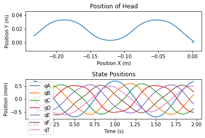
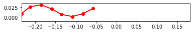

```python
%matplotlib inline
```


```python
#Set script to run optimization
run_fit = True
```

# Importing Libraries

Importing libraries for script


```python
import pynamics
from pynamics.frame import Frame
from pynamics.variable_types import Differentiable,Constant
from pynamics.system import System
from pynamics.body import Body
from pynamics.dyadic import Dyadic
from pynamics.output import Output,PointsOutput
from pynamics.output_points_3d import PointsOutput3D
from pynamics.constraint import AccelerationConstraint,KinematicConstraint
from pynamics.particle import Particle
import pynamics.integration
import numpy
import matplotlib.pyplot as plt
plt.ion()
from math import pi,sin
import sympy
from sympy import sqrt
import math
import logging
import scipy.optimize
import pynamics.integration
import pynamics.system
import numpy.random
import scipy.interpolate
import scipy.optimize
import cma
import pandas as pd
import idealab_tools.units
from matplotlib import animation, rc
from IPython.display import HTML


system = System()
pynamics.set_system(__name__,system)
```

# Constants of System

In this block of code we are defining all the constants of our system that we will use for our simulation


```python
#seg = segment, t = tail
seg_l = 0.02759581
t_l = 0.02
seg_h = 0.01
len_factor = 5.5

#Set segment lengths
l = Constant(seg_l,'l',system) #Segment Length, Formula:seg_len
lT = Constant(seg_l,'tail',system) #Tail Length, Formula:tail_len
lP = Constant(seg_l*len_factor,'lP',system) #Constrained length, Forumla:seg_len*constrainted_length_factor

#Set masses, 666.7 is density of laminate structure
m = Constant(666.7*seg_l*seg_h*0.001,'m',system) #Segment Mass, Formula:666.7*seg_len*seg_h*seg_th
mT = Constant(666.7*t_l*seg_h*0.001,'mT',system) #Tail Mass, Formula:666.7*tail_len*seg_h*seg_th

b = Constant(2.148e-6,'b',system)
k = Constant(1.599e-4,'k',system)
rho = Constant(998,'rho',system)
area_p = Constant(seg_l*seg_h,'area_p',system) #area of flat plates
area_f = Constant(seg_h*0.001,'area_f',system)

freq = Constant(1,'freq',system) #frequency of head oscilation
amp = Constant(40*pi/180,'amp',system) #maximum pitch angle of servo 

Ixx = Constant(1/12*(666.7*seg_l*seg_h*0.001)*(seg_h**2 + 0.001**2),'Ixx',system) #Formula: 1/12*666.7*seg_len*seg_h*seg_th*(seg_h**2 + seg_th**2
Iyy = Constant(1/12*(666.7*seg_l*seg_h*0.001)*(seg_h**2 + seg_l**2),'Iyy',system) #Formula: 1/12*(666.7*seg_len*seg_h*seg_th)*(seg_h**2 + seg_len**2)
Izz = Constant(1/12*(666.7*seg_l*seg_h*0.001)*(seg_l**2 + 0.001**2),'Izz',system) #Formula: 1/12*(666.7*seg_len*seg_h*seg_th)*(seg_len**2 + seg_th**2)
Ixx_T = Constant(1/12*(666.7*t_l*seg_h*0.001)*(seg_h*2 + 0.001**2),'Ixx_T',system) #Formula: 1/12*(666.7*tail_len*seg_h*seg_th)*(seg_h*2 + seg_th**2) 
Iyy_T = Constant(1/12*(666.7*t_l*seg_h*0.001)*(seg_h**2 + t_l**2),'Iyy_T',system) #Formula: 1/12*(666.7*tail_len*seg_h*seg_th)*(seg_h**2 + tail_len**2)
Izz_T = Constant(1/12*(666.7*t_l*seg_h*0.001)*(t_l**2 + 0.001**2),'Izz_T',system) #Formula: 1/12*(666.7*tail_len*seg_h*seg_th)*(tail_len**2 + seg_th**2)

```


```python
#Set integration tolerance
tol = 1e-12
```


```python
#Set simulation run time
fps = 30
tinitial = 0
tfinal = 2
tstep = 1/fps
t = numpy.r_[tinitial:tfinal:tstep]
```


```python
#Define derivatives of frames
qA,qA_d,qA_dd = Differentiable('qA',system)
qB,qB_d,qB_dd = Differentiable('qB',system)
qC,qC_d,qC_dd = Differentiable('qC',system)
qD,qD_d,qD_dd = Differentiable('qD',system)
qE,qE_d,qE_dd = Differentiable('qE',system)
qF,qF_d,qF_dd = Differentiable('qF',system)
qT,qT_d,qT_dd = Differentiable('qT',system)

x,x_d,x_dd = Differentiable('x',system)
y,y_d,y_dd = Differentiable('y',system)
```


```python
#set initial conditions
initialvalues = {}
initialvalues[qA]=40*pi/180
initialvalues[qA_d]=0*pi/180
initialvalues[qB]=20*pi/180
initialvalues[qB_d]=0*pi/180
initialvalues[qC]=10*pi/180
initialvalues[qC_d]=0*pi/180
initialvalues[qD]=0*pi/180
initialvalues[qD_d]=0*pi/180
initialvalues[qE]=-10*pi/180
initialvalues[qE_d]=0*pi/180
initialvalues[qF]=-40*pi/180
initialvalues[qF_d]=0*pi/180
initialvalues[qT]=0*pi/180
initialvalues[qT_d]=0*pi/180

initialvalues[x]=0*pi/180
initialvalues[x_d]=0*pi/180
initialvalues[y]=0*pi/180
initialvalues[y_d]=0*pi/180

statevariables = system.get_state_variables()
ini0 = [initialvalues[item] for item in statevariables]
```


```python
#Frames
N = Frame('N',system)
A = Frame('A',system)
B = Frame('B',system)
C = Frame('C',system)
D = Frame('D',system)
E = Frame('E',system)
F = Frame('F',system)
T = Frame('T',system)

system.set_newtonian(N)

A.rotate_fixed_axis(N,[0,0,1],qA,system)
B.rotate_fixed_axis(N,[0,0,1],qB,system)
C.rotate_fixed_axis(N,[0,0,1],qC,system)
D.rotate_fixed_axis(N,[0,0,1],qD,system)
E.rotate_fixed_axis(N,[0,0,1],qE,system)
F.rotate_fixed_axis(N,[0,0,1],qF,system)
T.rotate_fixed_axis(N,[0,0,1],qT,system)
```

# Defining Vectors

In this section of code we are defining all the position and center of mass vecotors. Additionally we are calculating angular velocity of each frame and the respective linear velocities at the center of mass. We also build each body of the system in this section.


```python
#Vectors

pNA=x*N.x + y*N.y + 0*N.z
pP = lP*N.x + pNA
    
pAB= pNA + l*A.x
pBC = pAB + l*B.x
pCD = pBC + l*C.x
pDE = pCD + l*D.x
pEF = pDE + l*E.x
pFT = pEF + l*F.x
pTtip = pFT + lT*T.x

#Center of Mass
pAcm=pNA+l/2*A.x
pBcm=pAB+l/2*B.x
pCcm=pBC+l/2*C.x
pDcm=pCD+l/2*D.x
pEcm=pDE+l/2*E.x
pFcm=pEF+l/2*F.x
pTcm=pFT+lT/2*T.x

#Angular Velocity
wNA = N.get_w_to(A)
wAB = A.get_w_to(B) 
wBC = B.get_w_to(C)
wCD = C.get_w_to(D) 
wDE = D.get_w_to(E)
wEF = E.get_w_to(F)
wFT = F.get_w_to(T)

#Velocities 
vA=pAcm.time_derivative()
vB=pBcm.time_derivative()
vC=pCcm.time_derivative()
vD=pDcm.time_derivative()
vE=pEcm.time_derivative()
vF=pFcm.time_derivative()
vTtip=pTtip.time_derivative()

#Interia and Bodys
IA = Dyadic.build(A,Ixx,Iyy,Izz)
IB = Dyadic.build(B,Ixx,Iyy,Izz)
IC = Dyadic.build(C,Ixx,Iyy,Izz)
ID = Dyadic.build(D,Ixx,Iyy,Izz)
IE = Dyadic.build(E,Ixx,Iyy,Izz)
IF = Dyadic.build(F,Ixx,Iyy,Izz)
IT = Dyadic.build(T,Ixx_T,Iyy_T,Izz_T)

BodyA = Body('BodyA',A,pAcm,m,IA,system)
BodyB = Body('BodyB',B,pBcm,m,IB,system)
BodyC = Body('BodyC',C,pCcm,m,IC,system)
BodyD = Body('BodyD',D,pDcm,m,ID,system)
BodyE = Body('BodyE',E,pEcm,m,IE,system)
BodyF = Body('BodyF',F,pFcm,m,IF,system)
BodyT = Body('BodyT',T,pTcm,mT,IT,system)
```

# Adding Forces

In this section of code we are adding the aerodynamic, spring, and damping forces in the system. The damping and spring values will be calculated experimentally.


```python
#Forces
#system.addforce(-torque*sympy.sin(freq*2*pi*system.t)*A.z,wNA) #setting motor parameter

#Aerodynamic Forces orthogonal to flat plates
f_aero_Ay = rho * vA.length()*(vA.dot(A.y)) * area_p * A.y
f_aero_By = rho * vB.length()*(vB.dot(B.y)) * area_p * B.y
f_aero_Cy = rho * vC.length()*(vC.dot(C.y)) * area_p * C.y
f_aero_Dy = rho * vD.length()*(vD.dot(D.y)) * area_p * D.y
f_aero_Ey = rho * vE.length()*(vE.dot(E.y)) * area_p * E.y
f_aero_Fy = rho * vF.length()*(vF.dot(F.y)) * area_p * F.y
f_aero_Ty = rho * vTtip.length()*(vTtip.dot(T.y)) * area_p * T.y

system.addforce(-f_aero_Ay,vA)
system.addforce(-f_aero_By,vB)
system.addforce(-f_aero_Cy,vC)
system.addforce(-f_aero_Dy,vD)
system.addforce(-f_aero_Ey,vE)
system.addforce(-f_aero_Fy,vF)
system.addforce(-f_aero_Ty,vTtip)

#Aerodynamic Forces against front of device
f_aero_Ax = rho * vA.length()*(vA.dot(A.x)) * area_f * A.x
system.addforce(-f_aero_Ax,vA)

#Damping Forces
system.addforce(-b*wAB,wAB)
system.addforce(-b*wBC,wBC)
system.addforce(-b*wCD,wCD)
system.addforce(-b*wDE,wDE)
system.addforce(-b*wEF,wEF)
system.addforce(-b*wFT,wFT)

#Spring Force (Torsion)
system.add_spring_force1(k,(qB-qA)*N.z,wAB)
system.add_spring_force1(k,(qC-qB)*N.z,wBC)
system.add_spring_force1(k,(qD-qC)*N.z,wCD) 
system.add_spring_force1(k,(qE-qD)*N.z,wDE)
system.add_spring_force1(k,(qF-qE)*N.z,wEF)
system.add_spring_force1(k,(qT-qF)*N.z,wFT)
```


    (<pynamics.force.Force at 0x21c2f510c10>,
     <pynamics.spring.Spring at 0x21c2f510ca0>)


# Initial Condition

Solving for initial condition constraints and using scipy to solve for initial states and setting initial states to system initial states.


```python
#Constraints for initial condition

eq = []

eq.append(pFT-pP)
    
eq_scalar = []
eq_scalar.append(eq[0].dot(N.x))
eq_scalar.append(eq[0].dot(N.y))
```


```python
#Solve for Intial Conditions

qi = [qA,x,y]

qd = [qB,qC,qD,qE,qF,qT]

eq_scalar_c = [item.subs(system.constant_values) for item in eq_scalar]
defined = dict([(item,initialvalues[item]) for item in qi])
eq_scalar_c = [item.subs(defined) for item in eq_scalar_c]

error = (numpy.array(eq_scalar_c)**2).sum()

f = sympy.lambdify(qd,error)

def function(args):
    return f(*args)

guess = [initialvalues[item] for item in qd]

result = scipy.optimize.minimize(function,guess)
if result.fun>1e-3:
    raise(Exception("out of tolerance"))
    
ini = []
for item in system.get_state_variables():
    if item in qd:
        ini.append(result.x[qd.index(item)])
    else:
        ini.append(initialvalues[item])
```

# Setting Dynamic Constraints

Solving for dynamic constraints of system to run simulation.


```python
#Adding Dynamic Constraints

#Position of motor limits
pos = amp*sympy.cos(freq*2*pi*system.t)

eq = []

eq.append(pFT-pP)
eq.append(pos*N.z-qA*A.z)

eq_d = []
eq_d = [item.time_derivative() for item in eq]

eq_dd = []
eq_dd = [item.time_derivative() for item in eq_d]

eq_dd_scalar = []
eq_dd_scalar.append(eq_dd[0].dot(N.x))
eq_dd_scalar.append(eq_dd[0].dot(N.y))
eq_dd_scalar.append(eq_dd[1].dot(N.z))

system.add_constraint(AccelerationConstraint(eq_dd_scalar))
```

# Solving for Simulation

Code to run simulation and plot motion, states, and total energy in system.


```python
#Solve model and plot angles

#Constraints and Plots

f,ma = system.getdynamics();

tol = 1e-12
points = [pNA,pAB,pBC,pCD,pDE,pEF,pFT,pTtip]

def run_sim(args):
    new_lf = args[0] #Set to variables that optimizing
    
    #updating constant values affected by changing optimized values
    new_lP = new_lf*0.02759581
    
    #Populate constants with new values, in case for optimizing length and height, all constants get updated
    constants = system.constant_values.copy()
    constants[lP] = new_lP
    
    states=pynamics.integration.integrate(func1,ini,t,rtol=tol,atol=tol,hmin=tol, args=({'constants':constants},))
    return states

def measured_perf(args):
    print(args)
    try:
        states = run_sim(args)
        linear_disp = abs(states[-1,7])/seg_l #linear displacement relative to segment length, default seg_len = .02
        perf = (1/linear_disp)**2 #desired result is largest propulsion relative to size of device
        return perf
    except scipy.linalg.LinAlgError:
        return 1000


pynamics.system.logger.setLevel(logging.ERROR)

if run_fit:

    func1 = system.state_space_post_invert(f,ma)
    
    guess = [5.5] #Change depending on what factor you are optimizing 

    pynamics.system.logger.setLevel(logging.ERROR)
    
    sol = scipy.optimize.minimize(measured_perf,guess,bounds=[(4.5,5.75)]) #Change bounds depending on optimization parameter
    print(sol.fun)
    result = sol.x
```

    2022-04-27 22:51:01,062 - pynamics.system - INFO - getting dynamic equations
    2022-04-27 22:51:08,497 - pynamics.integration - INFO - beginning integration
    

    [5.5]
    

    2022-04-27 22:52:14,783 - pynamics.integration - INFO - finished integration
    2022-04-27 22:52:14,784 - pynamics.integration - INFO - beginning integration
    

    [5.50000001]
    

    2022-04-27 22:53:20,181 - pynamics.integration - INFO - finished integration
    

    0.013957916253657797
    


```python
#Constraint Forces
if run_fit:
    states2 = run_sim(result)
    points_output = PointsOutput(points,system)
    y2 = points_output.calc(states2,t)

    fig = plt.figure()
    ax1 = plt.subplot(2,1,2)
    ax1.plot(t,states2[:,:7])
    ax1.legend(['qA','qB','qC','qD','qE','qF','qT'])
    ax1.set_title('State Positions')
    ax1.set_xlabel('Time (s)')
    ax1.set_ylabel('Position (mm)')

    ax2 = plt.subplot(2,1,1)
    ax2.plot(y2[:,0,0],y2[:,0,1])
    ax2.axis('equal')
    ax2.set_title('Position of Head')
    ax2.set_xlabel('Position X (m)')
    ax2.set_ylabel('Position Y (m)')

    fig.tight_layout()

    print(result)
    
    
else:
    
    func1,lambda1 = system.state_space_post_invert(f,ma,return_lambda = True)
    states=pynamics.integration.integrate(func1,ini,t,rtol=tol,atol=tol,hmin=tol, args=({'constants':system.constant_values},))

    points_output = PointsOutput(points,system) 
    y = points_output.calc(states,t)

    fig = plt.figure(figsize=(8, 6), dpi=80)

    ax1 = plt.subplot(2,1,1)
    ax1.plot(y[:,7,0],y[:,7,1])
    ax1.axis('equal')
    ax1.set_title('Position of Tail Tip')
    ax1.set_xlabel('Position X (m)')
    ax1.set_ylabel('Position Y (m)')

    ax2 = plt.subplot(2,1,2)
    ax2.plot(y[:,0,0],y[:,0,1])
    ax2.axis('equal')
    ax2.set_title('Position of Head')
    ax2.set_xlabel('Position X (m)')
    ax2.set_ylabel('Position Y (m)')
    
    
    fig.tight_layout()
    
    lambda2 = numpy.array([lambda1(item1,item2,system.constant_values) for item1,item2 in zip(t,states)])
    plt.figure()
    plt.plot(t, lambda2)
    
    points_output = PointsOutput(points,system)
    y = points_output.calc(states,t)
    points_output.plot_time(20)
```

    2022-04-27 22:53:20,205 - pynamics.integration - INFO - beginning integration
    2022-04-27 22:54:26,654 - pynamics.integration - INFO - finished integration
    2022-04-27 22:54:26,700 - pynamics.output - INFO - calculating outputs
    2022-04-27 22:54:26,704 - pynamics.output - INFO - done calculating outputs
    

    [5.5]
    





```python
points_output.animate(fps = fps,movie_name = 'dynamics_free_swimming_opt.mp4',lw=2,marker='o',color=(1,0,0,1),linestyle='-')
    
HTML(points_output.anim.to_html5_video())
```

    MovieWriter ffmpeg unavailable; using Pillow instead.
    


    ---------------------------------------------------------------------------

    KeyError                                  Traceback (most recent call last)

    C:\Anaconda3\lib\site-packages\PIL\Image.py in save(self, fp, format, **params)
       2277             try:
    -> 2278                 format = EXTENSION[ext]
       2279             except KeyError as e:
    

    KeyError: '.mp4'

    
    The above exception was the direct cause of the following exception:
    

    ValueError                                Traceback (most recent call last)

    ~\AppData\Local\Temp/ipykernel_29084/2410956507.py in <module>
    ----> 1 points_output.animate(fps = fps,movie_name = 'dynamics_free_swimming_opt.mp4',lw=2,marker='o',color=(1,0,0,1),linestyle='-')
          2 
          3 HTML(points_output.anim.to_html5_video())
    

    C:\Anaconda3\lib\site-packages\pynamics\output_points.py in animate(self, fps, stepsize, movie_name, *args, **kwargs)
         52         self.anim = animation.FuncAnimation(f, run, init_func=init,frames=y[::stepsize], interval=1/fps*1000, blit=True,repeat = True,repeat_delay=3000)
         53         if movie_name is not None:
    ---> 54             self.anim.save(movie_name, fps=fps,writer='ffmpeg')
         55         return ax
         56 
    

    C:\Anaconda3\lib\site-packages\matplotlib\animation.py in save(self, filename, writer, fps, dpi, codec, bitrate, extra_args, metadata, extra_anim, savefig_kwargs, progress_callback)
       1093                         progress_callback(frame_number, total_frames)
       1094                         frame_number += 1
    -> 1095                 writer.grab_frame(**savefig_kwargs)
       1096 
       1097     def _step(self, *args):
    

    C:\Anaconda3\lib\contextlib.py in __exit__(self, typ, value, traceback)
        124         if typ is None:
        125             try:
    --> 126                 next(self.gen)
        127             except StopIteration:
        128                 return False
    

    C:\Anaconda3\lib\site-packages\matplotlib\animation.py in saving(self, fig, outfile, dpi, *args, **kwargs)
        236             yield self
        237         finally:
    --> 238             self.finish()
        239 
        240 
    

    C:\Anaconda3\lib\site-packages\matplotlib\animation.py in finish(self)
        512 
        513     def finish(self):
    --> 514         self._frames[0].save(
        515             self.outfile, save_all=True, append_images=self._frames[1:],
        516             duration=int(1000 / self.fps), loop=0)
    

    C:\Anaconda3\lib\site-packages\PIL\Image.py in save(self, fp, format, **params)
       2278                 format = EXTENSION[ext]
       2279             except KeyError as e:
    -> 2280                 raise ValueError(f"unknown file extension: {ext}") from e
       2281 
       2282         if format.upper() not in SAVE:
    

    ValueError: unknown file extension: .mp4





```python
if run_fit:
        linear_disp_final = abs(states2[-1,7])/seg_l  #relative length of segment
else:
        linear_disp_final = abs(states[-1,7])/seg_l  #relative length of segment
print(linear_disp_final)
```
