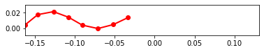

```python
%matplotlib inline
```


```python
#Set script to run optimization
run_fit = True
```

# Importing Libraries

Importing libraries for script


```python
import pynamics
from pynamics.frame import Frame
from pynamics.variable_types import Differentiable,Constant
from pynamics.system import System
from pynamics.body import Body
from pynamics.dyadic import Dyadic
from pynamics.output import Output,PointsOutput
from pynamics.output_points_3d import PointsOutput3D
from pynamics.constraint import AccelerationConstraint,KinematicConstraint
from pynamics.particle import Particle
import pynamics.integration
import numpy
import matplotlib.pyplot as plt
plt.ion()
from math import pi,sin
import sympy
from sympy import sqrt
import math
import logging
import scipy.optimize
import pynamics.integration
import pynamics.system
import numpy.random
import scipy.interpolate
import scipy.optimize
import cma
import pandas as pd
import idealab_tools.units
from matplotlib import animation, rc
from IPython.display import HTML


system = System()
pynamics.set_system(__name__,system)
```

# Constants of System

In this block of code we are defining all the constants of our system that we will use for our simulation


```python
#seg = segment, t = tail
seg_l = 0.02
t_l = 0.02
seg_h = 0.01
len_factor = 5.5

#Set segment lengths
l = Constant(seg_l,'l',system) #Segment Length, Formula:seg_len
lT = Constant(seg_l,'tail',system) #Tail Length, Formula:tail_len
lP = Constant(seg_l*len_factor,'lP',system) #Constrained length, Forumla:seg_len*constrainted_length_factor

#Set masses, 666.7 is density of laminate structure
m = Constant(666.7*seg_l*seg_h*0.001,'m',system) #Segment Mass, Formula:666.7*seg_len*seg_h*seg_th
mT = Constant(666.7*t_l*seg_h*0.001,'mT',system) #Tail Mass, Formula:666.7*tail_len*seg_h*seg_th

b = Constant(2.148e-6,'b',system)
k = Constant(1.599e-4,'k',system)
rho = Constant(998,'rho',system)
area_p = Constant(seg_l*seg_h,'area_p',system) #area of flat plates
area_f = Constant(seg_h*0.001,'area_f',system)

freq = Constant(1,'freq',system) #frequency of head oscilation
amp = Constant(40*pi/180,'amp',system) #maximum pitch angle of servo 

Ixx = Constant(1/12*(666.7*seg_l*seg_h*0.001)*(seg_h**2 + 0.001**2),'Ixx',system) #Formula: 1/12*666.7*seg_len*seg_h*seg_th*(seg_h**2 + seg_th**2
Iyy = Constant(1/12*(666.7*seg_l*seg_h*0.001)*(seg_h**2 + seg_l**2),'Iyy',system) #Formula: 1/12*(666.7*seg_len*seg_h*seg_th)*(seg_h**2 + seg_len**2)
Izz = Constant(1/12*(666.7*seg_l*seg_h*0.001)*(seg_l**2 + 0.001**2),'Izz',system) #Formula: 1/12*(666.7*seg_len*seg_h*seg_th)*(seg_len**2 + seg_th**2)
Ixx_T = Constant(1/12*(666.7*t_l*seg_h*0.001)*(seg_h*2 + 0.001**2),'Ixx_T',system) #Formula: 1/12*(666.7*tail_len*seg_h*seg_th)*(seg_h*2 + seg_th**2) 
Iyy_T = Constant(1/12*(666.7*t_l*seg_h*0.001)*(seg_h**2 + t_l**2),'Iyy_T',system) #Formula: 1/12*(666.7*tail_len*seg_h*seg_th)*(seg_h**2 + tail_len**2)
Izz_T = Constant(1/12*(666.7*t_l*seg_h*0.001)*(t_l**2 + 0.001**2),'Izz_T',system) #Formula: 1/12*(666.7*tail_len*seg_h*seg_th)*(tail_len**2 + seg_th**2)

```


```python
#Set integration tolerance
tol = 1e-12
```


```python
#Set simulation run time
fps = 30
tinitial = 0
tfinal = 2
tstep = 1/fps
t = numpy.r_[tinitial:tfinal:tstep]
```


```python
#Define derivatives of frames
qA,qA_d,qA_dd = Differentiable('qA',system)
qB,qB_d,qB_dd = Differentiable('qB',system)
qC,qC_d,qC_dd = Differentiable('qC',system)
qD,qD_d,qD_dd = Differentiable('qD',system)
qE,qE_d,qE_dd = Differentiable('qE',system)
qF,qF_d,qF_dd = Differentiable('qF',system)
qT,qT_d,qT_dd = Differentiable('qT',system)

x,x_d,x_dd = Differentiable('x',system)
y,y_d,y_dd = Differentiable('y',system)
```


```python
#set initial conditions
initialvalues = {}
initialvalues[qA]=40*pi/180
initialvalues[qA_d]=0*pi/180
initialvalues[qB]=20*pi/180
initialvalues[qB_d]=0*pi/180
initialvalues[qC]=10*pi/180
initialvalues[qC_d]=0*pi/180
initialvalues[qD]=0*pi/180
initialvalues[qD_d]=0*pi/180
initialvalues[qE]=-10*pi/180
initialvalues[qE_d]=0*pi/180
initialvalues[qF]=-40*pi/180
initialvalues[qF_d]=0*pi/180
initialvalues[qT]=0*pi/180
initialvalues[qT_d]=0*pi/180

initialvalues[x]=0*pi/180
initialvalues[x_d]=0*pi/180
initialvalues[y]=0*pi/180
initialvalues[y_d]=0*pi/180

statevariables = system.get_state_variables()
ini0 = [initialvalues[item] for item in statevariables]
```


```python
#Frames
N = Frame('N',system)
A = Frame('A',system)
B = Frame('B',system)
C = Frame('C',system)
D = Frame('D',system)
E = Frame('E',system)
F = Frame('F',system)
T = Frame('T',system)

system.set_newtonian(N)

A.rotate_fixed_axis(N,[0,0,1],qA,system)
B.rotate_fixed_axis(N,[0,0,1],qB,system)
C.rotate_fixed_axis(N,[0,0,1],qC,system)
D.rotate_fixed_axis(N,[0,0,1],qD,system)
E.rotate_fixed_axis(N,[0,0,1],qE,system)
F.rotate_fixed_axis(N,[0,0,1],qF,system)
T.rotate_fixed_axis(N,[0,0,1],qT,system)
```

# Defining Vectors

In this section of code we are defining all the position and center of mass vecotors. Additionally we are calculating angular velocity of each frame and the respective linear velocities at the center of mass. We also build each body of the system in this section.


```python
#Vectors

pNA=x*N.x + y*N.y + 0*N.z
pP = lP*N.x + pNA
    
pAB= pNA + l*A.x
pBC = pAB + l*B.x
pCD = pBC + l*C.x
pDE = pCD + l*D.x
pEF = pDE + l*E.x
pFT = pEF + l*F.x
pTtip = pFT + lT*T.x

#Center of Mass
pAcm=pNA+l/2*A.x
pBcm=pAB+l/2*B.x
pCcm=pBC+l/2*C.x
pDcm=pCD+l/2*D.x
pEcm=pDE+l/2*E.x
pFcm=pEF+l/2*F.x
pTcm=pFT+lT/2*T.x

#Angular Velocity
wNA = N.get_w_to(A)
wAB = A.get_w_to(B) 
wBC = B.get_w_to(C)
wCD = C.get_w_to(D) 
wDE = D.get_w_to(E)
wEF = E.get_w_to(F)
wFT = F.get_w_to(T)

#Velocities 
vA=pAcm.time_derivative()
vB=pBcm.time_derivative()
vC=pCcm.time_derivative()
vD=pDcm.time_derivative()
vE=pEcm.time_derivative()
vF=pFcm.time_derivative()
vTtip=pTtip.time_derivative()

#Interia and Bodys
IA = Dyadic.build(A,Ixx,Iyy,Izz)
IB = Dyadic.build(B,Ixx,Iyy,Izz)
IC = Dyadic.build(C,Ixx,Iyy,Izz)
ID = Dyadic.build(D,Ixx,Iyy,Izz)
IE = Dyadic.build(E,Ixx,Iyy,Izz)
IF = Dyadic.build(F,Ixx,Iyy,Izz)
IT = Dyadic.build(T,Ixx_T,Iyy_T,Izz_T)

BodyA = Body('BodyA',A,pAcm,m,IA,system)
BodyB = Body('BodyB',B,pBcm,m,IB,system)
BodyC = Body('BodyC',C,pCcm,m,IC,system)
BodyD = Body('BodyD',D,pDcm,m,ID,system)
BodyE = Body('BodyE',E,pEcm,m,IE,system)
BodyF = Body('BodyF',F,pFcm,m,IF,system)
BodyT = Body('BodyT',T,pTcm,mT,IT,system)
```

# Adding Forces

In this section of code we are adding the aerodynamic, spring, and damping forces in the system. The damping and spring values will be calculated experimentally.


```python
#Forces
#system.addforce(-torque*sympy.sin(freq*2*pi*system.t)*A.z,wNA) #setting motor parameter

#Aerodynamic Forces orthogonal to flat plates
f_aero_Ay = rho * vA.length()*(vA.dot(A.y)) * area_p * A.y
f_aero_By = rho * vB.length()*(vB.dot(B.y)) * area_p * B.y
f_aero_Cy = rho * vC.length()*(vC.dot(C.y)) * area_p * C.y
f_aero_Dy = rho * vD.length()*(vD.dot(D.y)) * area_p * D.y
f_aero_Ey = rho * vE.length()*(vE.dot(E.y)) * area_p * E.y
f_aero_Fy = rho * vF.length()*(vF.dot(F.y)) * area_p * F.y
f_aero_Ty = rho * vTtip.length()*(vTtip.dot(T.y)) * area_p * T.y

system.addforce(-f_aero_Ay,vA)
system.addforce(-f_aero_By,vB)
system.addforce(-f_aero_Cy,vC)
system.addforce(-f_aero_Dy,vD)
system.addforce(-f_aero_Ey,vE)
system.addforce(-f_aero_Fy,vF)
system.addforce(-f_aero_Ty,vTtip)

#Aerodynamic Forces against front of device
f_aero_Ax = rho * vA.length()*(vA.dot(A.x)) * area_f * A.x
system.addforce(-f_aero_Ax,vA)

#Damping Forces
system.addforce(-b*wAB,wAB)
system.addforce(-b*wBC,wBC)
system.addforce(-b*wCD,wCD)
system.addforce(-b*wDE,wDE)
system.addforce(-b*wEF,wEF)
system.addforce(-b*wFT,wFT)

#Spring Force (Torsion)
system.add_spring_force1(k,(qB-qA)*N.z,wAB)
system.add_spring_force1(k,(qC-qB)*N.z,wBC)
system.add_spring_force1(k,(qD-qC)*N.z,wCD) 
system.add_spring_force1(k,(qE-qD)*N.z,wDE)
system.add_spring_force1(k,(qF-qE)*N.z,wEF)
system.add_spring_force1(k,(qT-qF)*N.z,wFT)
```


    (<pynamics.force.Force at 0x2e4a12e3c70>,
     <pynamics.spring.Spring at 0x2e4a12e3e50>)


# Initial Condition

Solving for initial condition constraints and using scipy to solve for initial states and setting initial states to system initial states.


```python
#Constraints for initial condition

eq = []

eq.append(pFT-pP)
    
eq_scalar = []
eq_scalar.append(eq[0].dot(N.x))
eq_scalar.append(eq[0].dot(N.y))
```


```python
#Solve for Intial Conditions

qi = [qA,x,y]

qd = [qB,qC,qD,qE,qF,qT]

eq_scalar_c = [item.subs(system.constant_values) for item in eq_scalar]
defined = dict([(item,initialvalues[item]) for item in qi])
eq_scalar_c = [item.subs(defined) for item in eq_scalar_c]

error = (numpy.array(eq_scalar_c)**2).sum()

f = sympy.lambdify(qd,error)

def function(args):
    return f(*args)

guess = [initialvalues[item] for item in qd]

result = scipy.optimize.minimize(function,guess)
if result.fun>1e-3:
    raise(Exception("out of tolerance"))
    
ini = []
for item in system.get_state_variables():
    if item in qd:
        ini.append(result.x[qd.index(item)])
    else:
        ini.append(initialvalues[item])
```

# Setting Dynamic Constraints

Solving for dynamic constraints of system to run simulation.


```python
#Adding Dynamic Constraints

#Position of motor limits
pos = amp*sympy.cos(freq*2*pi*system.t)

eq = []

eq.append(pFT-pP)
eq.append(pos*N.z-qA*A.z)

eq_d = []
eq_d = [item.time_derivative() for item in eq]

eq_dd = []
eq_dd = [item.time_derivative() for item in eq_d]

eq_dd_scalar = []
eq_dd_scalar.append(eq_dd[0].dot(N.x))
eq_dd_scalar.append(eq_dd[0].dot(N.y))
eq_dd_scalar.append(eq_dd[1].dot(N.z))

system.add_constraint(AccelerationConstraint(eq_dd_scalar))
```

# Solving for Simulation

Code to run simulation and plot motion, states, and total energy in system.


```python
#Solve model and plot angles

#Constraints and Plots

f,ma = system.getdynamics();

tol = 1e-12
points = [pNA,pAB,pBC,pCD,pDE,pEF,pFT,pTtip]

def run_sim(args):
    new_t = args[0] #Set to variables that optimizing
    
    #updating constant values affected by changing optimized values
    new_Ixx_T = 1/12*(666.7*new_t*0.001)*(0.001**2)
    new_Iyy_T = 1/12*(666.7*new_t*0.001)*(new_t**2)
    new_Izz_T = 1/12*(666.7*new_t*0.001)*(new_t**2 + 0.001**2)
    
    #Populate constants with new values, in case for optimizing length and height, all constants get updated
    constants = system.constant_values.copy()
    constants[Ixx_T] = new_Ixx_T
    constants[Iyy_T] = new_Iyy_T
    constants[Izz_T] = new_Izz_T
    
    states=pynamics.integration.integrate(func1,ini,t,rtol=tol,atol=tol,hmin=tol, args=({'constants':constants},))
    return states

def measured_perf(args):
    print(args)
    try:
        states = run_sim(args)
        linear_disp = abs(states[-1,7])/seg_l #linear displacement relative to segment length, default seg_len = .02
        perf = (1/linear_disp)**2 #desired result is largest propulsion relative to size of device
        return perf
    except scipy.linalg.LinAlgError:
        return 1000


pynamics.system.logger.setLevel(logging.ERROR)

if run_fit:

    func1 = system.state_space_post_invert(f,ma)
    
    guess = [0.015] #Change depending on what factor you are optimizing 

    pynamics.system.logger.setLevel(logging.ERROR)
    
    sol = scipy.optimize.minimize(measured_perf,guess,bounds=[(0.01,0.07)]) #Change bounds depending on optimization parameter
    print(sol.fun)
    result = sol.x
```

    2022-04-22 00:23:44,411 - pynamics.system - INFO - getting dynamic equations
    2022-04-22 00:23:50,560 - pynamics.integration - INFO - beginning integration
    

    [0.015]
    

    2022-04-22 00:24:37,608 - pynamics.integration - INFO - finished integration
    2022-04-22 00:24:37,609 - pynamics.integration - INFO - beginning integration
    

    [0.01500001]
    

    2022-04-22 00:25:24,421 - pynamics.integration - INFO - finished integration
    2022-04-22 00:25:24,422 - pynamics.integration - INFO - beginning integration
    

    [0.01]
    

    2022-04-22 00:26:19,421 - pynamics.integration - INFO - finished integration
    2022-04-22 00:26:19,422 - pynamics.integration - INFO - beginning integration
    

    [0.01000001]
    

    2022-04-22 00:27:08,182 - pynamics.integration - INFO - finished integration
    

    0.015293297512492856
    


```python
#Constraint Forces
if run_fit:
    states2 = run_sim(result)
    points_output = PointsOutput(points,system)
    y2 = points_output.calc(states2,t)

    fig = plt.figure()
    ax1 = plt.subplot(2,1,2)
    ax1.plot(t,states2[:,:7])
    ax1.legend(['qA','qB','qC','qD','qE','qF','qT'])
    ax1.set_title('State Positions')
    ax1.set_xlabel('Time (s)')
    ax1.set_ylabel('Position (mm)')

    ax2 = plt.subplot(2,1,1)
    ax2.plot(y2[:,0,0],y2[:,0,1])
    ax2.axis('equal')
    ax2.set_title('Position of Head')
    ax2.set_xlabel('Position X (m)')
    ax2.set_ylabel('Position Y (m)')

    fig.tight_layout()

    print(result)
    
    
else:
    
    func1,lambda1 = system.state_space_post_invert(f,ma,return_lambda = True)
    states=pynamics.integration.integrate(func1,ini,t,rtol=tol,atol=tol,hmin=tol, args=({'constants':system.constant_values},))

    points_output = PointsOutput(points,system) 
    y = points_output.calc(states,t)

    fig = plt.figure(figsize=(8, 6), dpi=80)

    ax1 = plt.subplot(2,1,1)
    ax1.plot(y[:,7,0],y[:,7,1])
    ax1.axis('equal')
    ax1.set_title('Position of Tail Tip')
    ax1.set_xlabel('Position X (m)')
    ax1.set_ylabel('Position Y (m)')

    ax2 = plt.subplot(2,1,2)
    ax2.plot(y[:,0,0],y[:,0,1])
    ax2.axis('equal')
    ax2.set_title('Position of Head')
    ax2.set_xlabel('Position X (m)')
    ax2.set_ylabel('Position Y (m)')
    
    
    fig.tight_layout()
    
    lambda2 = numpy.array([lambda1(item1,item2,system.constant_values) for item1,item2 in zip(t,states)])
    plt.figure()
    plt.plot(t, lambda2)
    
    points_output = PointsOutput(points,system)
    y = points_output.calc(states,t)
    points_output.plot_time(20)
```

    2022-04-22 00:27:08,204 - pynamics.integration - INFO - beginning integration
    2022-04-22 00:28:03,678 - pynamics.integration - INFO - finished integration
    2022-04-22 00:28:03,707 - pynamics.output - INFO - calculating outputs
    2022-04-22 00:28:03,710 - pynamics.output - INFO - done calculating outputs
    

    [0.01]
    


```python
points_output.animate(fps = fps,movie_name = 'dynamics_free_swimming_opt.mp4',lw=2,marker='o',color=(1,0,0,1),linestyle='-')
    
HTML(points_output.anim.to_html5_video())
```


<video width="432" height="288" controls autoplay loop>
  <source type="video/mp4" src="data:video/mp4;base64,AAAAIGZ0eXBNNFYgAAACAE00ViBpc29taXNvMmF2YzEAAAAIZnJlZQAAU6VtZGF0AAACrgYF//+q
3EXpvebZSLeWLNgg2SPu73gyNjQgLSBjb3JlIDE2NCByMzA5NCBiZmM4N2I3IC0gSC4yNjQvTVBF
Ry00IEFWQyBjb2RlYyAtIENvcHlsZWZ0IDIwMDMtMjAyMiAtIGh0dHA6Ly93d3cudmlkZW9sYW4u
b3JnL3gyNjQuaHRtbCAtIG9wdGlvbnM6IGNhYmFjPTEgcmVmPTMgZGVibG9jaz0xOjA6MCBhbmFs
eXNlPTB4MzoweDExMyBtZT1oZXggc3VibWU9NyBwc3k9MSBwc3lfcmQ9MS4wMDowLjAwIG1peGVk
X3JlZj0xIG1lX3JhbmdlPTE2IGNocm9tYV9tZT0xIHRyZWxsaXM9MSA4eDhkY3Q9MSBjcW09MCBk
ZWFkem9uZT0yMSwxMSBmYXN0X3Bza2lwPTEgY2hyb21hX3FwX29mZnNldD0tMiB0aHJlYWRzPTkg
bG9va2FoZWFkX3RocmVhZHM9MSBzbGljZWRfdGhyZWFkcz0wIG5yPTAgZGVjaW1hdGU9MSBpbnRl
cmxhY2VkPTAgYmx1cmF5X2NvbXBhdD0wIGNvbnN0cmFpbmVkX2ludHJhPTAgYmZyYW1lcz0zIGJf
cHlyYW1pZD0yIGJfYWRhcHQ9MSBiX2JpYXM9MCBkaXJlY3Q9MSB3ZWlnaHRiPTEgb3Blbl9nb3A9
MCB3ZWlnaHRwPTIga2V5aW50PTI1MCBrZXlpbnRfbWluPTI1IHNjZW5lY3V0PTQwIGludHJhX3Jl
ZnJlc2g9MCByY19sb29rYWhlYWQ9NDAgcmM9Y3JmIG1idHJlZT0xIGNyZj0yMy4wIHFjb21wPTAu
NjAgcXBtaW49MCBxcG1heD02OSBxcHN0ZXA9NCBpcF9yYXRpbz0xLjQwIGFxPTE6MS4wMACAAAAJ
HWWIhAAz//727L4FNf2f0JcRLMXaSnA+KqSAgHc0wAAAAwAAeB0oXug4SqvQwAAbcABvyyN9deM3
+Zg5nzATd2LcL/nOLYGZ6DjHKNBwtPUxwu8EkPEU/hU4ntZZmm74GUunTzQ/0nbTLqcxNSIFj0uJ
RWEX7Pkt24ISGyGwtBuXQ0nxQnJBoeXh/DI88BPW//4xhnQT18xmzEoqGQuj/vO35Xx9+SPSOn7K
e++6FdIAseHk/f+KJ/6gcrT9Z+RTVf+eUnb0/6DNKaKxPpHs84Q/Dkq8GHh3jj1HZUr0UAoVaTdd
1KB9eaqTanmC2dM4yHZdQjEf+f3nHWUA7vq3R/YsHBwnUI/GRQ01Yk4VmzL6WcRWvc9IWTEjIbSI
SrT0HhIN/Cz/YTkY0aMQC89kIBpVr/izp5PNg7LrGoaljhjbDAesGb/YoN8FX6qnpUka0rvKGhwg
fHLyIM/1Z4qXg8BlUFoZmssBwstNZ20suX86cH9y65omoXn/xF1mHdJbuAIhBzStgZxW4XGJgplQ
NVLey2MQQzGyAFSDTbuCBy6PIucjttFrpu1oK/GK5EmDj5MPuh19ce/zyDSdYc9sEzdJkTU2ow72
JY4Puvzs01l0dO866yQ2/Jljo6F0zOIIJ3+DKvb+bk3pJmTdGD5Hl6rEuveAkWzfDv/lGQVmH8MK
Knn6UG209MP+BbdPhFL7H1+M8aL4BNTVIZ0b2pps6zf/BMAg9sq0FgR28TAUkvoE1aFfOqY30CJH
K1PrrC7KaFDY/my/W0AQP6yM5iE/gGNw1qsR4FSY907UNawrxqtWSVzQ9VzL5q9xHIB2NFvifHZx
eMrhljzFAW9XRlS36vncprbJ3quX+0aC7uAxjLsEptjotDJdT8AVB679MptR71NRAhlWgYlNj+Xk
ALJjWpEK2w1gFHoG+jyho/pm6O9x+vGWWQirNGbwB5I0FuQWgg086lyeG4cCHKilbYJTfpYAq/rQ
3ToUQ4sifAVorCGX+rysDOvW2ldPeOnHBfc5HRc1ZaR9E96BYvRDbNtKovN2QxWcxvPbi8wMicak
q+d+oSgdp6cuEB90XtDR5lClH5nDQAOmHk5WoPPBeLkyS2BbGu+DEgoSjFRvL/qXeAjmJycC7kUr
5PG+Egijh+XXAJajpV2EqFo4nwK+RZIF+6VwjfqxPomyVYyFEFS1Cqg0k1xGDkJxj1pIPteBpYex
1KnCxI7on4xk0wzl8RewkLuCM/RVnJG4Q3cYJw5MVX2+8NytpPBbyp++KJ7E6CLAAtSz1MVrp7Ii
rtTlPF4ByC5IYuoWgaSrF89ZStvrvvYLmKAbj8jVvTNsK4s34Qt1vM9nSx9MDRuOJE/nAdEbjhCs
SyiocJuFNTuSoFsVaLzD9+xcG8lzknatgcE5SqD/2GmTSGDCXrdMTwXWOz8AH/me26rP06nnjz1k
POCZmlKJ9a+DUa0YD1lOqz3+PzL4I4Nhbs5Y5INWF3WaWWa2FtaisR2/by7qo+UCZlz6MaIf6q1J
hIYFnkjr7sHLSCJ6lPYc/ss3YBvwrBUsm25T4lOdTufQ6y2B9U1uxzhAwKWvKUN7/hRIz0Xlw78o
tq8xvIM3iINMn7I8vxsc/JjCk9wRNIP6dlMMAEl+hY0h1atBoF0WtpBqpfMKX6gr4kwrz2Wkq2BK
G00dd7GraxSIofJfWVsccLk6bNO2W4gQSjQhbTJvPrp3vE0SedfDpQmj60I6BhnUrR/9+Lz97yGC
vlXHTzwr8CPaa5SzfO8o5Z6iT/fGPnprmH9Aq1j5KeuwbWBJQAv6f5SZQUEHqbZA2nXLhQ8E0/x2
VWD9jJrwrZfMUtQ8YsUj6TEwJVgG2pfyFBXjnq7bH5584SuaYgxNKIt9NOUBnGqp9TqP8OzpKC6/
7wDOP2MN2xX7kfVs7M/xKdh8OaZU3CF/dWaLz5HqQFk9oxppKYq/RaYOYyqQ+Qx+fjmI5VnhhcT5
Q84RgwBKM7pdbAzPF3/+JCgMP7+tkTJ3L3OpZcZIaiX3t9SybHniw/F9mSV3Zi2OMscVTKFVq/iw
7zswIRkqwtUlj2ZgXSr1xEim45SnQgOxNR9sn48KCbi2Pzqx3llDxwn2m6ZVsIEXAAMQcKVa9rR4
sm3ZUSGfaU2PoDS9YB+QxPgReKm30Co5CgFX24CCkw8BBTbvV/42HMZ7b/sPDKNIRgKdg53UB0KS
iE9tH3xtVwF25N7eqw/w2DlOtx1mrM+J+JVIyWnY/NKlHRD8MtEFWhhx8yrOFJjcQsdnu5BxhjkI
3xK1YShLYT4VBkYkxJ+V172l82lxH1bKWhmy0/Au1QDdDQhTKCD3Oacgk4lLWFJS76bDogTMLC2P
ckVXWuFSXFdbjQYy9L/WPcfw89BsZyrpoMVrvyCP35vFPBr1J4sXyj54/7BVYlWMIJNGXlh39KVD
O4FZUfefWYjW2HdABJvg9P/zuGVmldon83m9z5ZAToqx1VYzU9xW89lmAPW6BuWK1p3TTAOuhLKy
zBXqjteITiRSatjh5Q/3zZBlrwt0+vT7x7T1dhZE8mwDzfslZTKOe4tmzCS9XVPc2Myh8LSPzI2L
fXbE1467muzaHg59RiC/9kamDuWneVqc53d95yDtU1TVx+VUCFnotcyypa7deO5bk7bEjsMmsgWy
Cu8eySXaEADerJi+IEw/v8Sy+PxBncG/bDeuj1L40e7ribpg8O5m3jRBc3Mwvfihyymp235mMZmG
BB6HaxYkdLvN1cKjLItFXNGevzb3sAALHJ1QCOwrkN8p+tBoYOEUAA+s7Jncu9HRPnxWG0G8ga4z
8y/uk+/7lYdFaebcurKP1dRW54L1F1UDbOpv0bxsmy9bUcj8Rib/qDeEZ1c1+aHlvMKsC9i6zE90
C3QqYtdp5hmwXDFgjmukjkbakVZ+pBPiEL5I2mExGbQMTL73XtZXx0u+oDgAlzheKYvA/vRAbgxR
p1NkNJjGwZlfNV63MkgaM7VDtoM33TnquYNUL5ZsKicFhhjB3+rhuQqqHEUuFdf2PUMNwvY41ayb
MEG+1+toRvMdfPnP4K9DhKSLd2YCVqe3OnrQ2fZrmVNJxPvBuQi6siAAAAMAAAMAAAMAAEBBAAAC
REGaImxDP/6eEAAkqUDgBGR7XUb86b+PDUWsaYo9Z4Ly4qkx+oFI7unzlnOIew8EhknJ7LpUOQ0C
BJaXrMKPfMii8cl7FvQfjr0GRJwLsGr/9ShW8LDP3mZITBypzMVaXh6wvMoswSh2hn85LYfjfOQJ
w3b8kCG7nx/5Yfkd1WATig42xuE+HKCnyUpw9t+Ijt4h/w9LYfWg649sfjEJ3xv9CwYZQAJVYV6c
NlfO1lrogG9w0GpGF7bDFgXXEJ5S291/K1nchNW+MIRIY5gyTAUfKGsFRKk+DlmQJEwWDFjvtKm1
zkoqhFsc2jNAFwVfqNWqc3pGNp5SZCav6Q/4ispdPoz7WOZKiGO6AQf1Z6oVST2DmRayH0a6G18E
C5Ciu/xqAbRwKT+PmR86VYvEbwS5/qJl84zmlV+bjnSMgqZ9nwLKDRESKPr09SXtT9Z+pYmjiNu6
bZHKhmD6CiwtVGNHG+b2qw7nZzx+W++OdbhWHrWEppm6OuAH8AqH35ZecJeOJTW0YtNmseHZHLMC
fMt1nSnefsW3v2E9Ft11tgRXRtVp6zDoMxKFD8qWyJ+7RGfh3RgAikm0hsOTEFFu04lmiyhOazWw
YqZeRBhyYCDHbemxYIyyfxXQVCYDPVXe91rDNnnFPZh/OjPzCNlb/RtlNKZzly061ogzRMmhM0mW
jneVzq5wFeC2YNh4+MLqH1eEqM8HiJ4rzh59fUdHwA8MdGRlAfJv0o8lmBLtvoLBUzMsZCQwewHA
78JjysS8K9QwD5gAAACaAZ5BeQn/AAn2k+HbJFJ2oZQAbdcyNvIoAIZ5RRl0detHVZVAktd5Wzf3
q7iYUKMPcOxtTaRcEw0jwYaUMRUfGmmfE8YzL0uX23MZQdd2mqtvrn2wrHW+D0wWA0EAswhBjsKW
s2zJRaJZ7L59DLywTfsmcEQzWrDCt4zSu/Fgj6NIWOtuMZYPwssjvwlPAYBSx8xVA97wPgAIuQAA
AaJBmkQ8IZMphDP//p4QACXceecMbjqHfGG63cfS6ceQ2NI1k5Q8hCWeFHW+PDxXnFCREX33ZcCa
qH8WJJNZZZrl6uKS+HG/xltMZuvw8uGpkzBZB02Sl7xjQvS78+S2+O4HG89GVhRRw0iFA3GgWkGE
DSDq41mVYlQUBXymq/f5AVaZFAq8qYREZ6Tat0JF0rqs39cJQANzymrA59gWJim18+Bc/Wl6UpYh
CC0khcotJgBBXAqcN1GKqOS17yxndAWxGVa6LXauybMMX/MHqp2PU990U9yFSUStv/a/v5/kqUyp
tlP+fuZHBuIIuwghnEkbrhao296w7ZafQ8FpgWrdTVguANzE5tJvVuw2AB3DLEKWtY1WTLYuF23M
8UFb1wsVPzd8DafqTe3g1KRwnHgCDC+ar9t3BSyrjqK0pvvJzEPUXYkmZ0ievHIcRM0sqvfmN+i2
TpagkhmVkV8rN84aZoLBRUlupzmieGkx6PT+p2ed2lNGmEFIEl+AvcGf6v6VwY5pn7ZIvTZ6lsMW
s1vNVIP2NrLCe4BndGPDaZVZi6bgAAAAfwGeY2pCfwAJ8oRFwOwAD9Q3INtfEP6doFgbxbkpTvyN
sRV0KluWx9A1atHvgAiEB4+iup+baNtevFGKpiv61P2vHab1a5R0ulVOxsFhtva+NsjPtxPzo6b7
6vTSmA5Km3nkDHFVoWqkiy3Zg+jkuwxpfc1RswgUR9FEZeSQIGEAAAGlQZpmSeEPJlMFPC///oyw
ACQ8b+d8SdPACEt6D/zsExucKDwCsI1ozBIvt/ubTibFyWfu5kgpqsQWwUUB9x81p0pEfrBR5AA+
TpMSE8x2KR28PlxTi55im+eWik2KxoXU8doA+FPskQpsCuRv36ZUFPlSJEzdOebwWI5lC5H3QGVD
0eip/i3M7MvSVwkipjJgDnqg5lb/67ckIGBcy04SnYF79PFmTtuUBBDT3UuZXsmL2sR3uFKEPRfc
1y9ZFvkWH0f0inJSdXZfNVhm/q1ik2oOql/2MNDAxO25tfXrZdxuT1u3DXPev0WkoP/kr2ABaeZH
WCDCm11QQWfHAM0z9pluhTJqjPbliY5SfqkNaLd1ukuiyJ85MEGEfhVBMSrkKYaf6jqLk76WZgWF
092E6wXDIkNI2ueSmLS6F/0ayDJKzYMFQAeS8n9PKoX0xn6TqPE/xLD+SIex7qZNvkULJ/RrpgxW
seLVc5aho5eKEcagFSzh494eXCnwas8GDhxNUCStXvnYdT52e/jdBoEU4SLvjZp+9nPsQ59FBCdf
7Cbul/mHwQAAAIABnoVqQn8ACbRLAAJST0jcvpMd5T3bZmAsKZNhaGb8KzfrbnXVIOJWnWFf5OYU
lBvheX5vHZylFW9GFza9bf8Dx6Z5o8vxjpJZ4xizA2UOZNq+fzbMbckxiZmXauzflbeEdMP0zdl5
cChGb2fiUoCcbGUTl+75YhIVsy4M7bfm9QAAAWhBmodJ4Q8mUwIZ//6eEAAkomlxAAc4ep0Dhy0Y
oWi8GYwe9uOj9aXrqeQ9i7Kc3jy9cQw+cIaqXUCJbfNgO45ekhsmHnBeEgN93Yeds8yGjRysPM8G
l3JwC+sthXi8qU3t6IpLVFgCeRO4W4iMte9Sy2G5xLJRHo1+IQspN1OEo2mRwtyyM1X69EPqzAAG
DZ+GNEk3Bk+EUxIEgqHeDBw/6sTKAdX1DVWOtDjPOQi5arrW6ULACXoXbD9Iw5fgAqAIjV0XcAGL
AbJd9X5hz4NA7ugUz82PxGOSN0E0UHFpFImzD0/MMr27JVp14kniNt4zPxBH9CMorSf+Nsdt8gQM
1jCD5RONQRO/YS4FQleYURG6KGv+riIigRcU9249N6TUvG5G6UqsXA2+zn7Be16KXFgjgjExwLxh
DWHuXiVVYoIOLjx3g9RBVzP6RqXhe498JXJjt1XDsvxW15wdsTK/qhImMY2K8cEAAAF3QZqoSeEP
JlMCGf/+nhAAJNx554P3sADZlezuNLaHxD0EgxKc5dbf313U5DWx7da1lmtl9rkp81GvWMr0ckii
iXPoQx4+66LNohwPX6MrPDzwsNB7CL889bx0ZXgQz9zjV0BSNYevs3oh1w146RtaqX+Vavlx0RpZ
VoU0Ewme59FCtrlEc2AqduNM3R5sIzv0xXisszDolDlhucxDJDzc1x7X2ESiKv9GUJT7ofpRKjBe
pqs/sixGp2Q4u+jMPfAdzG+kIP0b15Au4JHhdHHp8i9zG2uVvnlZ4DUJ2qq1RkcNT7dvidOheMl8
d/Ko9USP0ASBqkT2KAiNlL8tqrPBJ3oTq4v1fnv8OkaZC5E9tzutuAscum/KiNLFP/Bpmmh7c1M1
4pmWnAtedmr4XzCrfEhDjHSJcsexieTBzBiNTor7Pm5SPe5UnduTXPRbrOPHJlcF3E5gU85jtcqW
NBMLgoHDGwxYs1X0t7Hv70/GBO7BTqN6Aqb0AAABgUGayknhDyZTBRE8L//+jLAAJT9CLqzyVAA2
gxQIA81pBz+dq0UsbWRALuHhH6vI7MvlkmtJ/PfWDvWlGVQbSWR716K+8/7CGySqegYnGoH/cW2a
qLCe6a0+Kj76VnCOEAIWgMi51e+9XkjMwPQ87+t5OGHHExbZiwnngHJNhrsC3dp5aOkcV3xYnKbq
r688ROVAUOovBOt+SweK9ogcp6x9pz7PMayiZe4l+UU0WjDqViOS1l6XFZ/M0VkbN6JmZ402RqK6
LZA3ceGSHWPubZkrPD+6YtuiLGZ2eqE6R60vKLrbmy4BcRFD2wyKDeDNmGCmtrxdpycpcEGsNfsH
8S4MmAvbf1ShT+fda0NiUyfn5Gve7UFrpHTiq4H7wsiSK7jhx1rGkTNI5ytCWK9aIq9z3Y7TUKur
6n7dRX5SIdq7LJunP+rO6YQuxTHVphaidv831DiBU1u8Ing1l/ZsjW/KO1OBf49WoIVIIEb7uQS4
awTKYvEUmJLoXwNdjaDS0GAAAACvAZ7pakJ/AAnzC/zufeDvgBB84MI2RXoHJQm+ux78O1pDEkEb
Q6xUBOEdsmkrPLIfLEUKP50hoQLnpiQRFD+IPRXEnYV9TIONZT2uhixiioJqVb1RlC5e4DvLgiu/
Z7D12zWGkMbG72PKow1mP/8qgIznDf6nSLZVdRhS5JngWmncmGpYyJHxdp/3YCvzWFSGM29JlvBO
fHc4rb7RVxukITvCXneJ8rShjdoLSX5swQAAAR9BmutJ4Q8mUwIX//6MsAAkEwFM5QADRvTD+PlT
cykfFGjFMsML02Obyn9phHbVx4XRERH4N5ZF5OUDb//mSeUV6vCZZpq1xOvg6SF03nttc7swzUfP
bi++uZq8PjWWevtsriuMXg8lCyEzu0snxV+MuJBudsduqOgqY4mJFr9TKx9UnVtfzQiHv9vxfGLs
6mp4gzEXB3tVHeBkxzL2bsc0/cbEcIZvkbTE2VKcfY6SC95saeMuNubehLMyLBCnx37ZatjExmh2
hBrYNabdegzV7yyQaN2i062iI34lrXJp8Ltn1KGcWyWEI/hChZEPFeLU9qLjS/UQwnHcLdLpSx9u
eHlkECoPU+KwPrNAthQh3i5G+GzFcv1tO5mjeKindAAAAUxBmwxJ4Q8mUwIX//6MsAAkNTNCQbgA
OyM9a946Ylloo2YzwcNEzYRL2e+d6at+F6jZOcGztO0fEMRaU57vuQ9patWfiU+6q6bAj+UwA9iL
iWJSb/aieOYWqB0wB7diIlIZX1WoDZTTS4ygvXTUrGtpqkmwoLPZRz4+cQZoRzsVKZ90mIeMuwjV
eHjA04fNM5IE2kXbjzFSU33pochFq1Y+UgOgx4s0YxYOcMdxGOo7S8l2dHGO03KnrYb7YPvJ13kH
8P8vagw8ofwFrxi83SW7YWmCJp4VCRUru3vdrn+EM8sxIvq6oHBYv988XnYxInazUB1D2mMpCnK2
L2MShI6dF8/o69dNbMVRT/S6YlH7S03ZbDVV3xXox//E6+anWA/AfkMIKe6dmm0E8fG4hgSzm3uZ
C6nIO9SU9mBDKon6Y1MUyWxbqSbzV0FutgAAAWtBmy1J4Q8mUwIX//6MsAAlA9yABbPUMHyqCsPu
BTeM81o/e0jwuErIOIujoGTtMBgNcpzMlQ1pyyUQ4rE1n/5X+Vd3fXsF+PSBSj9uc8C+10vIAzzP
Wchsg03stY/92EZkflqcsStppJeIkb8jjUUyJC3pCZRtifmAMXBxrXhd/PhCP6ayJNbp7BDppiBK
NUk0P/8XRKZ9OFEUpDIMptDcfmIVSPCRJ5l0fJJodQpyGdLYekaTDTXiGLHWk3jMw7Ji/28kxgp0
Q/Y/Ckpz+p6hMrv3mX6wAWou6cU5pGv11uA1axx76X5Jp2SCz5ebr+GdXD5MK0Xcpl7UJB5MmK5W
7WoADR1dethv8/1kStg+rBzEa4QTgrSe9cEGKi0vMumNhjoEhPmCyI68a3gxj+HnLWp1ggZ+VJsd
+6/5XGRNVcM5tKcMkcIG0y2Tl2RKkoQsqjvqlyaiXvyD7QVUNczl8kEVJq2ObMJ8/WEAAAEsQZtO
SeEPJlMCGf/+nhAAJKHqnrygAJ1oq5RdDDgoYNGnH6gEw7BmOON+hUaAKzMOeXJav3xudXhfn5oo
HpciDmzzBfJb2QqW3mGjB52i34d+kPlvpmEoxPR+Poawy+/3aj2zRlRwXORQJaGLbYvzcEEo82zb
ydLmbknKiYni32MeA6zjReASE+fQwsiQlg9Cz3iPryaWYzmaEIyKbbq/ECmVPJBSt5u4JMrl8Wli
k4+GO9QsWBI+OfqewSilJjJG9LwtAp/6KMFDci1kZDBvdbgbnPOeJE/19VMZq8Mq9mpU8TcnDW04
mWvXi1l+BYl3gJhubd+0BtE8ZFBOwBf8tvPADZIGDBJpTTmcO/Zb6CTySipO+KuOsSvnjIV1KY9R
B+GF5kk3HMC3TeMXAAABIkGbb0nhDyZTAhn//p4QACtb784Y3HUHgGG/Un+RMvLe5weMXHkCu/hw
Ok2poWTLaXnhki3FwK/901DcfiEoUnLHWFrdfkoYk0y76Cpimls/RlMlULYJC8qoXtmU0nxJBrbT
1i1X9R7geIrFsvmj6KNu8xVxcYRZM2ztKAk+8FX8GYxiXd5L4utwf498OnQfFBjIyLSfh+2mFBYj
O8AJ8uAwuG/PpSNejKFyrwXflxFm6K9wSiJNWfUdTyM53fUGH8ZaZ3hblHkw2cVgpMAtvtCS9fSw
NYiWD8Tt3/DaRkmHlS6UxJBc0ctG5J3tbMAOqKL3BKfmYz4l6Ra00erx1FESCb/3b9yHHrvUAwtF
hTartIOcsGCMVbtJHb8YArDz4S2BAAABd0GbkEnhDyZTAhn//p4QACsY3HADdevBp0kfVDTzUtXD
bcI23g8cEIgxnx7i9kXWZ/LZEjTCvTEqjgREZ988J/FCB+IWxPkADigasCIx80oMMKJdcYy9N6xC
Rlcq+g55FmcJoL/oHiv9ZUTuuO7rRiTaSRFf/cCs5iGH+uS8kHW+PAmHE9Rdh5X4hdGXsXanqfil
uDx+YbjFqcDCJs5WveEUd4t7aa8buy3xUpDEbB5nmzjfQuzwh/NwMzqdkhLGm/T4PwL7mNB6GaVB
4YskQILVRMycYrIj4MBYwbdrivox2KDT0QNj5gdqqlB7IuKQQICwlEcz6lxp3PLNz8YTkFg0Ha+j
TpZAXCGu4CpM5HddLsQNQD13xUzjyASnJLvUXP0TCo0wckRmLiMbNTO2I+u90lyo3ienuv/CN1PO
P/P6cFpMzQh/Kpw57YbZpIRTpzFeE32dIr+5QbGLOkXf/C5B9x5Xt9ltD9CFvCew65lue/r9yNdM
HgAAAatBm7JJ4Q8mUwURPDP//p4QACsfBhgAdofTvzXYXmrL616r1sHj+EA3ZW1Y0mRfnKXyJKXd
u27axffIPYJw2D0XkJBwkMJJTUYmuwQpdk5zoSpn0dNBsGTm9hU0/njNre6jo9n9RQ6AsuaHZAGX
oO/OpH7b9VdabXgTPbzc40iJByiHn++eVFxWXRr14rkF13jmxKttmho5jOLsvTQq4WGkJTLLymuE
l/drkaivx638AlJ4CMVNpdUz4uO1786RTQKnjr9Ph48sKIArQbPoluDN/ui6C/ZCJ8gZzs8uTjWe
9VfIh2QdlthbLn1SbaL4YGyb3+4yoalW9Znfdixu/JZ2atIO8gm7oG8vWtGq62u0rF/HkZr/qdn+
DhPHd28HjhEnBiyM7QodzuBMubtNYyAXPfnbd10Izkn1eWjDgBbJwRz7KK0StoZWaq0XFic64PX3
Oqode4DeWLCiZUIMTnmq9lHHzgdzzYnPdf35S530rzvvu7W6dDLO27vXo8FtVEvV03laDzIri8Yv
vYtQE2ZjS98fXLRwepPETuF3xdn66h37KAkJI+WACbaAAAAAmAGf0WpCfwALoiaLU+3KiTjfGJ6A
ZFmM63wYfzD3KcgWeLzKLNwgAnWZ461+YAmmNuy3RnlSRVKvfKWBL7zCAGKtwQxv9nhs3f7wnUt0
AOk0OmCn0NPeYu7EBgbPqU0Z7oeJmpGgS3AM74jBZJzJk1up1/0rxNVApe4b7il1n7jMtRhYBZ79
ZjSgk9qf3Cgl/vbet3RayAwJAAABP0Gb00nhDyZTAhn//p4QACsVvFcOgeso8CAAdoei21QsHT9d
HzxxEidodqzjiq8HZ381in4JLJ6klX2CH39H431TOoOABP94xGC6gEjBINuHs9Na+tq8BZz9d8wY
1EXniOeBGC/m/m4sxKG4gg7dgsG0/ftQt7Uy+dhhBM9R8waOhtI2d7BxSnIdeEruagO4yexs9HbT
sQxw608iL8bymKGOZuIY86RpGBCmj0R7+9H3wpwscYn09FjZl1PAZIx4NRXYjCHaVSPhwuDM9vXC
5p2yxfxJzSNllJEn/Krb/3SWYDyBKXvhVvalSxoOviq1nBaWi1WFg+xvblJpV5R1MTC6ypi/Pwcj
cmkVnyNzB1R4o6LNRtG9/zvGjFCwerl8HMCH6UpRjzjKBJlvVSpe2jnMDYothqoiV2/0SFwRlSAA
AAG7QZv1SeEPJlMFETwv//6MsAAs2+PPCBQAAfus6ln0wqXVjmlPOlMRUK25Z+baOTv0mWz75eLh
qSDUdhHN5XpTgatxdn4v5GrQKpO7BrdxRDi/9zqw6CKA/u8R5l3M5z2DAc6ZPj8lhXiIhylr1/GR
0XHDLOf5eakV/o/31Mdsy5zv9HqxuoA6A+XHuSVKed667oY6+EXt/IJgFddcYPB8I9RddNgtKjEJ
klvSxQFrNRhSfu5xupRNh25Rpe92QvMDPHtV5A0mbVAZmXMjU0Joo0KF1cOHMix/IOREDjPvpg9Y
PWX3kcIVJjZly0jH6dsJEA1AQ6vCE4XBXU9fgWG+NlS5leD9JKSiLdmbvhqi2iwGRaQ4PBGaHww/
GK6cHfVo2tl/qJOc5yxlLyWn5y2E+cu8TTuFufNPR1ICH9ZkylSzaCfaJdDMZthFTPiRoDKFn/I0
n72ShtGlJo71mNidKVn8eAHZ5+FH8at/txzzJGeKbqGqqCzkxoiaG9+w/spcNWQ2vOpDVXFK+4pJ
wDKBlCDatr9KQREUHcYNFfTd7VHbB+Qb2ZKu0zjILUHpe7t5J+rf+l+ABTnpBNwAAAC6AZ4UakJ/
AAvzTg3UAH7nmj9BaMj1QMt7mmkKSK850/QU+4Ww2qL1MTLVqfPbIcecxah1yAYmKBrfINcngCke
huEp63xgwfhCG/FnPpTdlogWozFA0N9BcPqkL5FFstj7O64jRAhg+cwedvqG7fYwC3gRIEAo7to+
iiI2ShrBKMqN0bPeBUuUrfzc5xekFig+kG7ZA1GzobhS0CYjgwuMsa0xl28XNwx5IbA/hcgSu/pc
zdv8TGT2ZLaBAAABSUGaFknhDyZTAhf//oywACyfvdASuh1kpwCDiJee2IQKjHUNG6tdlBViBQMy
5zULdHuB1ZSSajcjEg3EWfh+XOqtoPfqgJRYK6rxW41nHDwS73ADSDFYN4/pcr4G2ihETSNE037f
mwtm7BUG0VxMyjB4GWUHslt6HfUUgdo0x3IBuRbfIdBo3d8FDIuIcxB/jUs4okl3N5EHnt/ygKTI
umPHG9nSBRBP2U+TmNcMmKEQnoRC3bGwuCDexm+2YJavM58ay47hnfWQM8kW5+mn1Q/hwuw04VnD
ptvP+sjMgs6w5/LlCVc7WW2NvU8hDhiLE3ySOp27z1cG5JjZjrQO9CLTDLRmcRt13XFM2YE6l8OT
FtJSfpcKZylL4jOqzkyXT81MdH27QOM7t4DSOAbdsurUHeT7GZv0Y7SZwZtzY81D+wKnZzAT4u2A
AAABUUGaN0nhDyZTAhf//oywACQBk6gAU/UntMwH7Ux61mA+SzueQFmus/kdSZRfXfcivxnucp9x
wpzooDzivBcnWaENwoybx6Bi005EUajnyvZQ3a2VN3eDFBQoTZK2umKaX5PBAR+wemDXGdeyROhB
khmVsXXfaaeqbcAmxM3oI8tufYjGtxT7pX+kpoaqhH3YFmcOU1Ed0KsJlWLaYyT7WRLx2ClIFJvL
DtS3pSAVlrYCqvkLXrm4q446DPbO4t9lkeEUtZAcUF1AFdPbIqXpJEPWBo3ovVI5D19IaWicss2g
u1QN99yhx1IBUT8zrv5drraEnxa3xeiPGwqLwOpl/E61DV3g3bhUSTeuZv1pZ0u+McBkfayLFygF
pXii8r+Ub+LYZmVaWfQ6ipSAwm337pllmW2qBgXNlmLaqwbSKmV5u0zFoIWgc4H76GMX2MYTmikA
AAE1QZpYSeEPJlMCF//+jLAAIyYnjQOV+ABnz8LCIfXdWaWcUTbY2ka6dCBINs2pnD43OjOF9y55
zjZHosEndFvakzPUKxqa+9ynybte3Qyz786egjBb9kcbvqCIjK170euSJrqNWXvSdt1W8K69Owkf
Twa4WWxLOwevCaLZtdN9O5r2cZH7bET9v9d5WtoeVaQQHxotREUhbXp2xgf0hGhy6tQdCahkI3z6
/tkByAPIrtY5HEagqKj4lyk93/FtfTwwGmkvPtwytlier5zSsCg7msdsFj+d+kICCTE9itftbuHQ
xmIeBpxA8gpOAaWLnGFumiGgw67i809BaphR+xHpzXQ/GmV7Ag6d444KWRIqi0ohxbllICjpGbSk
CK++EZxvMTFwKqPCgyJCxcebyjICiFGS8ImhAAABRUGaeUnhDyZTAhf//oywACQHl9sALePKfaON
9QXKZcjibHPdkHd+fNjTK0TPNyv0/x/6Y0AzERXSyY4KfOMflUbfBI8Ylsfgy9lqsxT7dZ4g0+WU
+n86diWUaSGni0kkCMD58Ev9ah35teTTAqZjWVj0aAJ5nHK+Gen972QH8lS8UYXTHzyjlg7g2csw
cXlnnMdm/55p+yNBCS4L4aXqFnwF1e6KBCAg1JoGsNnECL+Q6tHVwABAQ7oDWitWYr+9S8nqtj19
bcWcX+/Jq6Zrk7hilu2Q7XBfhFyeo6rdKh5vY1KpPZ58j06CyRcTG2p90CWIGBMXt6vmFRTskOf9
NpXbS0O/zTEUhd+uDTeZxF/GJBQztQGBQNwO2qwRMzEJBIprLPL03TIf7gNjiZbTe6i6DgcU38Bn
b0FFWJJJCOVp8zCvOzAAAAEzQZqaSeEPJlMCGf/+nhAAI6qYcgBCmh+NapnY82LCIns0xk3I2HOW
lKw8grt6UKiUcDkbpzNS7Oz/gCF37tjaskFACDSdzezx4Ctp+qTmFnmVPagK7twPGL3RRiMdkkmT
LofvU0M2UszDpL3VReAm/3KI6UybFavHedYSOzxYmoVGW+/WqpvQgjPtYOq7n+FMkWddR1hUx9eO
jUQ+ITo5WYLFv/qSwUUOcmR2zZeaCoWRd9vd43Mwu5eJu/Cni2Np79otzxgOz0NAbNbinu3vyeEL
bJG0x6tbmOj5tAhvb4mZcCYcWRWhhCqO2F+QxHCanBPaPV6UFuWLwoVZJxg4u8es1P2QIZ82ocVT
RwIbWgURy41Od8C4vSr+tAeC4dcKIbZsqvcUYAxK6Px0DG/t6XjSuQAAATZBmrtJ4Q8mUwIZ//6e
EAAjohtCLyIcJHdLuXWAFs9b7xnX9ut5JV0jDhlhefY08hWXipo55w62qy1Yx5ibmTsfd+t1tVVR
LncgvWicV+IlnWg/OLRkgl7gLwqOVRHRsRMG9dpP7SBl+Lfta2o9Yo80DecfOvZeXqNADwQWJVBA
nNfa5eX+MyZRMMAaS+y1x76Ezc4Suao1AlfrrE5p67HYNpX58x5U9gztu5fX8wSCUAb1wCBWgGTm
8eiyprz6E1j4SWxnz3MPGaTwugU4TCrSAlha/CzzMxGbAtHTjBYVlkpGHCsV51lS84CqKcFtfzPs
Cw4R4D1n6H7E+g6YoCMBc2CaEr4KeAEPPphmMi0kEN0F0Zf9HZVJDrz8JnI/M4rRHxCXHMQAolSf
C7KVxlsIHTYbwCaAAAABREGa3EnhDyZTAhn//p4QABaq3qQWtwAjGF93+x59l/lS65HURdfpnzFA
rHKArh5moGmubs/PFfn3TUpUwxW4lyGOsAovGpWvvRnDVzeGuU8w+XppozI+wNQH2DYIOQBeNFPT
AzA+jL4w061RNMpAjcapbFq+U8monrSMxkvZ2GsAzVgfcI8Ox9MiyzbFdGjJ/vE0rvYwxzaXhmP7
GMahQyDvzznGRXIpS1tD/A+OuwtB/r5oBwDgj3rPnpoBjHNoP2QxSb6ckUHVRgGQr0ODhhf+plKj
Mdwa/LAcC7G8pU/qs/ejk/of8+XwUjgaLVpSiXyEgUz1xQjzIU/tZQSNVxghJFRV2h5VFLmDwjnx
7xfazOybec61BR8A/FYaUh+/0LfilsoJusXSnit4Trwo9BQ5MLQW8ZpuX4P3TyyGKCWV6WIXLQAA
AR5Bmv1J4Q8mUwIZ//6eEAAWqxgsgAbkyg8ocdnVW0nLbU26Qsw2PXISkIyJF7GmWC3EZv6Sh1XL
q/RED9a+FQA3N/bv/ardvF6cz6sHonJW49+pvgEprNHx+JCtx0w7Mkvjq00xScRf9yep8BL3X6jC
T6Zh/OhsNqQcXc2esFP3pUlFPmO/AmxcgIPn3l5jCZ9UzpN7XnpN1C2Nz9iFYY8sfIggD4W9Esto
m2lVnsenbc+mVDNocOdEhIMzvw5ueDE50qPV5otY4iJ0jANWY3eqMSf+tGVmo3uIhuN61xjXDvSl
OmAf+hxsGUBC47QuYQex1gIG6UnfXgfzm3NAHwjlqQX1dncxy+DU39V5BmG4dxJvlg6/AnIi59zU
qqaBAAABnkGbAUnhDyZTAhf//oywAC21UOLi9e5AEe9JHIy1ps464hnZeUrxKUZrrQSysYFI7Fi+
dD99/lANIgJQRGHRDMq3FBSXuSsTSL64Qk2FSj5HbIkS24KdShzMAoJJcrSQAVhQslnjImx9NgBX
37bR7Hv4NeZWTsnpq+BuvM6svfRKPNHHyc2v2EXeFKGHMNSgpslin6ItdfkcvxFmr44ZqUr68FXA
0KdJe+mKrL+0Q4URSiZDAhM/Ea43jRN+RiAf5QRvflNn4cl8DBeEA/AiRpzEBao4BeyxlTcsWDwG
R1R99GF6IV8EBbbzg3Z/phOO1HlyP9c+DmHy9rt7rOKy3M0xe8985dkvjHfcn6VegJtVnA6izrOd
hkp09coWqR6czTlAJC5+vpUcZ1Kh4M/b3mzBJoLKVzbXO4Lnl6PT4Hb/TGreoJcN+RdmQ864hzOD
ekPgWdw5Nb+QnkvO5dREna2uhQqRY46VDtsv4zpILPP/qxDcMg6oX9ruenf3/8+KfAIX1FAokRd2
TIdoPpk6aC+/sqpJU5oePj1ZTX4OwAAAAQ1Bnz9FETwr/wAI7ruYb5faVxNudVWDbQATqDPq9biB
m39Bu1FfHMHxm/2BjwHyqU1D8UB6+3ulp+MbBj3EooKQb0nNRVR82bI7eUrb1fvf4pkwOO7x3mT4
OvoVN1hi2hg/GxlHCeBHuTSbvmYO7IuOlK8vxC5fQpGgKX0xHuzXFryYB2Vh0tqRiLIQ71MjDgkp
WkOtDw2yp8Aj4G9QTHtwxPFXsNnaHKvBgEC8KHf7PUQVKBfyfi8gdbdvVdhODBRezoFQP09HYDpx
sZxMVJBktK31VLQPcsnmpyaQq2AJCyTLsd5Buj7aR2XfQmcWwf1bSk8iukstvimvsNLY42ChWFbz
Vayzr3Crk+AGzAAAAKwBn150Qn8ABh9/GhXWACT6S+zBCqepTPnUkExHNuiU9eh0E6ipg7iptNh2
5+MZwEvn1XdGDvemgX3DNAJe1mzYtTjBMJrAKiM/9epATR+YxJekqLqjPUVKe0ZKTTntGqq4JZWC
ETmAYBfGYVcloWID9FSEzlZoLS3axGGBwKjZ+mRolbKH/kPRPLE78IfY+RAfj095+9zfzbdTcvQZ
WR8+SygpHbTKNddnApWBAAAAhQGfQGpCfwALp5pNy0jPvFFeo5m2AEEcgXxxM4Zs7K4HzNV8meGt
qT3LTX+gexTtkgReB8FIocqi9K29La3fghMCt5bs8HSj/zi63ciGv0MF3eVwRqkfyO1inlM5RP1m
Cn6DWzZsW6/gAyif53E55A36rR0+rh9vtduMAxbwasQDp3ywdMAAAAF1QZtCSahBaJlMCF///oyw
ACt04X2wAtwvZCqcCftYaip6WHhxrXgSuUwfYT6uFzRtw+IXb2X7UN5F/ZQlQQtYH5A++tjQx675
puEHb3WOTENRN9S+Fns4Q7Yl9jgXC28caRChkoSndSI5IwPs5T9dOozdtecyAsbRgfgvFhAHzLcK
LQoo+gH+pMkoHhLlj3UwbVlh9uXu3QawKjMMF5+CJGny8uPNqfompkmsim1M1Mpzre2XV5TIZFJw
DaV6NdvCjHDo/rnf9yMt4OOyT0O8/PNqNVbviBbIo/sSOAni3C1c4wCgUoZq966Px3TMki9r8O9G
GuAgz48jUtMdt1GXlynQnbHH7j5Bq7eOmxPo1ezVxaAZuHy7xoU8JMXOsxfr2PRbZxzJjzoLNiK6
+tjz7RNxmCwdK3WfH8A2M/1dyFUmAyVaVI9iVqgHf2Wmck/IgrYvpmlfKb/hK30s5BqbWsq3Vese
/0bYlGniPrdZ0pt/tEWBlQAAAZtBm2NJ4QpSZTAhn/6eEAArKhd9UZgA5w6QHlN4dJw56pXrHORA
DP5eNN5wti5xJk/wqIVbYnhZerjnNyY0MWyBj4+FZJ9yl891kFnQ3DYc3vKNqo1Ly99IfW8KiuP1
T9IBr85xIVDuahI4TXKjH7YQkqGbbkNMMuOuLTrjsYQZOCwRm1oVSM0huit5e62YmXULr6bC7KaO
zMU6d6wxaoAzn2Ym7H2M37cdl15ZxHmjAIk8ieuMSK7oVIh6bvqlPo1m7g3B+o8EDXKiu1K38XKx
k0a9BQ5k+Jgg+8QD63OJWxTNxeY2uEHXO5qkl9QzVnUraTzj2lk4U2e9XB9PdzmZoGySluJt/DCa
N6Pb1tmWNGk9+zXx/QfOmh5dMyqN71H03nuuP1AtSO8wIBEY/HBC8ktTxmNHGfPpNS+owVID+D9C
Zu1liQ7hDrkoZCzt85YpbPQAGtWgVCn9wgjyNkX368xzPHjZzZWDjWePNXU8pT5fW/9D6UARbDKH
1Nu4c25q3hfmA5nAzp2v67lVlQ4Jbn4AYTTIO+FU7I4AAAFPQZuESeEOiZTAhn/+nhAAKyn4audY
AKjH4A6jwk1PS0s1T51xIwX0VnQaW03EBPjCYgVADvEiHhTkH/Vadc9VqIOP99gGQOY5IFrBXbaX
l1fQJ1+ogW7EVcnrPs001OpEl0xgtL8LVgWfnK2yDU6dnqpecy3vehLFyGm2m/sNjV4QnNLFprSb
BrgdILWDfHn5xKZHV/t+IOqQL8pQCGVOfVFn10RbxfuYb0lA+VrQUsL7yROr9M2faDm2+Nk/T0Mk
cK+M8tozU+CyV7l0TvBUcm2K3/xgR+u76aOGb8/c/1i9xDMQJwQhJgd1O+4uKeW9yS8flpU0N9wb
C9jbpmU/JU9bGO6ITscS0a4tfnQq+M52sml7tCJBCC7u2tV5tSYu0rzpyPeghvTKSGfTyotzK6ph
vHC/K+iIOgyx9dB/r/h1nbpCnHaPD52cKWBcz4EAAAFVQZulSeEPJlMCGf/+nhAALDbsyACJj6ll
LqrCndTiUziNAwZxkVlQnUoYunnNLXuMrosQduJVO8/Jzz3jdmAMHhgp9C55tOq15NUixthiFC4X
8i1+a9I9d/q7Sz0vunACmvm1Flo+6JbhOHuHcljpYK0spGsIyaR7lgxGQ61bHy22aH5zd+z6xlAc
NdTW6D73cP77m4Jj8qnnpd0oYE7kpDY7hFUQAdiPkg894k9w+9jiaZnh0c0CNH9NluGwDkQNPVcO
3Tc5UcsSl12/VYaxNL99FxaY/iY9iLUEuHOKvfAnvirxWbsHU0NjeVcBo+gWqMko7H19/ivj5eUC
WsUjgUOsliTfg0XrRd0CpHPxjzyIrrhJinKqzb7qgaZJDDX+qtR7xABYLwFtCetCDxz7dDBAeI8n
VfccPTTdL1+Q3H/d54oWWRcQEePS7cqEpg+sXGC/7MEAAAIEQZvHSeEPJlMFETwz//6eEAAsf9di
ELKFHcbNyu/Tkeo2g4TiTce/dn3i0oJWnXoJomfOg9ZYI0fq7xL667yrt1NqmmLn77aWGPaFz3r5
wuS8BW5s2eZkBQjznJI0CToqZEbDXFKvcKoE2c53Q4IS8LPkULtsLkSSH4uruoTp3sSo98xQ+UWP
g3ODZrHGH/qOWZo2MF2aabvUWQGSJr+FkM//XkloE4fr6k93IRcvg4G1ZPy3adfC+F4AFK8EHZZT
sxTZ1nIOQYhXsGFG9qg1K7tnuqmfAnKjjjUUqFtlqRWkelK/MNGL6rji/sVUx8wWtOSqaSdwbI1F
nwyg43kcJbPsxMe6/Qh3mHgMwuV6lWg/QaKUhjPTze009SBvVZVac9gWgm9sw6Z0WMVHgKrrgtTT
OQMMbsF/fYXUUMwT7TLXXPnRzdSAzwGLgnVL+RFnA6XdZDu+DA+MfA6XKr5oTyV8FTIKG4qXuy8i
pf6SVChp+G1uCDk2aCHsjwh8DCqLdBixV/4Jp9UNuOOsjYK8cJ3H1fUzp/R4ZEroQ9JMAVQONRNC
CG37N0BVovdSlSGRIwnCBUnw3wM+rDM99MSgLaxgxICfUH9Yvb7xUujEjIwXgoqwtn5jusvULL0Z
MlR9JBKvJrAOiBw2HP+RNSv5SS5Zczl0hQZ5q+O7YhzaMpJ/1gthAAAAyQGf5mpCfwAL814rAAJ2
QEOVNGap8zpQoBdsO0suEw6+unbhJIUIioHTugwLqLFplO6P0ReVqKAjvUTVh9SNkzkQs7OMLYyx
XY9Tppq2osUalCmgm//WE6eYPJzjAVb4E4F9d+oZeTRqEL4WT+wVuJY/3D//bqSwSGMb5UTOPLAz
m+4nAYy3SRKS7jow/gG8G49OFfMJbk54Bg/pedlhev3EiY1OQ3dJuLVNW48MgL9RUmGq2p/YTb04
qJ8KzFnXw90oF5ao3UMW0QAAAaRBm+lJ4Q8mUwU8L//+jLAAK3W/L4AG0Gc/80J2BVS8h4PKabQ+
geftBBk+CBek0RxvJqpa0p7kR0dscjjMYx7deeTJ7G+/2x8zT42Q6DNYFBcqQfX/NaZR5ZNWbP6p
2wiVgWnrNTLXrphc+3lQHx2C2nXpP8XnmQZWG4pcxMrK4CeDCQm/z/UjQ4GRH/HjPROCp/kXGyw2
wtE8fQkfqu9yC0CpJX9F/dtZwkYjMpv/nEFt4uu8/IplrZ4/Bzl8FWvcH4VByPZDQFlpK5KcH0Oa
3ycpaQFCVlRDO2SwyALAoH2HzT7pCLQ7bYdRyKUfuraTbxYGXMSdgpR+2gI1s1tMV4lr1MQox/hk
3i6UU0rfBDUZveBRG+TM7eiob7KdXQLWRdQ/sXkfpluD+UO6zFVfo04XnJ/CRnWV+QgtYdv2b9ld
EkfplDFNGF5Zxv3bYnaUZLICX+nlkOXSsdnzr5nVpEKRIS8XYT8LNbV8KlW3KBQee/XawYGK1hle
8IGR+6qiMSjZR13wya9w8QnlOEWOkx1xFQFUJSB3KemKzrqIrWQ/TAgAAACYAZ4IakJ/AAt++1KO
jwAhNxpbTVSnD5lIBe4r7vk5WKRWOBvHndo0X+dxbQoi9L2SR1ZHYo1IbnHT60uvKYRlMUASQPak
dZZ217f8xKuL1rwFxsVvmgwKx06y41UI8crycG0YwqRut++7UqAP4ZuabLsJWkrcntYQDSvqg//G
nOdhdM2H81UR89UxYKThN+S0Ae6/z7FVAuIAAAD8QZoKSeEPJlMCF//+jLAAK4mhwO/LgA5oxlTj
bGOul3E5CV4t6NuFhxXCoLA20iiCsuNPgYzS9oV0B7Dc1/t95WhnYIhwADK4QWxIydRGi9Qm6uLc
2S+5SJxuMLUmFXJjvlGAMSQI05eMB26MZ6UPAfHDr96f5p+g3Rld6z4dX9vmyXWjDTXKr0ueUif+
FbqF0tdLl94P/GDvizHeMFRVNY+Qqc6l55HvJpPYsdP9Qzkx0+YXwjLJLMuwaU5l1jbFffIyUh1X
fRwqyApkcYnovwtWfLfcxJ7hg/c/4RonjUmxhsZKOHKC/qP7G7scURzp57Dp0lEtyUktpPLBAAAB
PUGaK0nhDyZTAhf//oywACuBXbWPwANoMZfbbzkUoNfObNKnyh2IUHtfhsT9bCaBDaT42UNphUfc
WQwAeqPJ49Svum5GIpuCoLhVxqOqdrlvuVxMzMTuuI2wxJEAlxWmfV6MErs7XJ1e1cjuQmAgiuLH
KKg7M8+FFaYFjX4VC4m0+tDGkfeUTJChu2cffMT6HjJSoLxuqYCIkeP3OrJIxIa2IVXME2URIdP9
n1d+BqwRMFgBX4fI7ehsrDwACn+axl3knjmDbfnK+gOVOI/qBzsBY7GUgqswGJHuG2Cjinz2XXBF
1zCiw26D4uUH37xV+/04/jQTcaLaiibpz9WcWeWCTTUqaGxlOLoNcZV6B2y1KhLJsHZx4cJB4J2U
NlRdfaJSuQuw/Q8Ga7i5NXCUR8hu5eRuBq58EIIt5OFqAAABIUGaTEnhDyZTAhf//oywACt1Q2cb
tbQAhOQlhrJPwPjWuBuk2745PdpBYU6FxZVW+JXMFar2wskjM+83GX9TVLTWgyUAd8eAte63+Bfe
QJ1rZF54K1hrB+pqBFa1FI9o9JIUAR/yguCA5JXF6jH4IPtfvDmGMd9X2falTO0++AF7tJR1Y5G8
1skgn9tnYHgE0SAYutagk11gJVJ8d4BQJPl2Sdl9LR8g3A7mAA87YnzFnxb/g+X+g2xLOBNanhnn
veKGR4IqvHBEFLdCMpDD7vMR0sTPi8DmzlKoBG4BilxeWHzAl41mchZyyOx+6XYL7rSlyd1YeJwi
fmag03KzC3WA2rsxJ5bjrtVtzyjYdoilLoEJpn7Pv9ZDPeNEcwo3HrYAAAE0QZptSeEPJlMCGf/+
nhAAM7rnzhjcdQeAYb9Sf5Gn9fFkBJv57wDVymtnVC/b9kvAipGFMF3bFqWjeUgUWWCljohDvmrv
djpn04ujlMgQgEpsdWToeU5RognGKSSvIia826ETRSi3K1Yywuzq/QrlKNeJQtvXjurLTLvwS0Ri
ai8Gq0hG4+oUb3bulUJpvXg4LSwT0XMSod1sT0tksgWnb/7BP4YMkb3bz4jLh8+eoHfaJ797QmeC
hu0lCwzWI9tss+ScXBvxNfZnOAGzNXO7aidqSJK0WrPGFm6TP/871caLpgUHvr3pl6LY7ax8p4BH
WLW+c8KWJEB1Y6hO0r8jhRX+xCymlaxQAEyZ/wuTeNskSvIriPAf1Mgdi/PjqRvbhRv3/v4keDAk
zD9i1pozQE4rLVsAAAGiQZqOSeEPJlMCGf/+nhAAMnrnz/sbpXAC3DOLuM9ptepYpYFJHEBhAmg+
O9Uy81gQr71iejQQlurAHyuc1g4T/J/xwOsjBcJLAxS5i3Jmqzbf0ab63+xXGjo6GebpX+lbD5Wi
CqaLJF/i6VPkSB8UerkmhVFvykfVIH3/cnJk2R8GPKLX4AhIS4Dmmwz7Hd/saTYn8jfvEi3XnxHt
QSBrR+jfJAY56mwBmS/H8N6l1mUx329PDR+UP0tAxstkSmkpdTc1rTWh+P6TjTbgZE5fah4ng3Gd
X4T57WmrsYsR53Ml02YIQWHvgWlNMxFSQVOX0tjUjePi10ULJxNY0JWJpi1eHDxtSAHl/TYEBGkO
gDyP9Hha5xG2RUGd+d1+rmeyg1f2ORxciF4pQXe1tKDQmrkKHZKAqtrgzjWBzrlpsXrwWoCBaODM
Geyu151C28mECvhdDnjrGzK0vFJdaL/dmjndaeAauiAJMY0sHxaX2l8Fe/btWV2keT5kKW+dzbwB
N4qapkeANexfbIcsn/CA/hR2sHdmqk1MCJcsQMc7Y/7MCQAAAV9Bmq9J4Q8mUwIZ//6eEAAzuufP
B+9gAfz0xztbt+zIbLTl6AfHTs3x4d87diS0ooIqRxo3k8XPEj97i6byciR5MiVPy1S1p/Tcon+6
p6G1ESWHCjNc00mpnsNYd/W5fYETOhDjARd+r97zJnLEalnlXmTUuGdAuPngZ2lcBOfTeDrLjf9L
dd1TLPyn3zWRfEHFcslyEFZ8esEBb8X+Qw8kUF3Y5P0wNFxSdyNbxx6l9YX6WM5cP8hMfzR+6ILX
3A57xR9Kdk6U3Jdu725YT900YVtF2zeowFo5b29BseGHxwBUwaCzOv0YeuE6+6/nyhO7UdfYX7jE
DjZcj1YpGHeAMTjDQZL1Lw+Xa0bqsKCk+S8Bz+ZrF0fdEebsM4rCDZAB0hBxydEXiUgYUOvPLtUG
T2KyMHOIpjxeOmtETkR+HSn1uuQkIDYjpoWg0lENve5i8JOirEnp3o6DLJhTGbsAAAG+QZrRSeEP
JlMFETwz//6eEAAza91VgA7d2UQN0TiwAXtjrlljHRD1YADONeb2bVrfSkJPPJg9kjLZq5k8tYmb
6TZO8YKR2l7+Rf9QWW52VYw9iyKbDVx/i8urBPGrGlEu7mh/5QDWg12Q0SYP+PDm+OrUazk6sIan
BHAllZmjMyY9Zrb9vzI8hU1x4MBhiqd/m6Kn6tOaM4sDrwud+6aS+gYcM5rd+ZIZ3bN7t+aIxflh
AdQybx+jugdbp9xlthTRV2RsvHjHbvuj2SwzhBg3ZrFVT9eqtHB84sAlSOFwBfX52bicZ25jVn9Q
79dPp+upo27HnpF/iD96FQibYcjzyl8oHT0YMNtZ4A4WAisySpCZVhNSoymT36Zt4+K8q7ZWCYFI
UCZWDoX9dTd6JwGkeIz09e4QjO3/+HQpkj8t7F0MYzKBYcZQFHvpWZ+YYO+3d6FfKU9eD05ssEMQ
SxTdgpnwy0gW4UMGvjCrCw4mi1/1HiZTTB4YwP+uiPmlejrKnBMoeNHYdCCbtjF2KjAx54OvjFa4
EfIGGf3t8PvRilZTGmkNLZF0EvTxonqW/fLjdXfvTZ7/XOZgyTXKvkAAAAC8AZ7wakJ/AA3PkotS
zI+QgAiDFH9znPvcH9IBHjwcYEsG2pfzKaUmeK1Sk1EwN4K0IQoNcazEaRKRXv+W03xQ3VrGplz5
0x2c03gT0gZ08lkZOIgzl62x1X4l1dg/tjvGGqbgvIc56Gy8rpU9CJBWxvDxDBz9zzF/tQ2AQ0S2
fHME/fq10fszI1kqTFOZmO1JJ0wNCqfsPvl8okul6q58Yv5cNbXks/c1vvlmSZoqKeHb/1uGAk/q
uLPXXdwAAAF2QZrySeEPJlMCGf/+nhAANLax+dfNppWJ9zd08wXXvGAEJmlrCT9BnaPgQ4lei+32
X6aGMwjWCY85nEbgSmVrhbmVWIegvGe/J9SU3TQNAztCRV4MD2IBb6tjPRvpGrcgbH+o+TsmiTiC
m6o2LSXvi6Ef3t9rKK2fwPW6JF6O/uDE8KJcsAt87WeXewAXdMbaRTo3RprnkHxRYaD2+Kleatkb
BwCKg1Ra24jIlYMGv7tsQK3FUJ9hk6zyPEGnBMya69v2vmtgt7JaP0dPHSVTzdv9DU8iKVtGMkdQ
wy8K//PMy6We4mhEiL2Tut4YWbN5gALkTZE60laOBSKOpLVl8EZ/mYOjeLPjb2lK1tQ8cy6uiaRG
M+hb36TjiwGwzPGxhL3S/Vr1cOYn3sfY8kz39BDWpiIkeyanQaQW/AIiIIo6sCCr5h0fnUchWQ6j
S0N/DDVcU/2VJsyAqCh+gPFiXvHMuDj+lKMKsWWoxNSXlqfA4exmiz8AAAGKQZsUSeEPJlMFETwz
//6eEAA0wj8wAeSn8YQkmnDawAOtEvMa6//6lZo1nYZSiHzjBRa92iRmHpBYKIddo6YN4sGgGolm
4z7iopNIMYpEpvZ3/TaoF6K2pFW1t+CZ05XaFjWfqWq8/GsWmdoNgTf3J/D687cIMFaVdaB3qJKW
Wnodk8WC3z9XVnXRrQPQT0Rhyg9sPUJjp+xR1RaLcdYDY2CuaNDQYQGiNcAiRaoghrlyjdORoabu
02QPYbw4QsOT2i4JCkmKib9tg4XUG9tbRWLqEw1TsHHrT8qHqMmTqv76+1ifM8TuOO9oQyxRB1GG
siG0oxdnCuzizV2DkDNrYptkgo4EyEqkw5n5BJMhWg16j+uhdEaxWiaPy7gJ6KdIsrcLD7dUfUY6
BTF/yvGpy43UlKaM51tHufmp8Gd75Sn9lUcf5f27MaC93oKO8FXEbfko7tTyfudmzD4FuRNpso3M
vKuZqPyzRhCR0PvggHN5CBB3B2B+g2Db2F8k61a1/4YJ9XJuWpK2gAAAAJcBnzNqQn8ADig0ujQX
uCrgQAfun8bHFL5mt6jY8hX4Rrmo3Lx8n+iJLGp7aiemo1zcjWuXJKi+hADg2cL0SPZHUYmkNBsK
/bzXlIWB9VejrlqUIFiusHC+j1lFbKRcJlioqpLp20QPB0xfER8ooUvqYfa4NBVdkkWYbB3/V/RG
sOsHWtTpjPowXrpKOD6Bz8hoZK3yLgTcAAABh0GbNknhDyZTBTwv//6MsAArdhKuVSA8P+AA0N/n
FNyAk8ouIaaUKpRnznjcFP/2vFtHH9xvwASUHIKER9qJycdes1ywkUMUlrxRgRQOk9H3gAKlG3th
79k8/KkcBO8hZVwQdEc5ZgX+E4ELD7hhqLquZJxKRaXfFgmWsAFWODMANK/5R/3B6K7JEroQv39S
+16ApdAGjouGQFxVkFVCmM7LxGtQjwURUN6TyrNGt64mnLA5PU9Ee93Lsyj8pj6BvL63BBJFWTEp
7dixM7sxBvA3nG54CaJYJjujIwoQXwHb4oW68Om530MlYJt1p8p72xbMEGAD0wkrEGD2wtOvQMr/
xWAV+4TVVuNwyV/ATRK+xX0JYeuOsGulKJhPVZru3XG3FO9VdhFsPg/PXgMUl3zWBpOWSz5108M9
9N21MGrNv9+BeTbfE1On5yxFQ9gqc0pdxEa94unzemJgjdtQNnuXQA0M17NITSwitwLO0VN9HYWG
emhTi0cDnoRhMwl76Qhrv1nJE8cAAACJAZ9VakJ/AAtPA43eO5wANiflFl/tDTvHBh3sYCTJ08Uy
CIfgeJQTL59UqwNxr6569hXT9xgveAefrrDv6GwSe9du8kAJcQLRqLiScb+tytOmpKdVXhbWfNmd
6GjW2aKWefDSWt/7RQF14ua6eSCMJrGwEqIJIweObgM8z9Gdi+ZWghXwuVswkGAAAAEDQZtXSeEP
JlMCF//+jLAAK39dyfM8r4ADnibTRLJIpnIe8oGDk0Ij0Sdru83VqdV1rHZr65nhkjPApp7g9vQg
ucAcFei+umoglH1Dodpad2/t2DHrk9Fj/Pn5NO8JTXIzTJfamY8IuMJqAahoCtpSkryyxLV2ezO8
kuQOetRggonZHA5NhGB/UVDuRBb6TFPY8nKr4RAheA1PQkbXIXQ0ximimzktbM3dQEw/u/Ju2bn+
rWAI+OOAlamcfwrMTiqELruXIPz2HTK/yUuuxwM/ma8WBJpcnn1OtKUHPazbYmolW/Vvwzt30WgN
O+UBXM+kth1cNbXXBczbMhjPMji+AS25DwAAAQ9Bm3hJ4Q8mUwIX//6MsAArfsn7nk4fAAh+cyQ0
HZPymaCu32xQHPLtKSdfSoW/N5EMlnySVddLzQxt9dEBhyF1YxpKA5UNlPWz6mLyLu1yXNGADnBM
FOpIcV3hyvPIRPc6UJK2w8TMfEABiWhXOwZcQhS6kLErx5qtauAf1NKzj91EpXCtkXM0nttFaQW1
3cLHdNK5QQzjxadfUYeJrfaiaQhWHIAwFXAAxQPACUCnwvqewXc4EqDmidB0TabD+jUK5pNRNxx3
SEaa8WIOT9xr/39xI8+GonuSZ73KWkuN7drMWUbwdaTbwTo/iuovvjVEaQ+OKY4vG9PKQ1DvqJMA
4RZtHCz10cefYqDxPV5BAAABbUGbmknhDyZTBRE8K//+OEAAqPw35rk9OadkaCIOrQcKAA/c9Rk7
SAT92euwpCYuHWY5NsntwWTsfx4oEU3FVpsMZ4eXOmUjjEVphCy6yVAoxpRcG8TpfQzccQasvFhY
K0Q7+bIDiFaiL2eIEzk2GnFj4BJZ+QweIkINQDFrYpOmsxGKHAy/5HLW5XvRzqUou6ZiJP8hcTiq
p2vJWLgwXuklqkuvd17UBTRbYaTr4a/qLgbGyIMl4tJITaewMRvIlZ6ZkNrR+wvwnuuruhxV3mU/
OEaRgryvfxWRIufM52JyGIVeZdFaT7vDTNKv8APJV38zJzDb0ycT+ZmVe2OmFCEevy/3WbMY60qu
gKeD+7E0Py27UaHTaaQj+GxoWmG8ObxLjQYYqUaBjKYCMjAJcGoKHcZVINQGjwbfZPQnhMWwbsem
eX51lObOr+AnFLE4WE+mEh56iqJXnO7hXlSww387Is3uO6Zhuazr2rdlAAAAlAGfuWpCfwALoyYo
UnIMeWRJ32gf6g3Wrom5VjBPHnXuSACGrgouIeZrUw1cB0gaJ/fy+pLNHY1I2KRIkZmuI5Oy3C4S
N4/TdieR1jH6m78wpE8b2J56pPC8l6Zi3I0gYUKOK2A4EYLFhOm/tBSeMmmPrlgqIprhUKlIbxRf
IyaqAupXCPTa5xjMvti61DxLiHFRMPkAAADeQZu7SeEPJlMCE//98QAA/elm/RVQPvwc4dr0AISA
obCJub2z5CECMzfpEvl2bjN+cmJUv+9SwLsKlRYkTMCCjzHagutzWS0ByQdjZtN16Pe7Db9OL+oy
fj12g2xkwjbl73hUrszSgKivySdsn8INa2wic7oddLlwvfP5s/HQFqxkqt6MCGpf6aNer2yli9+u
jmalF4SSiJvEmNPhCup/+FjOu/MS57urd44VL9H+klSHmZdMxvhz6YopN+onMlNY8f6mXUu3LXbi
6AmvI38hwIR9/k4BxkwZjEwuf3pgAAAFUm1vb3YAAABsbXZoZAAAAAAAAAAAAAAAAAAAA+gAAAfQ
AAEAAAEAAAAAAAAAAAAAAAABAAAAAAAAAAAAAAAAAAAAAQAAAAAAAAAAAAAAAAAAQAAAAAAAAAAA
AAAAAAAAAAAAAAAAAAAAAAAAAAAAAAIAAAR8dHJhawAAAFx0a2hkAAAAAwAAAAAAAAAAAAAAAQAA
AAAAAAfQAAAAAAAAAAAAAAAAAAAAAAABAAAAAAAAAAAAAAAAAAAAAQAAAAAAAAAAAAAAAAAAQAAA
AAGwAAABIAAAAAAAJGVkdHMAAAAcZWxzdAAAAAAAAAABAAAH0AAABAAAAQAAAAAD9G1kaWEAAAAg
bWRoZAAAAAAAAAAAAAAAAAAAPAAAAHgAVcQAAAAAAC1oZGxyAAAAAAAAAAB2aWRlAAAAAAAAAAAA
AAAAVmlkZW9IYW5kbGVyAAAAA59taW5mAAAAFHZtaGQAAAABAAAAAAAAAAAAAAAkZGluZgAAABxk
cmVmAAAAAAAAAAEAAAAMdXJsIAAAAAEAAANfc3RibAAAALdzdHNkAAAAAAAAAAEAAACnYXZjMQAA
AAAAAAABAAAAAAAAAAAAAAAAAAAAAAGwASAASAAAAEgAAAAAAAAAAQAAAAAAAAAAAAAAAAAAAAAA
AAAAAAAAAAAAAAAAAAAAABj//wAAADVhdmNDAWQAFf/hABhnZAAVrNlBsJaEAAADAAQAAAMA8DxY
tlgBAAZo6+PLIsD9+PgAAAAAHHV1aWRraEDyXyRPxbo5pRvPAyPzAAAAAAAAABhzdHRzAAAAAAAA
AAEAAAA8AAACAAAAABRzdHNzAAAAAAAAAAEAAAABAAABQGN0dHMAAAAAAAAAJgAAAAEAAAQAAAAA
AQAABgAAAAABAAACAAAAAAEAAAYAAAAAAQAAAgAAAAABAAAGAAAAAAEAAAIAAAAAAgAABAAAAAAB
AAAGAAAAAAEAAAIAAAAABgAABAAAAAABAAAGAAAAAAEAAAIAAAAAAQAABAAAAAABAAAGAAAAAAEA
AAIAAAAACAAABAAAAAABAAAKAAAAAAEAAAQAAAAAAQAAAAAAAAABAAACAAAAAAQAAAQAAAAAAQAA
BgAAAAABAAACAAAAAAEAAAYAAAAAAQAAAgAAAAAGAAAEAAAAAAEAAAYAAAAAAQAAAgAAAAABAAAE
AAAAAAEAAAYAAAAAAQAAAgAAAAABAAAGAAAAAAEAAAIAAAAAAgAABAAAAAABAAAGAAAAAAEAAAIA
AAAAAQAABAAAAAAcc3RzYwAAAAAAAAABAAAAAQAAADwAAAABAAABBHN0c3oAAAAAAAAAAAAAADwA
AAvTAAACSAAAAJ4AAAGmAAAAgwAAAakAAACEAAABbAAAAXsAAAGFAAAAswAAASMAAAFQAAABbwAA
ATAAAAEmAAABewAAAa8AAACcAAABQwAAAb8AAAC+AAABTQAAAVUAAAE5AAABSQAAATcAAAE6AAAB
SAAAASIAAAGiAAABEQAAALAAAACJAAABeQAAAZ8AAAFTAAABWQAAAggAAADNAAABqAAAAJwAAAEA
AAABQQAAASUAAAE4AAABpgAAAWMAAAHCAAAAwAAAAXoAAAGOAAAAmwAAAYsAAACNAAABBwAAARMA
AAFxAAAAmAAAAOIAAAAUc3RjbwAAAAAAAAABAAAAMAAAAGJ1ZHRhAAAAWm1ldGEAAAAAAAAAIWhk
bHIAAAAAAAAAAG1kaXJhcHBsAAAAAAAAAAAAAAAALWlsc3QAAAAlqXRvbwAAAB1kYXRhAAAAAQAA
AABMYXZmNTkuMjIuMTAw
">
  Your browser does not support the video tag.
</video>





```python
if run_fit:
        linear_disp_final = abs(states2[-1,7])/seg_l  #relative length of segment
else:
        linear_disp_final = abs(states[-1,7])/seg_l  #relative length of segment
print(linear_disp_final)
```

    8.086292213940428
    


```python

```
