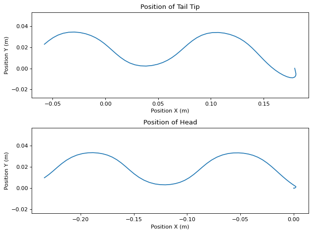

```python
%matplotlib inline
```


```python
#Set script to run optimization
run_fit = False
```

# Importing Libraries

Importing libraries for script


```python
import pynamics
from pynamics.frame import Frame
from pynamics.variable_types import Differentiable,Constant,Variable
from pynamics.system import System
from pynamics.body import Body
from pynamics.dyadic import Dyadic
from pynamics.output import Output,PointsOutput
from pynamics.output_points_3d import PointsOutput3D
from pynamics.constraint import AccelerationConstraint,KinematicConstraint
from pynamics.particle import Particle
import pynamics.integration
import numpy
import matplotlib.pyplot as plt
plt.ion()
from math import pi,sin
import sympy
from sympy import sqrt
import math
import logging
import scipy.optimize
import pynamics.integration
import pynamics.system
import numpy.random
import scipy.interpolate
import scipy.optimize
import cma
import pandas as pd
import idealab_tools.units
from matplotlib import animation, rc
from IPython.display import HTML


system = System()
pynamics.set_system(__name__,system)
```

# Constants of System

In this block of code we are defining all the constants of our system that we will use for our simulation


```python
#[0.0276 0.01]

#seg = segment, t = tail
seg_l = 0.0276
t_l = 0.01
seg_h = 0.01
len_factor = 5.5

#Set segment lengths
l = Constant(seg_l,'l',system) #Segment Length, Formula:seg_len
lT = Constant(seg_l,'tail',system) #Tail Length, Formula:tail_len
lP = Constant(seg_l*len_factor,'lP',system) #Constrained length, Forumla:seg_len*constrainted_length_factor

#Set masses, 666.7 is density of laminate structure
m = Constant(666.7*seg_l*seg_h*0.001,'m',system) #Segment Mass, Formula:666.7*seg_len*seg_h*seg_th
mT = Constant(666.7*t_l*seg_h*0.001,'mT',system) #Tail Mass, Formula:666.7*tail_len*seg_h*seg_th

b = Constant(2.148e-6,'b',system)
k = Constant(1.599e-4,'k',system)
rho = Constant(998,'rho',system)
area_p = Constant(seg_l*seg_h,'area_p',system) #area of flat plates
area_f = Constant(seg_h*0.001,'area_f',system) #area of flat plates

freq = Constant(1,'freq',system) #frequency of head oscilation
amp = Constant(40*pi/180,'amp',system) #maximum pitch angle of servo 

Ixx = Constant(1/12*(666.7*seg_l*seg_h*0.001)*(seg_h**2 + 0.001**2),'Ixx',system) #Formula: 1/12*666.7*seg_len*seg_h*seg_th*(seg_h**2 + seg_th**2
Iyy = Constant(1/12*(666.7*seg_l*seg_h*0.001)*(seg_h**2 + seg_l**2),'Iyy',system) #Formula: 1/12*(666.7*seg_len*seg_h*seg_th)*(seg_h**2 + seg_len**2)
Izz = Constant(1/12*(666.7*seg_l*seg_h*0.001)*(seg_l**2 + 0.001**2),'Izz',system) #Formula: 1/12*(666.7*seg_len*seg_h*seg_th)*(seg_len**2 + seg_th**2)
Ixx_T = Constant(1/12*(666.7*t_l*seg_h*0.001)*(seg_h*2 + 0.001**2),'Ixx_T',system) #Formula: 1/12*(666.7*tail_len*seg_h*seg_th)*(seg_h*2 + seg_th**2) 
Iyy_T = Constant(1/12*(666.7*t_l*seg_h*0.001)*(seg_h**2 + t_l**2),'Iyy_T',system) #Formula: 1/12*(666.7*tail_len*seg_h*seg_th)*(seg_h**2 + tail_len**2)
Izz_T = Constant(1/12*(666.7*t_l*seg_h*0.001)*(t_l**2 + 0.001**2),'Izz_T',system) #Formula: 1/12*(666.7*tail_len*seg_h*seg_th)*(tail_len**2 + seg_th**2)


```


```python
#Set integration tolerance
tol = 1e-12
```


```python
#Set simulation run time
fps = 30
tinitial = 0
tfinal = 2
tstep = 1/fps
t = numpy.r_[tinitial:tfinal:tstep]
```


```python
#Define derivatives of frames
qA,qA_d,qA_dd = Differentiable('qA',system)
qB,qB_d,qB_dd = Differentiable('qB',system)
qC,qC_d,qC_dd = Differentiable('qC',system)
qD,qD_d,qD_dd = Differentiable('qD',system)
qE,qE_d,qE_dd = Differentiable('qE',system)
qF,qF_d,qF_dd = Differentiable('qF',system)
qT,qT_d,qT_dd = Differentiable('qT',system)

x,x_d,x_dd = Differentiable('x',system)
y,y_d,y_dd = Differentiable('y',system)
```


```python
#set initial conditions
initialvalues = {}
initialvalues[qA]=40*pi/180
initialvalues[qA_d]=0*pi/180
initialvalues[qB]=20*pi/180
initialvalues[qB_d]=0*pi/180
initialvalues[qC]=10*pi/180
initialvalues[qC_d]=0*pi/180
initialvalues[qD]=0*pi/180
initialvalues[qD_d]=0*pi/180
initialvalues[qE]=-10*pi/180
initialvalues[qE_d]=0*pi/180
initialvalues[qF]=-40*pi/180
initialvalues[qF_d]=0*pi/180
initialvalues[qT]=0*pi/180
initialvalues[qT_d]=0*pi/180

initialvalues[x]=0*pi/180
initialvalues[x_d]=0*pi/180
initialvalues[y]=0*pi/180
initialvalues[y_d]=0*pi/180

statevariables = system.get_state_variables()
ini0 = [initialvalues[item] for item in statevariables]
```


```python
#Frames
N = Frame('N',system)
A = Frame('A',system)
B = Frame('B',system)
C = Frame('C',system)
D = Frame('D',system)
E = Frame('E',system)
F = Frame('F',system)
T = Frame('T',system)

system.set_newtonian(N)

A.rotate_fixed_axis(N,[0,0,1],qA,system)
B.rotate_fixed_axis(N,[0,0,1],qB,system)
C.rotate_fixed_axis(N,[0,0,1],qC,system)
D.rotate_fixed_axis(N,[0,0,1],qD,system)
E.rotate_fixed_axis(N,[0,0,1],qE,system)
F.rotate_fixed_axis(N,[0,0,1],qF,system)
T.rotate_fixed_axis(N,[0,0,1],qT,system)
```

# Defining Vectors

In this section of code we are defining all the position and center of mass vecotors. Additionally we are calculating angular velocity of each frame and the respective linear velocities at the center of mass. We also build each body of the system in this section.


```python
#Vectors

pNA=x*N.x + y*N.y + 0*N.z
pP = lP*N.x + pNA
   
pAB= pNA + l*A.x
pBC = pAB + l*B.x
pCD = pBC + l*C.x
pDE = pCD + l*D.x
pEF = pDE + l*E.x
pFT = pEF + l*F.x
pTtip = pFT + lT*T.x

#Center of Mass
pAcm=pNA+l/2*A.x
pBcm=pAB+l/2*B.x
pCcm=pBC+l/2*C.x
pDcm=pCD+l/2*D.x
pEcm=pDE+l/2*E.x
pFcm=pEF+l/2*F.x
pTcm=pFT+lT/2*T.x

#Angular Velocity
wNA = N.get_w_to(A)
wAB = A.get_w_to(B) 
wBC = B.get_w_to(C)
wCD = C.get_w_to(D) 
wDE = D.get_w_to(E)
wEF = E.get_w_to(F)
wFT = F.get_w_to(T)

#Velocities 
vA=pAcm.time_derivative()
vB=pBcm.time_derivative()
vC=pCcm.time_derivative()
vD=pDcm.time_derivative()
vE=pEcm.time_derivative()
vF=pFcm.time_derivative()
vTtip=pTtip.time_derivative()

#Interia and Bodys
IA = Dyadic.build(A,Ixx,Iyy,Izz)
IB = Dyadic.build(B,Ixx,Iyy,Izz)
IC = Dyadic.build(C,Ixx,Iyy,Izz)
ID = Dyadic.build(D,Ixx,Iyy,Izz)
IE = Dyadic.build(E,Ixx,Iyy,Izz)
IF = Dyadic.build(F,Ixx,Iyy,Izz)
IT = Dyadic.build(T,Ixx_T,Iyy_T,Izz_T)

BodyA = Body('BodyA',A,pAcm,m,IA,system)
BodyB = Body('BodyB',B,pBcm,m,IB,system)
BodyC = Body('BodyC',C,pCcm,m,IC,system)
BodyD = Body('BodyD',D,pDcm,m,ID,system)
BodyE = Body('BodyE',E,pEcm,m,IE,system)
BodyF = Body('BodyF',F,pFcm,m,IF,system)
BodyT = Body('BodyT',T,pTcm,mT,IT,system)
```

# Adding Forces

In this section of code we are adding the aerodynamic, spring, and damping forces in the system. The damping and spring values will be calculated experimentally.


```python
#Forces
#system.addforce(-torque*sympy.sin(freq*2*pi*system.t)*A.z,wNA) #setting motor parameter

#Aerodynamic Forces orthogonal to flat plates
f_aero_Ay = 998 * vA.length()*(vA.dot(A.y)) * area_p * A.y
f_aero_By = 998 * vB.length()*(vB.dot(B.y)) * area_p * B.y
f_aero_Cy = 998 * vC.length()*(vC.dot(C.y)) * area_p * C.y
f_aero_Dy = 998 * vD.length()*(vD.dot(D.y)) * area_p * D.y
f_aero_Ey = 998 * vE.length()*(vE.dot(E.y)) * area_p * E.y
f_aero_Fy = 998 * vF.length()*(vF.dot(F.y)) * area_p * F.y
f_aero_Ty = 998 * vTtip.length()*(vTtip.dot(T.y)) * area_p * T.y

system.addforce(-f_aero_Ay,vA)
system.addforce(-f_aero_By,vB)
system.addforce(-f_aero_Cy,vC)
system.addforce(-f_aero_Dy,vD)
system.addforce(-f_aero_Ey,vE)
system.addforce(-f_aero_Fy,vF)
system.addforce(-f_aero_Ty,vTtip)

#Aerodynamic Forces against front of device
f_aero_Ax = 998 * vA.length()*(vA.dot(A.x)) * area_f * A.x
system.addforce(-f_aero_Ax,vA)

#Damping Forces
system.addforce(-b*wAB,wAB)
system.addforce(-b*wBC,wBC)
system.addforce(-b*wCD,wCD)
system.addforce(-b*wDE,wDE)
system.addforce(-b*wEF,wEF)
system.addforce(-b*wFT,wFT)

#Spring Force (Torsion)
system.add_spring_force1(k,(qB-qA)*N.z,wAB)
system.add_spring_force1(k,(qC-qB)*N.z,wBC)
system.add_spring_force1(k,(qD-qC)*N.z,wCD) 
system.add_spring_force1(k,(qE-qD)*N.z,wDE)
system.add_spring_force1(k,(qF-qE)*N.z,wEF)
system.add_spring_force1(k,(qT-qF)*N.z,wFT)
```


    (<pynamics.force.Force at 0x2c14d30cd00>,
     <pynamics.spring.Spring at 0x2c14d30cc70>)


# Initial Condition

Solving for initial condition constraints and using scipy to solve for initial states and setting initial states to system initial states.


```python
#Constraints for initial condition

eq = []

eq.append(pFT-pP)
    
eq_scalar = []
eq_scalar.append(eq[0].dot(N.x))
eq_scalar.append(eq[0].dot(N.y))
```


```python
#Solve for Intial Conditions

qi = [qA,x,y]

qd = [qB,qC,qD,qE,qF,qT]

eq_scalar_c = [item.subs(system.constant_values) for item in eq_scalar]
defined = dict([(item,initialvalues[item]) for item in qi])
eq_scalar_c = [item.subs(defined) for item in eq_scalar_c]

error = (numpy.array(eq_scalar_c)**2).sum()

f = sympy.lambdify(qd,error)

def function(args):
    return f(*args)

guess = [initialvalues[item] for item in qd]

result = scipy.optimize.minimize(function,guess)
if result.fun>1e-3:
    raise(Exception("out of tolerance"))
    
ini = []
for item in system.get_state_variables():
    if item in qd:
        ini.append(result.x[qd.index(item)])
    else:
        ini.append(initialvalues[item])
```

# Setting Dynamic Constraints

Solving for dynamic constraints of system to run simulation.


```python
#Adding Dynamic Constraints

#Position of motor limits
pos = amp*sympy.cos(freq*2*pi*system.t)

eq = []

eq.append(pFT-pP)
eq.append(pos*N.z-qA*A.z)

eq_d = []
eq_d = [item.time_derivative() for item in eq]

eq_dd = []
eq_dd = [item.time_derivative() for item in eq_d]

eq_dd_scalar = []
eq_dd_scalar.append(eq_dd[0].dot(N.x))
eq_dd_scalar.append(eq_dd[0].dot(N.y))
eq_dd_scalar.append(eq_dd[1].dot(N.z))

system.add_constraint(AccelerationConstraint(eq_dd_scalar))
```

# Solving for Simulation

Code to run simulation and plot motion, states, and total energy in system.

For my optimization, the goal was to optimize the link surface area for our system. In order to accomplish this, the desired result of the system was the linear displacement of the system relative to the link length. Initially, I minimzed the total linear x distance. The issue with this is that as the link length increases, random movements that generate forward thrust. An example of this is, if the link length is 500mm, then the system moves 290mm. However, if the link length is the optimized value of 27.6mm, the system moves 234mm. These distances are very similar, but the relative size of the system is much smaller for the latter system. This means that the propulsion generated by the second system is much more substantial and additionally repeatable. It was for this reason that the 'perf' value that was optimized was the relative system displI was trying to maximize this value using a minimizing algorithm. 

Additionally, the method that was used for optimization was scipy.minimize. The reason that I decided to use this algorithm was that it generated the best results of the different oprimizations given by Scipy. I also added bounds to the system of a minimum value of 10mm and a maximum value of 70mm for both the height and length. The reason that these values were selected were the constraints of the material using and the laser cutter. 10mm would result in very small segmennts and would risk burning the jonts of segments and 70mm was the maximum dimensions supported by the laser cutter for the bed size that we would be using. Additionally, the material we were using for our prototype was fiberglass and we only had 2 sheets for all group members. This meant that our overall dxf files could only be 12 inches long. This is how the 70mm bound was generated. 


```python
#Solve model and plot angles

#Constraints and Plots

f,ma = system.getdynamics();

tol = 1e-12
points = [pNA,pAB,pBC,pCD,pDE,pEF,pFT,pTtip]

def run_sim(args):
    new_l = args[0] #Set to variables that optimizing
    new_h = args[1] #Set to variables that optimizing
    
    #updating constant values affected by changing optimized values
    new_lT = new_l
    new_lP = new_l*5.5
    new_m = 666.7*new_l*new_h*0.001
    new_mT = 666.7*new_l*new_h*0.001
    new_area_p = new_l*new_h
    new_area_f = new_h*0.001
    new_Ixx = 1/12*(666.7*new_l*new_h*0.001)*(new_h**2 + 0.001**2)
    new_Iyy = 1/12*(666.7*new_l*new_h*0.001)*(new_h**2 + new_l**2)
    new_Izz = 1/12*(666.7*new_l*new_h*0.001)*(new_l**2 + 0.001**2)
    new_Ixx_T = 1/12*(666.7*new_l*new_h*0.001)*(new_h*2 + 0.001**2)
    new_Iyy_T = 1/12*(666.7*new_l*new_h*0.001)*(new_h**2 + new_l**2)
    new_Izz_T = 1/12*(666.7*new_l*new_h*0.001)*(new_l**2 + 0.001**2)
    
    #Populate constants with new values
    constants = system.constant_values.copy()
    constants[l] = new_l
    constants[lT] = new_lT
    constants[lP] = new_lP
    constants[m] = new_m
    constants[mT] = new_mT
    constants[area_p] = new_area_p
    constants[area_f] = new_area_f
    constants[Ixx] = new_Ixx
    constants[Iyy] = new_Iyy
    constants[Izz] = new_Izz
    constants[Ixx_T] = new_Ixx_T
    constants[Iyy_T] = new_Iyy_T
    constants[Izz_T] = new_Izz_T
    
    states=pynamics.integration.integrate(func1,ini,t,rtol=tol,atol=tol,hmin=tol, args=({'constants':constants},))
    
    return states

def measured_perf(args):
    print(args)
    try:
        states = run_sim(args)
        linear_disp = abs(states[-1,7])/args[0] #linear displacement relative to segment length, in this case args[0] is seg_length
        perf = (1/linear_disp)**2
        return perf
    except scipy.linalg.LinAlgError:
        return 1000


pynamics.system.logger.setLevel(logging.ERROR)

if run_fit:

    func1 = system.state_space_post_invert(f,ma)
    
    guess = [0.0276,0.01] #Change depending on what factor you are optimizing 

    pynamics.system.logger.setLevel(logging.ERROR)
    
    sol = scipy.optimize.minimize(measured_perf,guess,bounds=[(0.01,0.07),(0.01,0.07)]) #Change bounds depending on optimization parameter
    result = sol.x
    print(result)
```

    2022-04-27 23:27:18,598 - pynamics.system - INFO - getting dynamic equations
    


```python
#Constraint Forces
if run_fit:
    states2 = run_sim(result)
    points_output = PointsOutput(points,system)
    y2 = points_output.calc(states2,t)

    fig = plt.figure()
    ax1 = plt.subplot(2,1,2)
    ax1.plot(t,states2[:,:7])
    ax1.legend(['qA','qB','qC','qD','qE','qF','qT'])
    ax1.set_title('State Positions')
    ax1.set_xlabel('Time (s)')
    ax1.set_ylabel('Position (mm)')

    ax2 = plt.subplot(2,1,1)
    ax2.plot(y2[:,0,0],y2[:,0,1])
    ax2.axis('equal')
    ax2.set_title('Position of Head')
    ax2.set_xlabel('Position X (m)')
    ax2.set_ylabel('Position Y (m)')

    fig.tight_layout()

    print(result)
    
else:
    
    func1,lambda1 = system.state_space_post_invert(f,ma,return_lambda = True)
    constants = system.constant_values.copy()
    states=pynamics.integration.integrate_odeint(func1,ini,t, args=({'constants':constants},))


    points_output = PointsOutput(points,system) 
    y = points_output.calc(states,t)

    fig = plt.figure(figsize=(8, 6), dpi=80)

    ax1 = plt.subplot(2,1,1)
    ax1.plot(y[:,7,0],y[:,7,1])
    ax1.axis('equal')
    ax1.set_title('Position of Tail Tip')
    ax1.set_xlabel('Position X (m)')
    ax1.set_ylabel('Position Y (m)')

    ax2 = plt.subplot(2,1,2)
    ax2.plot(y[:,0,0],y[:,0,1])
    ax2.axis('equal')
    ax2.set_title('Position of Head')
    ax2.set_xlabel('Position X (m)')
    ax2.set_ylabel('Position Y (m)')
    
    
    fig.tight_layout()
    
    lambda2 = numpy.array([lambda1(item1,item2,system.constant_values) for item1,item2 in zip(t,states)])
    plt.figure()
    plt.plot(t, lambda2)
    
    points_output = PointsOutput(points,system)
    y = points_output.calc(states,t)
    points_output.plot_time(20)
```

    2022-04-27 23:27:31,611 - pynamics.integration - INFO - beginning integration
    2022-04-27 23:28:15,539 - pynamics.integration - INFO - finished integration
    2022-04-27 23:28:15,597 - pynamics.output - INFO - calculating outputs
    2022-04-27 23:28:15,605 - pynamics.output - INFO - done calculating outputs
    2022-04-27 23:28:16,658 - pynamics.output - INFO - calculating outputs
    2022-04-27 23:28:16,666 - pynamics.output - INFO - done calculating outputs
    





```python
points_output.animate(fps = fps,movie_name = 'dynamics_free_swimming_opt_plate_area.mp4',lw=2,marker='o',color=(1,0,0,1),linestyle='-')
    
HTML(points_output.anim.to_html5_video())
```


<video width="432" height="288" controls autoplay loop>
  <source type="video/mp4" src="data:video/mp4;base64,AAAAHGZ0eXBNNFYgAAACAGlzb21pc28yYXZjMQAAAAhmcmVlAABSKW1kYXQAAAKgBgX//5zcRem9
5tlIt5Ys2CDZI+7veDI2NCAtIGNvcmUgMTU5IC0gSC4yNjQvTVBFRy00IEFWQyBjb2RlYyAtIENv
cHlsZWZ0IDIwMDMtMjAxOSAtIGh0dHA6Ly93d3cudmlkZW9sYW4ub3JnL3gyNjQuaHRtbCAtIG9w
dGlvbnM6IGNhYmFjPTEgcmVmPTMgZGVibG9jaz0xOjA6MCBhbmFseXNlPTB4MzoweDExMyBtZT1o
ZXggc3VibWU9NyBwc3k9MSBwc3lfcmQ9MS4wMDowLjAwIG1peGVkX3JlZj0xIG1lX3JhbmdlPTE2
IGNocm9tYV9tZT0xIHRyZWxsaXM9MSA4eDhkY3Q9MSBjcW09MCBkZWFkem9uZT0yMSwxMSBmYXN0
X3Bza2lwPTEgY2hyb21hX3FwX29mZnNldD0tMiB0aHJlYWRzPTkgbG9va2FoZWFkX3RocmVhZHM9
MSBzbGljZWRfdGhyZWFkcz0wIG5yPTAgZGVjaW1hdGU9MSBpbnRlcmxhY2VkPTAgYmx1cmF5X2Nv
bXBhdD0wIGNvbnN0cmFpbmVkX2ludHJhPTAgYmZyYW1lcz0zIGJfcHlyYW1pZD0yIGJfYWRhcHQ9
MSBiX2JpYXM9MCBkaXJlY3Q9MSB3ZWlnaHRiPTEgb3Blbl9nb3A9MCB3ZWlnaHRwPTIga2V5aW50
PTI1MCBrZXlpbnRfbWluPTI1IHNjZW5lY3V0PTQwIGludHJhX3JlZnJlc2g9MCByY19sb29rYWhl
YWQ9NDAgcmM9Y3JmIG1idHJlZT0xIGNyZj0yMy4wIHFjb21wPTAuNjAgcXBtaW49MCBxcG1heD02
OSBxcHN0ZXA9NCBpcF9yYXRpbz0xLjQwIGFxPTE6MS4wMACAAAAJ/2WIhAAz//727L4FNf2f0JcR
LMXaSnA+KqSAgHc0wAAAAwAAeB0oXug4SqvQwAAbcABvyyN9deM3+DxGfmAo24z6CmvqjPHjDiNR
cA9TG+RwBfFHV7qKVMYLusBwe0RD0JDzYkHM1uyxw9aBX1iCN8wrnK10KuJP4u8qdC2hlvgPxwkA
Ik24+zsfUdtfYK8NjkUdxoKfIbY0mJ9YdInmBx1g/TmJ+3cntd9P4dIqTHAQIKlFaEmVRgxqRyui
8EcRDRoWoh49a/Xt5ePvDaWzdaHRr0ldgPlcCGjJ+z5f7eyQ6XvwgD/cUMICBlB7GgjxTzr0LLq4
kgtifNJFz4jpWapVL1pMK/T5UYzJ9ZWMiVzqKt39dGuv9loR5J17mu0cUdFhfMpgnisLASZrD9Fh
yiBLof3mrtxdNpGFO1w8XQ9afHa8uYBH+tbnfOq8N+2A9cYFcfrnp74rferwHz2BcOO9kTqG/iFq
ULTF4oKLwlEoRqNOZTrirxp1YvOrv/1FFcFn4s38XiQoCMOlwcu7dcjnctA+HktjhbMMyH0H/nOU
3sB15RTTMEeueURD5UcWrjI3S3rB1kuJNmQB4XdFxei36UmcLyfDHRi3I1pMdjWUPe9eJREib7Lw
mWSO5Hm8MtwRSw7CjNBJD6rmm5XO7rgdSFc2Yw3h1IkYTqzMXBXAbx05jTOQLvEVubqecMhmEqUM
m6vo2XS9VZXKLYHqtjpgaD6gtOSrLW6dP5DDICNJKEQI2lPph1RNThtqmSvQJNSuRFfzcriH7eGL
x8Er4SZwSx9QxWT4W+ZdfgaRcDejE8inbzqpFtrwokDMwgbud0CqJDSXR4i0gXmto732lztMNdsI
1XF6JlylBnSK/TTDx6Rru4die155p/4hA8qvqPJIaLcW5jJTUStggBU/s38o6d8rRNQzfxIF1WSb
dckjqQHgtXd2qnK1XJZv6qlFjutvybX8ugJewFq4nLhUtEfwizITy3GHUVn99k34wc6vzAnLsXYD
MaRFkwg8fqM/16OjE3vJ9JCROSkYM/gdwuVnQvc+5wLyzlLVwNTpZN82kbIxgWonSyMX92NvC8Zh
r6Ttv6bWGGandJfxwE5Fxt8ElD7N/HBDkjSvmSUWbooiylPQwP8C1kgQZE4JihTbZSZBmiWjjOn0
bOxodWWtB9+b3f+FtTN7/ybcY9Ena8HDPsflQofRETCIjUzW910Tq3/j/2UqJXUdfQwvICmX0xof
eh1Vye5nC8fV5sIJOGgJ2JtBTqS/269fcn4E4ZZCLdUnnSFPY1wsg4V5nQBqIlaHNI6Alo9LX4F1
uwKx/zlCcfPI9YoOkUzq33WPhFID42F9OGAIpOFPbfjWJCgLOdsYgwi46Pz3P4A/QTOjZvvFQACk
qM+UUuRfArwxiHHk7JtudQ6kp55QdMDk50H+Zkw43e0Je3ZYHe9wlapirOrb1xMX2yHhdTNr/lj3
QV+ghbXvka12cKW5+KX6l082h5YWzCbf9eFf3VvVgXpPurEV5gnHAnp0mVm2s1CcfWYBbJ3QYTdN
zh3t2wrMrJMZJovOHiqUHvreC8AYowcnt2mZhJizXqSjSMXWXpAaQQ8nqXoolxXJoEn+zBWQwk1W
q5vODkO8xV1N7cMZBsHWyHkLn1syTqfiUWo/pK8gKTSGvHAYWB4MRQGjdLX9K5l/RWp6QgSt1y4j
VhNQqFIB2ox2ml/gXzBSfZWNkw3kN62Q8RX/V6rU6YIZiOCj5hiSNVtE+aPqh6TCc5SSuRKr+FYg
vEVmYVIi8RbKtKvijPfUH9Zmci5/hogsK5a7qxOCv44Z3uE9B8ARrjVuV1V5mNbpfypRuBjRRvAw
xyCchxYUwZ1O4EYWIxQBgSGH/2qhXW09Rx+TCZN4G3fVF+CEFb9gkcAh8LEdHCAhXz4ONKzLBSz1
efh0yUE5AsBW1V2z1REHzf/UnM0gpUYOj/HYD6WpsWFNvOS/Aas6KupgNbNloEM7sl3OZVvtP7VX
M81kTDAIlztxFjRmu0sgryzzqB/Ue8y4FdakMZoepJuryZsVUlXgtFCuVl05mT6NBjF974Tw7TIP
KvsdW0ApzY//Dg2f1MtVTLmyS2vAdG+gDyLALemMCqfTmf1JRRizD5Hr/82V3K8OF+aVilhdvJ3x
1apKAkuwJP5tQIi/Bzi0JLx/j8mE6sIhdp3E9em4RKzoHUlIBVryrPg4KPEtQn8XQyy3812aDFa5
7Dq2LvX4iOZRc0VQXrzLqbgB6SaPIc3JTH9p4w0QKeY+shlKtoyoM0K9NGgC+V3VJNiDj6MvpEo3
6lnhb1BBpM9Z7U6WT17Y0v2E1DxQ9kJQ2y1nnLi0eAfnWRxXmlIR/KF9tSSqYLJCJWrbt+ihpr61
jtFQ5bk3Zh7yijXsIX6uuNcznQsEWxhWihS/LJW0BmmaZXHyn53WT3Jeq/goq7SepBlVpHDjPa9m
M+Xe8rDXVEqycNcQ0zsC1Vh7dA5ouXRzgzyZ3F1rEq6HBd7D1Lro9fWms2HZOZf+zQ0q+QU9/QbK
gRH91asKjufY8y2TfzLgKLnmNYySBET5VZsi9rnDrpgNSO/Tkt4x9nWLLHfiI979McxM974PCOzt
S180bYGKNCHnkb4mC2zRIuR7vQYrj25X197/+LjhtUAWecV20pxn0uS+KP3BfeY1bs+n6LFK7Fyp
rc3SJ5b2Wj6DROxFSu9dFa++9xJwu4Di/u6b9giSZucmOd+bKz2codxiSXuizEdEUGYLtM+Cb8kW
TSTFrQHszly/wmkXRY/qpEslsgfi73ZsdrziNFG5SjvmJuK+5Z+rHpUw64NFBaUgWVIkGPiTJrsx
Kq9r/U17Uap777bMxEJNRchtIsF3bWCB3HsU/+WPbSOfyGuDao/o2H8X0cBaKDmujOAf2Y5kATuP
PRT7NJVl7LfbwSggR9ItdarwzZ+qdHswAWuBZrD+R6hD4Ihjzg9AQFS51VSO9OFV4v94NKy7k4wY
BdSkYFY8P3z+L4h2unpBlg/CPSIs9VbN8A1G04uA2BAG4iwRMQqPxHgoYWgCI3PfV9vA8eFFJwgO
fXpMx8aehPNyipfKw/TwjmxAnghjcSqazlCLTjsOfOxI9M3RFUna58JVrH+1IK/LUy4Dl3LR6Us9
QvbYapF9nq1au1EifTqeMxRIqQqGljLKE5qPNu+qwBwRFVHvlcZ5e4OETLZqCNKGDaX+soA3SV/W
C3zPfbEjzNfJWlhR7Ek3dOkUK7gFzyhCCPNHONJ28L83czGEF0mBMWZMsJrELttBrkoGIukKcuq7
emldmbRqH+LK/VmoSXzUbuiymv2phjHJzXm1n6O2KKPKBofTfifsyBp/iovlfKPxbjZMjjWRyl3r
prllX7Bfwv+oa2helokE5r8DU+bsRqgAGQAFsBiAAAAbMQAAAcJBmiFsQz/+nhAAJNx59YQh1WiE
ybSf3vgPUN6BkjO3GU30Kw20/HoTxoMHtGrLeg7CdbYTCPxOye5fRIHnLWK4iSVHDOYaFMg4Va6s
rf066wkDs8ne9PjFIQRQCB8umdEaZMz99kERzlT3bbSDYlyGsMr1gMLUFyvqJRT44WxE+RCHT4Bl
WcuNcEpCmSbb0BkPU3zkxeg8VWPjydJ813wxVbzo1RobMp6Tvf4uJBhutTyAoI4BmP42WYxEQj3U
MHIRLOmxz7WoTAyQNUrAywqGj9pbXd+dxkS7smTKGqTsZWZajuRUyvQaSBa7h4+hTprUhId2Jotd
a42VFz92u7j52Br338l8h7MMddHhdUe+f5bxgKqa4mkP8Rc7G2sQ5zzetfxpdHZdgvbRLc1REJ9u
ovU75AmEWLwxy4ARN4ajG0d+muRTfpri4jhaeTXVgtFVDeV4FyIs1Ej/wllbMScnlfdyRl5nOapW
klXHW82JID3CJ04rWEKWC4U+Dz2DXl5qAa/o5wfAU1hk4LaXJtFovDTuRdyUnVydKzemgt3nWrIn
lkHewdbWnOUvSyQrW4dROlMiR3WUxIqvJgRyP3e4Ag4AAAF5QZpCPCGTKYQz//6eEAAkpGBwAsPr
wSHBAzj1rZjXHJGdj5rrzbeE7U3hGocwoUuAXEoBJGr1Huv+Wx7tP73sMT7zL5pcIAHIt6M3KqwI
fN19h16PCnwgnrNx4c8PZhxbZpqiRHmOSnj66gt/Jcxbo4uFNM5T9RVuy/+geYwh/kzTNY4Np7rA
SoGMcuCYdpUqRM/WcAYoChrRoJ3gIT+8qZw8PzBnqGD0zZ/nGNcsGrCTE8koFtlOfAy4edU0L6XD
Je+1wkNylEWsiSPX5jy+Wq7Oz9Wyz8USMyzhWpaTLz1qEPaVHUG+O6boTAVlrrwUbqvscSstF0xj
SC2Ymoithpz4ne2RMYykUkCFyQfj3/vjkROZDErgfLiheIRz1KiVhOvfK8N7LpdJf+GlcXz/yy9I
5u5kjxJICe7DoTkGcKRUL41j/AFYVtry/DuOGnGhG5rTLmYWk3zMQupjR357cTInbwB4W9/QH8pR
iZUwujjs9H0828aEEPEAAAEgQZpjSeEPJlMCGf/+nhAAJqqhDQQeOQJgKkTephMxG+ZxYkp31m48
hetEtM7MJ+78MyqwpdfCuuTc5yAL6kHq9GYnvY4vtCwfEKiPk+NXLGTjGekOaOt4U0TPxqngLy5f
nyTJaZN8ME9OlpdAr2OT02aJb/OMSRpsJDN2qO5fi+yboXxEqiato8EFiTXNyiWEO0zZ0De2oFYh
BylR9Lnju9UFroupduos+rbTWHqy1YRRoa9IaKmv3YoBIHxg9bMa9Vc7Y2OZ6K1+W34DB+qOFBFs
eHFvXdRs4ZUA//1JGzH5vq9DOxpEPPlKtRdC3Cmkqq0mvVZqBMjrU/i9DgTg4c+xmQJlvSobxCYX
nnWxChPrdrykUUg10+dTR5hEtibcAAABgEGahUnhDyZTBRE8M//+nhAAON7HiZP0uMAF0GjaQPuy
nS4CDIbjSOyjlBn7s4uP2sMq/BwYsQAT3HRQX53a2IvS2jpvvsJBlNC8G450g2ZZDwACVcjp3SUZ
zXew1JiOfFGQ/aqGcG1trlhSPhT+bOkfAaw4N0eC4S1Njwqg0GKCj9jSSj+r5bzUePrkLtLM3tpg
sW1CszMP5wGBZWDHamCngSDc0hmUIgTiW4JG+nv0KQiOoB0aXvPVDONEfLp2F/yluGBPZIUC5XSh
vDR2nOMwqLTL0gzFwXz4jhkLn7SYG7Grx2fPRJDkvhNP0EWlwkBO7sfmvfb3M7KDYooDCsRKeDkm
HCDA2VLqbmaf3KenffunH/LT3jGEgAB1wg624xcuTnT+lNyYUe2XUmKQCxj2f9fBE1ZarLUSUqHQ
9bMmkPfVtH0JysaIiPx1hIZgKUPv7u/bKPJGEogo2cippvmw+sxfGY7k1/LFyyMETp5eKoElzQR8
TDXLXtTZ6txlQQAAAJABnqRqQn8ADzBOWmSh9/nj7zHf8oKSczC48JfLAUUQAJ2yX+2Dhug6EedS
BxMG37bR8M7ApxCF6UVSBtIGxX9yHWF1YqwWeTtXwhszaN7cvdCGTqtnj1aXYNcpW1zb0o5w0Dzo
hL3sIuR3yqA8E7b+yIT7ngD0Fhj1wAYyxRCJUBw4NyGpF5g173YVog1AHHEAAAFoQZqmSeEPJlMC
G//+p4QACWkTycAAfxPvvIdML74lc88YJuk8CTXCvK++DyOz1tV9wJCfuCk5NOwkfIE/4hJniLrE
m1xB/RwbfdeFsFFxEJMLLD0jR3THPhEIRzVu0GLe7RNWZVT4PkQe4WqtUkeEeTJFhaQBUJ5w8CyK
AYHmhQc5NwkiL1WZZGa+hgOXiG4cRHJw7hbJ64F3FplemSHPxhg0DwMysgjNKo6X8onzpn/b4nJ+
CzX5NqFnX/6gUdNMFHsMnB9/RSTpPxYnxzTIkuvW/hATAx6GPCtK43b+616BKJ8suE4aTiBqacTZ
1o5j0fbKpT+pHJbarlnSTk1bFQWGf5i73TsNHqoLfli9yOE0guifds8gl2RJKD1M7PxXHqFqZRWJ
iPkIvI8OXqF6QBlHEZNlMY4cN6495tBq7CK14aux9j8qUOu6ybGwuc2Yiz7KkfOGXT7IBqASivZz
3SItbtj3RiphAAABsUGayknhDyZTAhn//p4QACTSZisXZeqhfbgARBktFRDcj4Xg+EI/PqkoGj46
JS9+IsIy8n/OzxXPnGyrT0ygeIVZFYyvw34OjuaFi4i03M/C37InYJgTGdszVOiCkcssBTVnWTfA
ezAp+rFVyG+E9xibmCA4YAHCL2yUtbOQzlzAH9pNrN8vLTU96PZ/bjDIJDqVLyd5K3cnENsaxYkQ
vGG/K8OwAXZ3lr5RBdW3NpSh+hRpvQdJ6S+XQ2bJbn+D3I6U/ABD84Vtk5Db+vVBqRlVU+wmuUeI
SS/YchZ/VLTqgaDsamKzxw3Ylv+eAOV9n9AjK6cCAlaetHnUMGCsCF+yKIHiQ5FBv9eeyvLzBmij
XlWjcVna/MMishnxM1YHBwmkYiWBMqSIXfs3xoZTTULR8DHjSdWgvm5cNZGATWnm/vt+5X0PkKVm
oaYtgGNtMKzg3uuCknthtlu5rtp0LusvOegG5k/m1UTacJePML8zZVtS6x16jw1NROnK0QBA1KjH
ahZ9HnZPKVNtwUoxVlo9XDrquHhr//uZEDaEYiyvaizW+8U1y4bK6F+bnXDvnY8AAAElQZ7oRRE8
K/8AB4PbR5aABLJVHTS4uXFTx7YGFAXRfpQWg70WEpQCrBDVyw/gAbylTrZwG2H7wyC+W/dWJAcG
C3GBRcYtlMR9bGCrKAJhW1vKARgl4GAmKdkSLD/5Bfs3XVEiZibvelcHZA/jAhVh2GfXC8KNiHV2
fVs5hzLIJi+wh/4pzAWVIq4zDQ+EkmFKgwSfBMv0Z5HKZ/6ro3936jdKsxbGtgLGvr6/AS7mgYLe
us499+Y+XEH96Jzt0XJnMura/GeU3H/qsM3ByCHJDOgbfleORTDl0Ku0P+PUI7v9DCu/D95LSD/r
OmHN+oAiIJYRphhlbIp8dBSGayRRXHFmBuqU/KGrBa+np4XQz3bINK0dsWSheV7wZixXNlZYhqxo
44AAAACBAZ8HdEJ/AAnxmmN1EIYuYcgIMZG53osGw+1WGEfNqjGiC2ZCzWOlAASk8XDVN3tY3oiW
5IDPrAS4NQYJPB8pvK/+MI3YK0grZZVteDacDyu6MZhtH1vxUgXOftYq8cYH9+blmciohQsP6d0k
IdTR6/hzzAYwFgtETYZbyNWibn+AAAAAngGfCWpCfwAJ64Ut0wAJ28e+vDFU1uimuymQX58H6rwo
K4+K62KF/85XneFknd3Z2jZBom8aG4bZEEG6pvTtmfohBPqzA1byTFyuT9SZ+kM/H8nFNrQPf1PR
02lPMq/6tQAWIwRQMIQv6x4jl1jRlh/WyvSgMKbW2vAXnsfoTD8gldlQA+T9gNmTkUBAL9CcsCFN
WiKhIWtx9/MzcuS9AAABDUGbC0moQWiZTAhn//6eEAAjomo9AAdoYc/yZ4haPE7y9hvBc3GYG9nx
7lPBzXkvRmdq62xe+SnPDgj9SX4v+MssWOxx5nITzeRxZegEHiyhbjb44yHtVZ8Tm1iiY3HXG8Iq
LCnyS6uOnVqStYw9z3KapG/lVCXR6ruHtSLt91aFprFeUkKV1EgpcNUUF9VlYTpAmcZqS0cTgk06
iCea5NwaYODscBhN2tgMrU3q1bCqR1UbSQTmYOZgMEVNEbzsUz/FD6HgqiqSVTqGUnV45MqgnXlC
PGwzA+NSoMmfRlGyqS6mXlgNlBzPOVee6wE7efQQ33d7UpCYuykxyVfnwcyTkdTOMp3xrplCzAu4
AAABC0GbLUnhClJlMFESwv/+jLAAJQol8H3EEFmjABc9Vz092Fz5zgn0ipUxPRgQd0AI2EoeOpLz
zFg6GrIkIPSc+nAimg41YU5Ez1/jHIjfDWtMHp1xnkEi8WiMwYquj27Y4rFRGGn3MWLs3PCPenyy
WXhVHNRQYjWSmg8SjqlvnozQ14FegxqibNKpXGB4BBlGeXyFUK5SHwoCWMnXL1nIPF0Y0IBQSj3I
yPoD8DpBwRBygBxh23ntYSoGwvKsRtUhzw6BbVLsp+WfAzaXRxa1xoIxhBBlA+gMhWnbW5bzOK2q
li9Pi2J5HFsrcsEQIXX9ar+IxDTZkJ3qNx3O+QfeEzC62fVQ8j6ORLiu6AAAAJIBn0xqQn8ACfWD
tkUZ4TVwgAiBpR6+bDZZcj/D0zYJY/YVQdGpvbMW4EhML2WUDS+ft9rNbczj0PhMIK/H0+Qt4jXV
Y+yOx8VuQyzeKXl+5+TC6C1ycRUZ6AbBkVYyKOq5mpCSk791QXonSWHFhuXtP9zrduo/Jlsf5EXC
kCjTVYmnSzCcK821/euo/gDF4qnGDQAAAQFBm05J4Q6JlMCF//6MsAAlP+IxCYPYRfMuYe0hTF2e
s3POLIYyUMKCQqg/NI3W2/BxpCXA7bhQDRTqSnzoA/cioQYHx/VlORk2YR/yBAWNj7hEAYTUlrSb
6kvILaiH0Riujnybb+T142khqWU4Ui41oBKfwPJXC9ly2qNuuQEZCznMzZqgYcXFIOb1MYFsvfIF
4EF77OkZCtnSh8qut8BAJmALJPGtm/w/peOVfnTxwhEInQf4yhlQEHTYcwBzVzPW0/G0rkf8IIwW
+hdXnmX2jMPlleo4B3tyg5bGu92qPZkNs43cS+TwiUJM8OwVmRuyEnRPrGEQdn8+GGypQT+OmQAA
ATlBm29J4Q8mUwIZ//6eEAAqO+/rCDEwA3Xrh1wL174QRjuL1UaktXWu7S2eKITIltWgcod3LLBU
wiEXVqW4W7JNCM7oJoBsjP8XzUQQg3QFCsYK1tS539TlbEmJrHJrfEOnzCUqkV2DUYW22zOAfVcq
KPNWdosHE9/UZf8aPos0g9RFK7siaRqz/cfOwqI7ZVDTgPdq0Jlg+8PSLocENPYpLV2s3UhnElCo
Uv1oglM2Cmmk3SRnnR1we/+3YbihdcyPunGjJMMrSf0dRtJIhhfNy2uJM5mejJvA4EnAbGl4KmAd
ySyRZ+rFobEAAnrKBI0AYwIUw9/zWMU1AJIPrMc44LPhsYv89yotL16G1xkDy5H4M36Jzy90wLZ/
AoIF4T/EKu+98ta4D7votUuATAKfY4fbh5109XTBAAABSUGbkEnhDyZTAhn//p4QACsZI4rK28ti
nz8y2KrwMdDiipid8saeDbPht7T0EwJG7DCtBAmKLFU6S4IV9pd2gHbL8/Mj7uy9/7PX7qkdZtOf
MUICNvfYZ3kEclVJv7IE2k+UqzEwosPtmgZ+55J4W4iMmX/GlnG7UtdEZdxgTjhVeYN80aLeJtpr
MzBjwMFE1h05DsyiNoUl+iRSO1RFPiUgWK8XJK4e1yu9Kj8tOTP1vlVWlRNCuxS7b7Sd09u2sWpv
edTqZO+R4hfZGCQtic3ywdOtwDRsapa5BTHiuThoqxTzwIbSHeARRRZjizOR05NsvGaX8J4iQozR
/gKge23aBzVK5q1ObOeAMCheymBoR3V4ATjHC60wEUlZboYH8miJe1ILkca2Um+kOaZ6ZlY5WX6b
Qd2wlZLljM8ZSYOjCbVNqdBe827gAAABdkGbsknhDyZTBRE8L//+jLAAK3UoX2wAtw0oFsU/C9wr
7UvRZc29430qMmTGVzPFWFAWX6eoTz9YQP0bbZFl4CZcXetXNFyvcqOaOE+JWId1NAQBlaR55q6C
4oEtdQ1g55IZvt6XXZbdPutoDnf/qXEsSFc8rii8xpxXE9P8/Bdve/dOqlPyjYhlLXbufBsRFeJV
pSM/Di8JKee2Ko6NObaScC+k1mjyDOIAzTiTvea283pRfYNY3TmShvtpCojy1QPq5doKB+FxK6Bf
HWCWP+S0ROytPsnZt3/2SK31K67fhz6oXknfav9rrmu9NdxZfvj4R/1tOeQt0ga5eVYk9hBK8v2o
N7YOu4VmySVaURqw8t7KDE97Pwe3YwafPX9sDFuXdHAPKGvzte7bc0z58Uz+I5v4aC+XfQULecKb
NVieZhfOnKglrhfuW/89KqG/aZfa7BQ+9ouaqMEsLWjTnhQIPa1XzPXWQchiIUjtU+Z1P+/OpWiY
AAAAkwGf0WpCfwALoikWNfetZlyNjHEsAAbMEuxh6R4jnl7xUbySUcKDBx0rSvlXpRTRZf4ehcxb
2ybE0IqWqhRNmX0n72mnt9239bKRAC0ZcNsQcJ12qRMrkld1dq55qFJv7Y+R672ch0jqdvF/WrWc
xGgyO8htpX8t8wyS7UawlIEKVDNGk/lCgR9QpSzeJXooU4CXgQAAAQ1Bm9NJ4Q8mUwIX//6MsAAr
dPhw4YHLfLCQAfyGgqT+n67Daa9Hd9oyLmcc3NMfZjHwvZ3MlJvRp1Gk5OWLbyWGE3NN+hCrNiUZ
zvN/KmWgYHwZ8zVbLOez9xpEpArfg6/zJYtZ90cqd5/R+pMjP4iUTdo5mZfOw0w1u6WAIwg31/Dt
xJ1UTVentVx29uMcA0NTj2wXqzNrgOV74Xp0lp7IDVIYTv1sdlOpgQFtP1YrcB1US8PIKZ8wLHkh
Orn8SBjkl/BDcMMYrm4iu679EPKqcRMNrR3bWhSSib5a7h0IM1kLYAuVKXSQudlSTc7j7dO6YJeg
vCVUtlvghLVqcizzRsROvXxEnAZ6aRrswAAAAS9Bm/RJ4Q8mUwIX//6MsAAsy92tHOIHvEPvamIr
HoABdPxaLocdFP5cRJObWasvBYAxNfQuE2OEdsK8Vc8uBU3obpunCrpzBksINnOTIsTHibJwfVZk
jXhrQZRXiDZVqmILHlu/vot2GnR3kM9v+IRUKhMktFaaWhCK98NWyTaHqZO5BMsL0THMxYLOAoWr
KCbIBORZcL5aEedg06bDF6mlqsqYV8Bm/K2virwd5/SCXPGvwgyca7MatSixy4n3yxDyd5ZN+b2c
h+wd+nDx2knigx/5LFeANSA/Q4tIRMtBeN3ZybKNISR2p36qr4siTDorhoW9GeCel4JkpPxC5kKf
TSUQdUfznSx46oKv5uUBZHQS6BAHPFobwGo41RbFiEaBooM7ermfFZER3kaEtmAAAAEtQZoVSeEP
JlMCF//+jLAALJTscQhf+dSuiwAmgz5KNG5kow3e3hmoVxPipdLt1VOnEbQ+Soii6Bwzdznzkm7E
lQmKl2qyMAMEvtX9gXwHIn4mcSMI58PAjC0NJOG9YWyE2dBWkHO0xZMXHbSVuKDVr3dD7hZ7yykj
oy7ldYH8utqBpnR9F2/mufo8SWp8X76hfUeX2x/6iWCRAjSrW81uTjvCl2Q1T+355F4XgMDZI9Ne
KLAC0kPH43QYmMnh2meuI2uYqM6YpBqCSVvkbbtEuiaYQSPzT7I1PM+D8d+9OhFCXkhL0J14l6rF
FlgT+6IYRLUWve9FYaA9VSzKnCEteuWOD7s7cAZ9zNCJ4fWzpg2yqYjcuTXsIv8+m29ndqto4Ctw
jeV1wAlaS2hPwwAAATxBmjZJ4Q8mUwIX//6MsAAslNVcgAL26YyXjHn5Yg/tHVB4tm3qO2kuGnPt
o4nrmZOiQolu7ESA+88OrEn9F6XkqBloToOjWdin0GMgY+gWb9VLUtfNfhMf/135S7dIfT0JS2DG
3Sa3D8vnluNLNOrmKVt5I/K0xOwGESGgEESBlQfEtEvVKMExYI/gyldoVEEr1TPftFF1OrAo+irq
kf1ipm42Jy2rG7KOMJXKdlutjCmU43AEPS7AWb7t5Nmkvx0/cXtwjWYnnoRy0yLvZMVNyOjm0lg4
MhDNidpMYWd48QU+OV8JL+xgM8PveDb7B099I5sTag+a6nfeDa/ONkTZpXdqSu3tJiMH20mMEDf1
deVgooFa2Ad2lj0u31mqb7CzEkM8UYYWC+yrI3Y2T/0L75+MtFH0T9CbT/D4AAABJ0GaV0nhDyZT
Ahf//oywACysLdSeAB+42CjcLn63IBAW/EIQDrWENc0bxa5uEsM0yu8X/w27r3EC2Ti6kUbHL7oA
OOWCveK49hgWKpxYxF8oXnGSZdqO12zeBexiUuG+jIcXr5hGXcVwyNed1OU2RBNsjHC+/sNsZzXZ
5mHelXFXkmMolIPYCK0K+XNJXDsLEjjLuPP8xhzyb9fV9FACZQsX6xWeXtcVb+erTVp6CkJ8zmW9
InAilfa7/NHtvFLlxVfEu9Uc62e90lVgUHyvimLs91jnm77o2WSHptBPQAmUSo32TedmuQqDRytY
9YJzQYbSJROvfRNnbxZQEixGD3ixWChsiHTdUu14pkwxI4rxLB6zSAcNdkfFgX01h2kIzc1rPs6u
8VkAAAEoQZp4SeEPJlMCF//+jLAALLuxLnxWcWMgAlq1Wh55WO4MidIOZLCHv0S292cV1vYQUMXo
7ENQb1ZdpZgIiPIp++/07RIybQYrNd1MTGRw3X8ZLjCo9bXkkjorb62RZlr7acpufrG9HCupVgQZ
HGNAC5bjl2poqGl3eH2yUSayp9Jy3Pd0OYy630ax3wxc2yKu48Kj5Nhta1xWYOsXlovxUcqHLT9g
WiGnyWz/tpWGNxEYuuaACgJPnJKloC8QLX58tgMaTtSBpvAY5Bxu9Csp0dYcGlqXSrFNRsefClny
Bwlp9xeeOTM5q+WvYk/hILfiFumJiKBi13jTvwBKZERqEG2xHJQwlK0ZoWtJQyJPFLdiXPYX+D/5
XrmAKPJe98yUo1UQyQ/rYEEAAADuQZqZSeEPJlMCF//+jLAALbVNsuLnvOmba5MZUkrFhS2Sd1Kg
BNSxSzZHzXxW/wOX//vMQGrztg96FM12wNAqQMARfZL7QAnM6Ds1aP33MAFcdqUYE5xYtz4Cv8Rt
m+a5JVP29nhGhxb+d4GK/FPwYTxdl3a8XVY1czBb7zFrz3peNumoPGSSNpiQn5QYlefoa+Vw3vvZ
uS1tDQjUsER12vmhp+iiTrLYAvTMvh9CREn+CVTrZdaqbw7nearaIIKkGASGLfMSk9VdJaI08SEF
R381c98Xst7W8z0H3zK1BjSko8f6s1pSG4xpsv1n3AAAASlBmrpJ4Q8mUwIX//6MsAAsoWGmYMAH
GWhtbUs2gCK4/FFMmd1t1scIl+pgdi6CqfArLfcL8+ayWVB0St/UvfUZ18sCeIcNhfp1inrz+LN1
yx7hRi9Pcw5HCNdxaGw4JR3jb8OejMxHvKaPekviitF3944/ZGal1vocvKzHtk5qJLmHzqXC/7Pj
vD4ac4xTBCJAUMum8cXzEIQ2XZzBZcPnJ42d4QuV0/lOeD7tilg8zp8OxkrmfIjh4LnzxBdD06Z2
D3/lsYfBY3wjaZwQkeaWoDzB0zgzACR8mksLYjCrvbwxHrMk0SBgwhqynIOkplRW7GbdY6nwRqYW
Dp4H6kFX7CtT5IaxTxyMUnt3FGOLVvYWGG0WOC1U6KFhWphTvJe3aWzIoCtGlqUAAAGIQZrbSeEP
JlMCF//+jLAALI3CfeUIuAEKdU70IfMxExlATvJi2ppXEhjto8gYgCHwP6CW7sS5dKDnqFIin3gb
ksYDe8IuvgHWAVJ09HlTAweKarjDkskCyq7ZBNOm61UgdMNyuOgaMIaTLkhgO/9guUqM6RLLH+36
2rE83+JgTYOWoAKRPoZp2Olwr+nuCI8tKw6I2GGtmbbYKbCCgO9lhxCvJA84DyXVn4yeJYexORC1
8FyQ4SvoCOsSxXFUI5YdjkRWerz83HzstGcC1kxWg7RlV/28KDx6VurZAk/Ru/PDjIPNCKC1pdYk
IX62m6DKJUoya7lV/tex/jjKcbnEajyd11phkZ4anahAmRfZeafcqXJBDJSDuI9L6vtaVSDh4WiT
XfPhD3lV97RvSimmmBaInMc3r8figwmPLHweGb2SNRXie0KaaSXNaMnLzqsCyzU9agp8ufTTfm1F
YWQWkjj/XGyaXR5hjnssFY+JHbP+v7GMZQNNK468RM7w6Ax2pp1AGtamGNwAAAFdQZr8SeEPJlMC
F//+jLAALLXvO/WAD9UIMiNNr4CY9X+TvFxla2UIcnjDXY/xqkjv0pvwHmK78TdZe61fmCyLSq3B
dl/nEVkrhr0+28Zk/1EHZ4GQ4/Ps5JCFjtV2p7/gkAXox7pBe1Q/HdPOBIQK6qMFvIDYNI0zUySv
3PxXup+PMJgCaANRVWh5P9WwSxl9rSB0yiWKg+D1RQpQoyaswheKUNDzp1DL6U0HEVMBaBdvOLYl
UUcfWmMiLoedm1iTNDZCusnvGWugrO05QNMplWYwHmCw8/GyIht2olX783CWoXxQiiVeEU3dSW2n
rajLElq7LsAA5ZLHIbDLRvfKe1ptEQixd+zS+O+NsiaPUcf/6rULba1NPYq35+yHSkOdYodWtrox
oaE2TOYGNBuCBGbObHO6xRiBDGS56xLepe7x3IdQrvO++LA/3C5+vQcrx2KQXiXmHq8tmhibQQAA
AVJBmx1J4Q8mUwIX//6MsAAsoWJix/lwCAFuGFsNtHHMBUWS9jGD3nc+aTgXgIUMH/FYO60TA/TS
jL7Dbem68LfR3VC3XJ8i4GQlruvu8ZwNv7gNVCaNDPDIF27nOtF0Hab9gQ0pbBnYhiaU38nzSYsY
xCpKyE/+t9vwXZTFEojp32t4HvjmAMh84lPYdl9cpGolbkmituZxllMks8wGIL1vMIRJ6JYie0RA
+vuqPQhj/z2Kz0C5d6cYFyPBvineedMvcFMp1ckV2VvBSZdplUf3BpwvO0aWOIRrQRxmbfAEXb2c
ZAi4x708grjbBMXXi0omxdkG4H5LzFGRg9lxxlKUXPaeQ/tLRlfsZ0c7J+tLWvMtUyOFafRSv+jz
uBHofN3Ii3/qVFbWjPpAYQDBRJh0bwvHj/ZQFEKnxnphfcunpucw4YwPLSE9ZY7xciq3vtaBgQAA
AP5Bmz5J4Q8mUwIX//6MsAArdPizALD7jl1Q3TXW7ZsSFwgKnvcHQA0Y6/ibDed44RRCz63jiqQb
uhg7WjIQyE06UWaRpcRPeJB2wH8zaE3NAQp7W5e9XelVkN05B6iVdQRGnkOn19NjS6X+lrvl4L5S
TQGOLatH8p7++CbPvLNojA1tz1CAAJBvoQnxGXHZhwmA6QKmhSG771F3ASpHsk/ZFqFnseuCynEU
VvNi21GB2SToqBPR5fGUWy3KfqUb5BBBNxuNtlf7/OTMGDjZ6LOCEWHpFwxH0soAmkOzrK83HoWy
LcpGuzZOpmlgSVuebTRa72JQ4ftq+5U8Ka0JpAAAARVBm19J4Q8mUwIX//6MsAArdPiy6osT8oJC
JDMADu33RfPwDLcmLiV5+96t8sAnHwaPhWwrwuVi6ZizufrTYvJUlnqAnnAXUv1DrLjvR89j05T7
AWB8gwr8IDkgrulRPrlx8wAZhhpDPYkJUBsRHxNMya7VrlxjAQNbR5ehNVMOyEV/IjB7EEW5M51K
YwYM0y8VhWSFsMijGNy7H/uqQTrbcTZEmye/pjuTX7Uz+Tl4Xy/Rfp5Xe2B4ccq+EeM5ueeHCG3g
v8xp1xvVK7ad0n7BZiJSDJrT+2UPSw4fG4uyDCYEpPkN3QoJDeHnXmTvG4+ZkWWE71HMoPYyrlYK
eA5cnzIs6zDZbetjePFsc4MDCUbHhzZgAAABAUGbYEnhDyZTAhf//oywACyU+IU8NoACdBX8V2Kc
ccFCTQVyzbnpxRhUBGU1PV/xl82BZRRsWT0Zd1hleSe3Son50JnGwdXaZSX+L3TCUsdCKp08Yqr9
FEoV1NbG8W/zkX53vgB/ZgMH2e2vRTbECYkEBQ+Gijp5fbXBasoEEX5eSQpr3w1CuA7SL7J5JIaO
8PXhTIcPvu0Mi5hIQjvUpJZymtYIqlVscuQCHknywV6UerrRx3l0Xhy6VUwb95ff+eSDW2j7C3cF
HT/LynQ3D5lLlUCt1JC3huX7FyBqL96JivwR80/+3txbfWGo+GUx16WJERnUlHhP5p5/t/ScU9BB
AAABREGbgUnhDyZTAhf//oywACyedYfuAEKekDz/9N8f6wK0d5Zbz1ZFmqI2fWowrscSpF6j5Tsf
GLuZjvdp1IZDizooo8pq6r1959hHPSvmfkrrBfe7DQKi76uyd/pKdZuW2xzZMHhE9oRRnNPH9M36
pzlWhc1phANOvYwUGXpbsmc/69OyzdNqHsj4t3GcoIaRl12trO4td8JiLuHJ2YEHrx/G6dyrdKWP
X9VlcNKajRpN9Exava77Ti9ldlyhnmbofHy74zXu6+ij6PGPWPGa6cS0+bdpS22iQmji7529Q53A
ddR6M81H8peSQFriLYtSXtAseTGtxE2hcHOnWWQE3Gd7dZ6tfB7BMDHpjaFkL+pu55pT8k392BU1
N2tRMjmhEtyBQcOx/AGJ36QNEN3laI2v2YXP7Ojf1CKqDsrwLmNYL0YncAAAATRBm6JJ4Q8mUwIX
//6MsAAsobhcACH6JyOWerGHwsdD5C+KR/cNLutrc9iUrwVhQiA0k4ynAwPcwLflMymRLH1f+OWL
YeFptfQ9B8sCUzEghWU8L37YP00oOxiZhTV/Lly1U2P8F37p+NIpDpkxuS6Spor3XEXtjolYz2U6
kKWXaFtpeC0GuKE9K+UrlUUnsHmeizOz2KiiMPh+yqMM9aztV0Dh8B/TxOnOItIYjrdH1retjons
jWSAyBgnzCAi9HfXnXNllwHjc/IeJtJdUOuvWKREHzMoZkuccBQFMuahFdnRd64hKWg/SHTQP7mE
QGag9OQH0FvgzNOfX01zvAGLWgI7zYTRR7d4R97bA2GnRr0yaBJ5sOlwyRBFw4H4BFGKkZu02VmC
5IE2GHDUp1wVPZ1KtwAAATJBm8NJ4Q8mUwIX//6MsAAsy9xNogDM5LaGKZsmMM/Rgsq9N3CaSZuT
tB+GT67ADLn4ZN/MF3YH0ahI/6Ke8KI26nwkXjxnHetK6eXJmLWgdPLvKUdhsHNXzZf9fL4Qu4qO
myarj0dXnr/ILOM2UOHmbUGapFI74DBt9sAUsKI1WpS16s72fArEEpmUyBA9trXMayIxBEEz6zQb
9aKgJqqTgIAk9YhI/QQGZXP/SGw8HgYJ2ytWx/2oM+QM/0Zle2g0T37RsVhaLQ0H/QFogDrfGNtb
0+Et0/muSHbTeu8qiIzkeYj+P6+/16P998cRKRyFJr/84gSKf0j3zqR/6S2zwvDQR2Lv3oKwIN7X
nQlFR6TIqIJiViJhbaTQdsEZZTqkCe7A3a1PELrMO2fwce6hxLYAAAD2QZvkSeEPJlMCF//+jLAA
LM5efOquxdABfXPcQnecfTiQZSznUG63jyTbQuXpY3V1JE8vs19+l2U2LglMO+buen9Ia2DSlNcu
9nOPJ7Se79Oq18tHwtB7d4mUvbOEzvL/5NArcKy7FBSXKkjhWYG/3ZKwuA2Hhc2D2VpapbHu3FZ8
PtQMsByaHvyRgAXKSWgL/MTTVCamSrrSMc8+vq4AIG3yqvL5AWW+Dvc3nBM2iT47OEOtrUggwb2t
whipvKYYoAnN6SXMEmzHKx4csoGjy4IRvNwDjaaUTS7/2xL12BEftVzcI7GP1QpXDsuDZ9N/G8XR
9krbAAABMkGaBUnhDyZTAhf//oywACyVfC0FhCIAL46WzNv/1gjtbOnGARkBNkZSbzBdqhBcEhT+
3gzh3Xds13z0HDVSuaBxiaglgci5EnQp4ynbxbk/HY/2Y3mieUrdfuX9F33w1NGKBn05AD2smUPQ
vUIoYMGbulYiy3qAwVVRRf3yQx2KcnQr6bB0pPPjOwkDg2BZ9MsRpijgSPziJ1XAMC9eGjPS82E7
fh6uG+iwsbQgi7RYlBn3zG9lrjmCKQoGpOuX9GLoRY83EKrlQE9ir7g5jaZe6S3W3aGBllrPvmHW
jILQegQhuqbUPmRp+9VSZvp/sKHUfTQy+RmeB6e6JfPHF3A/C5q07o4KAU3COTpyxNEutLKICvR2
S1OS60Dgbxm3boGsskMkSCcoWjy6Olp9UpzqgQAAAVpBmiZJ4Q8mUwIX//6MsAAstezHVgA2gwQQ
rTEXf9yMn9YJ1GJD4iWyVnpgLz6RCGizkwJfsWPC/cdQ17X/NN3rovg7vlbtOhT89mskA4mgnxSM
1jFBYgmHioe0yzjKojcWnpvBBL4F7si48wKK9eUZwAiXqSMNIXYGEED5LXkp2s56ANCj2T5jgIB2
QWOlCGhumtrTgbxBtlzmQfPZzIaiudCeeZFx4z2MrRo1tqEoqfIAKf8Gg4S/O/NmIPJbXGAlhaP5
JwUmqQlkC2uvTgq91+Zwpwz5uOPd67/KNNSqBK+BOsKgi3NlsecZvP0sIW+kQyuql0elI0KaG+W0
KkpWV0L237idA8SvUZJKR4ax40R4Dzioxn760sj++VTmKbHJfzQXRYYMpF6777HwuQax3Sg2xgAi
Up1Yabi2HpkFSzeaCBzc//lN9YtUL1JaEuWHVrqZnVEupVJvAAABMkGaR0nhDyZTAhf//oywACyU
1X2wAhLFG4MBaiWws2bhTwxwa8vFrxf6g3TGW49ITSV7WnN4Y9kwMKt9WtKLtNhAreOpdeMlJVQ/
+bR3fgGMY9nLwdibBDOWhZdYVX9RdCzff4djn3cH37/kF82w+EG7oWSCoyjiAQOtojD9JfkMADBz
MlVk7Kzz0ufTmpQAkD2NacCf82jKZ871J2h/HjYL3TQTx8JtroRGf5qstjhPnwKx9XEGPZBRHYqZ
dyeTQKLAGDBkWUJNk7L122k8R/BHDRp0QeRZGw8p6otiypdp1VUMUeHuDVHgXHeQHes7sZ5ElTrN
W3bHs2ckTGcVGFbzX5ge22+DwqYKMgqeB1i/DYWduDJTyqk4k8HaotS9qUI5S8OkLQf1GN90tygI
pNVeQQAAAWBBmmhJ4Q8mUwIX//6MsAAsnoXZ7AWPIAH7qoEosV4GoPhkeyFAiaiTR3S7qGGlkSbp
sdVM2AZLhW1+FYx8s8fNC/97VL0whiz1aoiM3YjSKzoBdmYcHXbOBnRgsYg2qNoZlaqSJM91HE0+
s9JcRXZXDBeIJYv9q27TeCxShAizilzLhrx1Deozhq0+buBAWyuC8Fv0bO/k4GP1yzCJwRig9cAy
qSay6F19YjHmV7AwzyIamKKv0NEwS+Kb4Gi2pmwpHK3oHiGjK955g/OqjUeSrdCO4zdPzImDepM/
tF/6PiMlx++py+worG4ODyQj4TxrsiJonqYx4PWn1jXANRIo3kjvvlm6fTYpNgYeXV0r4812aUQL
Mna4zTAWNSrYimuGyOQ5s2x47P5gK/bAkzm+8L/wZ03+rWKTA9OGlKYFjr3j1Q782mGXFVac0gcS
LXZkNhVJwu7ZyzMp1YSUplruAAABOEGaiUnhDyZTAhn//p4QACsrGbqXIAOb/CAu5pShd2dZhb4G
vT4b/jhJk6PsPlLNydXLwIbhGipW9PbkjEo2bReE0wgnmUE9uS99OPdt6g7SeY1JDhL3lwgW81+V
bPt5f06fSqXb3z/i0udQDrkjkaGd/wXsADhZ14U10ERLZ+N1lWmbYZC/mP4ZXXpsX1iUJ8G0f/7H
QYAdb9bNRXgPDDmh5xZc9YMs8jegMZMiVgs9Yaphl4MiA+2CDtXUYXIrq3wK0j1hjxQj7nJpML8a
Rm3VJdRF6Xe1KiQGXu7btVEuTAZRSkZdPeryxYPMvlYGnwyGNb1adhpRaMDui9IDFAFcHNNAvqtJ
ZU/OW/4aK/JaoOmB1hEAJeBNoMI5IiBjyJlypVhZxiXhcDKopy0KyQPvvG5Xig0ygAAAAVlBmqpJ
4Q8mUwIZ//6eEAArFXydwAGiGoE4Zcvnzl7NdH/y8FZ2UBX9skexOzQXrhtmDlH2/DOIrz/7Dhb6
ZAj4gcvz2EpSnQjj46Hf2p+dIcUw4mZXMzsCxyk2Mo41USkWktky9eH//4p6RwT+obuce2nsWfTJ
0bj9PT6ri+rSj85CCTe/U5CRx1k7yP7FsoHnkTECA6CIOYKN1xhBXI0WCUNjLLkhzIS/UBP9JEhq
VSfz0TfEMZuezygaNkCzKhOlWVPFMvZHsJmrtE8nEK58OLwtdHkWTaaYJeh5xdFRYlJhnRZBXk5a
TIQL6bpErqk1HfUc/3uX/CUy5QnhR+27bXE0FQDsxvWtVZCRWmaAHKCx6kKLL8T1Jpt8kYWnd0Rt
I60USDezzSiJgJDq3JbFsrYFLvkuEFYN3SjMIjRmDaTYuchIlXzESM8p/A2PafK1+dl0kapl3cEA
AAFiQZrMSeEPJlMFETwv//6MsAArgV6jyQAXUfMaOWugLhYVJVxPqj5zBzMkCiWNHAxJeNQfxMVY
dXrDqNbG3yI732TrOCgKP8M+eOiAM9o4tkTHsx/B7PLXyLfgk4oDkHkct6eANcqSsx6VqQlH+FF7
afD3dy3v7x0Qbsk991PPmI8FgguEW7JdxHI4fGiNtcR51F1dYVSTGEoqLQnAed40v1YKXQ5xhGtS
3wwND0wRul4j4pFeWtJg2nsC2siODyiJ8r2Wfxmyu3Yhe3kJRAN9VJsn5CCmdETpmi38BF0JI5bq
eZQsYN0ETYCyAP2eEQl7UlZdSdl/ak423QJxLkUz1BLUhGIGFcT+NsU+mgH9P9l1Ttc8HdLio6x/
eTDlMf9u8tg/xjSxI++oqtTnLxJGop0VY29b73b2GHJqirb3pXzKbMJO7m2DIFhbNAsyAlplDaR4
oP2rIWLr+YtqgwrAindwAAAApwGe62pCfwAL8y04mxYCRQATrNIU130nKRELA33sb4iOZ9KJdnJm
MdXbHfFZQilSzI2ve4R785/0VdQdvRjvrrUsQR8cYsUGCZE2JBnufPo76bzJrdnTOB7SCKsG8diZ
AcFDf6BVZFX5u+cmGPCiXGAJNR+nbtGiXK9j2tHDw1TjUW0ejFxykwCMUZSkodOH3ru/U+T4QrhA
5ssHlYT55Yx83xxDQCqgAAABLkGa7UnhDyZTAhf//oywADQe+dDodeb58Ohpk9vhlj26ZMsnvXL/
hPwcDAPupXY23I0VbblDw58p1FnhvQs+aRQ1e59YPMKgLFa/nmuIiasOcHOYbxA8yjaGeFs9WZp0
JSVz7IVCO3Zmz+ExKo7aHpTLg+ShIEfFFY8tbayBLWXpsf0Ww766mOrrr16ef9o8sueYjdV5XT2r
j+knbHkdwa+CCVoBWb55VkZZRmF10AoZsyLE3qkpgsHIoWG33lW52JsDmstE9HIX1g+OY60ovkdl
FLWZ9QVfVkl5vJzvBx3IPRnAszOGRSGO1RVQAO7J2/gcXwKiamfqdaVhkmjZkyGr+rOPmftKLJFl
NvXhHxGUhQJQxG9Pkox4CkoFwPtX8UulTvBghUpwADIGnqxZAAABIEGbDknhDyZTAhf//oywADKg
GzpP4AHG9EL3SMbMsj4GZqpkpRXbNCJAWoF4zrpWF2EY5H6wXbytOVwD7/qjKaM18+Sjh7oKD1Nf
f9ocbG1zgtnR9+2CGuHReupFL6A4MQ5AKPL0tMUqYPf1qhZ1BMahYcgW1AGrqanhBsz6v3Guuye4
uWGY1rQUyaWXS3NiRMLqGRrMcKvxoZ0EON0RGeUkiTVPfpZjBbnvba7vZmgErQjAnAU6qdyifFWN
bn2C84H9sUDLSf718dvBqqW8WnR57a5K0YYg6QkB4PeOjFPL438jera1RY4cASFSMxj4oJZkCg7t
9RnSqvbRyc1wJwlfqpmH9K78pbcM0na67kRWxR1LZEZAPHt7XN9Mb3+sWQAAAThBmy9J4Q8mUwIX
//6MsAAzzu2wBzD1vgBfGrJnaE/nnsj/2iux4XT2D7pI75Q4ntCHxnDkhQ3ladcXYC/rBaP1bBC8
b5XnzsXqbY/rwwCm9IN/84ei/GIPMpLIzZEC10DDIbVHy0zpacBaZ4U6j4nxU0U/B8dStpnlgPfL
7Pu8BaVsBM++N3znlkgx06/MivUOOIjRDFAIvOS7I5jptIa/0v/PymFHJnA67zp2NW+dWF1yGcQ0
JN9fNBBifWcm/Ye0e/TRCcMeXsNHVfXTDl/H7W5N8gDHk4nBsDL1A4dfrnT9ANfkacjdilU0wCW7
d1AoyvTmh+zcHUBJAQbphL1xnnNk3NXFAai700/D30jq4ej2mD5CeJE08wth+PKou8HEp53fh4iZ
DD6v8kBmDSgLZfE/5dBFW0EAAAEmQZtQSeEPJlMCF//+jLAAM+Jy0ngAtdDcrPlYYoXdTfbLWmt6
fLRT5xbaLg40oISMav2Qgqe6dS49ke25fRBydND8zv4xsX9XzgOoHOeE+kWW0PAv9jyNXH7iEx2Q
TaA7/z+npTl9TfoJT9Qf5cN1UjewP3Cm0fBSdFQchGyYHi3O9G6OAktZFKL4odKw1zjynvke2iXq
X/3JzJFC81qy5b1RQi2J0aqq9924DLu0SI0HIG2/HyrZTdbybGK1bg77lyrwt4WTNc2MP19Gmyah
kiJxIKHE7MyiH4eCfL6OGuRrk6N1rvNC6Liz7WqKZpPYc5DBL5q+kX2WR44UgLUuQWNRdMMWZ7Cp
iPzhYQPbOWZMVScmHCba5Qv+Mp7EeCWP+88GSeXAAAABT0GbcUnhDyZTAhf//oywADPid5a5CVdj
+ljA3cARHYBAgwQTdubp5phqzhapb/Phjk7buVdnlGFa8EuPZstJmcIHLcFcoGXZk1PQ8kbBWZ5h
GRWHH8v2H53DRoHKRs/VpMIEVmn0Vl+pfeTVlo9e77FTSt01RCptHQipv8Q1auBVfZlEUtYnvQ34
QiF7+gpzL5UWN6Ax6nKoAZGRwrKPz51J57GpIwdcEX+dXF54fWPAWPsupcYc8MN1mOdRPOhGlLmF
9Tc2EAg6c+KJRk1XUF10YMtTEqfLWuOgrN6v5/NexnfQkvk/aYv/ntouPmEIjsjQugLTGcNikLIP
JYLzKXsVtKYoMjheg3X6udTfhPKuSV0O2EFUJHEDsApZBETX2454uO5fSEHF/GWkG5SeC9EC8dq6
DWiLQY5NR10qaDqbXPkxTkNLtiViNUypBEtgAAABAUGbkknhDyZTAhf//oywADPAzpTDbKq2m+gB
LEsdxdHU1Cs+2NACM+w45SvujRPA07i+7Cz//SO/+QKr5fgK9bFdyHifU6/B38XuC6CtHzEZ/4FD
7REChxUo1DcdlB4XBwPoJuISjaot0RNzNlLmEe1lqzXffCtOc4wT2F483Cv4KceUFGYaQAD6H6u1
QfR9rDvGsEP13ibXzWhOZPr+hSMt/llOZr8V8eVeHCKd2XsFWsE27GYyv5KgSK1MucmaUEHoLtFM
Nthlkn5SsAZlvCIfgEdv57ityCq/B97ZsgEUwGARi8r3zpsSpGfrA4flL3GDbyL45hLwS7aIpOJ5
CeDBAAABOEGbs0nhDyZTAhf//oywADPK7es4ALqPV6TjVScDO8s1Uaa1Gm3Tt5gIivDPJ9YJEgj8
aM0S4H1ht6qbNwvljvrbZHqFNpuU5nuWmKtGaHUwa9u84sk6KjtTXvXWsQbtBjnvmUSZ7wTv0iML
wIgvPfZdoodft86RZbDFx4nAkS+uxP5EJ+BhInFjBBpciI4yB/hw9yQFzoKxhcW67EG+eFKwtUA7
BpgbkXF+dQw8XScLyG8QzQeyho5ejRkaN8VpFFBmmj6TLWo0YsAUOaiQznO0k+v9fARsSnd6lxeP
s9c/cLqA8uof6likpPqohonHkjkiqu4jIEfxlcKWKQlplFxKxCyB3qKErulPJT4jKHrKzGh7HLnt
0rAat5B+mUuQEfUc+BHp5vHllJF/6Zlw8TsYJqHrWZf3pgAAAVRBm9RJ4Q8mUwIX//6MsAA1CtRx
F0Ot7eAI5QmT29gU9umTLJ71yqWGWad2vVuZo8MDUg/W7HTvBBccP4720fszKO6GdDyQVPkYaznM
gmZzfE7HoX2syXpGEzWJMjFGI32jr3F5XNaq34asIdrxdMSNN6Z3uDJYsODsDKDcdYDY+7JaLSMP
Uni+62pxyotpoegAiWKwOl3l/U3LtYXivFKhH/iIqSLUAq+ZJbPAKAykLor8eSCWWQjG5//DCoCp
NPL2e9hHF8BnkTdcbwoyyojc3AOYYrHNW7t6oCRJ+YTWz3YnStEBoqKUxh6ByIRP8y978mJXIW4R
cHFpatRmexYCbkFeZaEbe9BRy9gqHHzy29wY3J+KZzgN6GYAa2+rkLay4LzYXqFb5PuY1KeNVWdl
Sra0olz963L8D202ukrhuAtS8AO+PB2SOJJC7D7naZZh/emAAAABTUGb9UnhDyZTAhf//oywADUX
oial2oARjuDKTcod2oyiQV/e7d2MysQrtm05Q7tSvQyBBp1EbLDn1U66eKbF9k2sp+WIBu6dq+x3
/kbTxCM9vfd56ze/1YVGOtYyvn10YToyKDBH4KY1Xse4jyTWr1n1aiCQ6r0pbC4LzWQNfLcIX4hR
Xgu0B0yhTKg5d4F2xFwrCWkabKY0pcozCaFgtMrY/AeRw3/G0TdwWz6zads/xEsAu3YTnLCgzRjp
/c3N3a0VsLbSFMukep9h19viOinSgt//KSYV1z+EhiP/uWjrTPal1EsVA4Y7ho7AO5bkiGDQ8y7o
XZiW+Kx4LOkF+7Lh8RuMjCTv3z/sZPC9mz2OQiRvdjqz3iedWpYZtdvlPcoa+NWUb5gugR+jl1mh
UGkWuymSZ4Y/GpO9O0XuNiGYLapFS+tQLAZV0l61BQAAAT9BmhZJ4Q8mUwIX//6MsAAz4ntUngAl
hbqBN44o87faucd9L7jNKlGnxTvumsfbbmhU14DqtWGKMFUeR2VCxda63AOcoVP/tRMHCFnKkpr6
LLeJ/UODh+uRkeohLO7ij+T8YPOSpEKaEk4dKKrlL48y8g+dvtWWCq6ZOpLDMRy6GeRNXU+moyu/
EYw+dqksk27rLhTRpNjJ1VhAn0c7BywxKjVmNCo9L+2hMr3yTtGo/XdzxjEyEkbSt4K18cv3ECgM
kRkK2y/CpjxkvUfvoDGKjZfVf0g7DtM4/UFOjBbsx98Ebj10g/VW4iVE3vePPmGHqRCwMKO39soB
LJeqvVCDXzn7fO1ZsHcbfSziiCtQHvNU84newP86x1ZNqNYHEsB7MNILHcvM8V+HryPwtZpegdvB
u9b5nck/GkTtKzZgAAABDUGaN0nhDyZTAhf//oywADPgJqvJcQAmBm/ytYr3TupmRrblFc883dnY
rlniYPNDwcPoQqshjrAPolx+d7xwnKvs5QywgE1qHtf21/dqvvmTHxvx0EhvFfPscKXS1VkianDQ
mqCvFkDhsFknOjxDAneXcptCgo+0p9w4dZmLMUTkoebjXJl8uSoaUwsOkvvhWUUTwnS9h4FMzsU1
h4PVFDnm4rO4hdMebch/szNXmbXZgEvpCuwLRKw7Ei5pvdgsgpr92mqWIC00Q8MhJtR3NWljSDtY
kv1kVXnvV2xTEQleuAVb/pXbcE/u3J5KfYMWijzlgT4OdOZ1Eggdu2WTUK3xYk3soJGpq9Yd5rUF
AAABSUGaWEnhDyZTAhf//oywADUXvjUHj+BYRLikDNOD4ZChgFJ2VeTY6TPxmqMyT0rdXhtf40y5
mJomeFcm5iXjEYrWzlPFUakzJ56/oZA5Zpa50QYSltvWwY/snf8KMkPsRqZKU3fJiu4myx9PMfse
vH+CzMROK2V2AwBlyvISH01/zGwxnbMH38ydhsdmUQPeYVVvBH2lvKTU4MwEzd/LMEgT5pIyel/3
HHHbqGrwCwGgDkaaQYroFv+bk660MVTCr4TwM1dtsvyiiIWpIXfDQkvl+JgUdlatZIqGQM4JXs4+
/QoyDN9f51mQGbUXpWyhjpt8KHSec1x6CjaoizEzPEUnBMqhNUXpH42TgyC6Ki75hnwi7xvVK4aI
AXmNeMWez26KMwU2qmlLbRe8/aq8/kAtpV2JyEHURCIK7XLzGhdl7cqN4ntaNKyhAAABGUGaeUnh
DyZTAhf//oywADULBB5qCNMHgAHG9QwqSkaXQ7KL32C62BeBpOpGZ3iWypCDqIvi5WCGE5trlAwi
87Ku9VzgXFNpD+n1LFeGVFm4Q5qni16ohivc4por+s1ZtWQGNmtS053QM3+6jEYvzrXzCNAhkPhU
6zmpy1zQ4fwnni5fAFLamV8dwGd660nrZdv5Jdyb3G93Lpa0DkR2RqLJu1DSl9uJo2XbRLIMiOiX
xowryErjI6PN1ZgHqOzgDDvJqPHAbhjdLzX6kFluaoK5IwM49b7dep1AssocaJFg+ZMHmcYopsyo
Sq4RgG19a/s2Vm5c4Smq+4zEwWrdhDXgqXb/picDkKDoMl9ofzFEKiVaEghrUwv+AAABdEGamknh
DyZTAhX//jhAAM3aGmgA/dPU47eaw6/WEOhpMxaCF2v1JbPmjkSvPVyh7TXZ0Jev/HixcBo17ka+
op1pq4C59icv25bxi81w4hKzJPjsoUif634H5UkG+G+ULlzxSx4RKBp15HLpL9afn+dP8E8iCv2u
siBoNlNcW9PwLbVH+GEOSaBGwrSgjduUNAVpMjLRR7AKme0v7kJ4GaNF/B7UfUxQFBScIJaqIbhY
o6N3+w7N+BtweY2nFu17V2xFXdvnwSgs08M1eYbZRoldo4iXGhIQzuXIB5vmbHcrjJrS7elxXCYb
wSB1QrGD9kx2V1B9OlN7sEXbDno3OihN7yTs1z3o8/PpFk72NHWcjWL2cC7WVTIgeASTMPqJ90GI
UvHnTPL9edC9+kwbkZSdjVvhqOmZu6h+9PHnwgoMfVzoKE0G4WhbvLe0WuiUS2gG+M/w3HrPwhdx
5pjlgS28Zll7a4PClZ+DnXnjUXYyqjLpIQAAAOtBmrtJ4Q8mUwIT//3xAAHwRYpYU4AAmmfbcAvb
4rWxPY2sQ+vAFqqRINYGvaNBNCotf4Ft8XN0vDIHi3xHY/0Ty5jaWMF5LW6bmzDylG+FL4yUBgur
IBpDGSV/Qdj8Uwt//7wrGll5gHcdjYfkPafgBW9TTyFC/+zfHDKr+Ly5VMIKlauFb3Ncj5NmJXYz
NYTbmIh0flNR/NL/6qS5EOnCkzYgPNdz9F1VnIVV4Rw9TksfQxTm5bbY5lPHu1EsNPAAqX2oM/Pl
KB5CQwWt0hAsPFPWU1ah/EB//Agz6qq2aMW1h/7u5wIN5zyMAAAErm1vb3YAAABsbXZoZAAAAAAA
AAAAAAAAAAAAA+gAAAfQAAEAAAEAAAAAAAAAAAAAAAABAAAAAAAAAAAAAAAAAAAAAQAAAAAAAAAA
AAAAAAAAQAAAAAAAAAAAAAAAAAAAAAAAAAAAAAAAAAAAAAAAAAIAAAPYdHJhawAAAFx0a2hkAAAA
AwAAAAAAAAAAAAAAAQAAAAAAAAfQAAAAAAAAAAAAAAAAAAAAAAABAAAAAAAAAAAAAAAAAAAAAQAA
AAAAAAAAAAAAAAAAQAAAAAGwAAABIAAAAAAAJGVkdHMAAAAcZWxzdAAAAAAAAAABAAAH0AAABAAA
AQAAAAADUG1kaWEAAAAgbWRoZAAAAAAAAAAAAAAAAAAAPAAAAHgAVcQAAAAAAC1oZGxyAAAAAAAA
AAB2aWRlAAAAAAAAAAAAAAAAVmlkZW9IYW5kbGVyAAAAAvttaW5mAAAAFHZtaGQAAAABAAAAAAAA
AAAAAAAkZGluZgAAABxkcmVmAAAAAAAAAAEAAAAMdXJsIAAAAAEAAAK7c3RibAAAALNzdHNkAAAA
AAAAAAEAAACjYXZjMQAAAAAAAAABAAAAAAAAAAAAAAAAAAAAAAGwASAASAAAAEgAAAAAAAAAAQAA
AAAAAAAAAAAAAAAAAAAAAAAAAAAAAAAAAAAAAAAAABj//wAAADFhdmNDAWQAFf/hABhnZAAVrNlB
sJaEAAADAAQAAAMA8DxYtlgBAAZo6+PLIsAAAAAcdXVpZGtoQPJfJE/FujmlG88DI/MAAAAAAAAA
GHN0dHMAAAAAAAAAAQAAADwAAAIAAAAAFHN0c3MAAAAAAAAAAQAAAAEAAACgY3R0cwAAAAAAAAAS
AAAABAAABAAAAAABAAAGAAAAAAEAAAIAAAAAAQAABAAAAAABAAAKAAAAAAEAAAQAAAAAAQAAAAAA
AAABAAACAAAAAAEAAAQAAAAAAQAABgAAAAABAAACAAAAAAMAAAQAAAAAAQAABgAAAAABAAACAAAA
ABgAAAQAAAAAAQAABgAAAAABAAACAAAAAA8AAAQAAAAAHHN0c2MAAAAAAAAAAQAAAAEAAAA8AAAA
AQAAAQRzdHN6AAAAAAAAAAAAAAA8AAAMpwAAAcYAAAF9AAABJAAAAYQAAACUAAABbAAAAbUAAAEp
AAAAhQAAAKIAAAERAAABDwAAAJYAAAEFAAABPQAAAU0AAAF6AAAAlwAAAREAAAEzAAABMQAAAUAA
AAErAAABLAAAAPIAAAEtAAABjAAAAWEAAAFWAAABAgAAARkAAAEFAAABSAAAATgAAAE2AAAA+gAA
ATYAAAFeAAABNgAAAWQAAAE8AAABXQAAAWYAAACrAAABMgAAASQAAAE8AAABKgAAAVMAAAEFAAAB
PAAAAVgAAAFRAAABQwAAAREAAAFNAAABHQAAAXgAAADvAAAAFHN0Y28AAAAAAAAAAQAAACwAAABi
dWR0YQAAAFptZXRhAAAAAAAAACFoZGxyAAAAAAAAAABtZGlyYXBwbAAAAAAAAAAAAAAAAC1pbHN0
AAAAJal0b28AAAAdZGF0YQAAAAEAAAAATGF2ZjU4LjI5LjEwMA==
">
  Your browser does not support the video tag.
</video>


```python
#Plots of Simulation Vs Data

#import test data and convert to numPy arrays
data = pd.read_excel(r'Link_Data.xlsx')
df = data.to_numpy()

fig = plt.figure()
plt.plot(t,y[:,0,0],df[:,0],df[:,1])
plt.axis('equal')
plt.title('Position of Head in X Axus')
plt.xlabel('Time (s)')
plt.ylabel('Position x (m)')
plt.legend(['Experimet' 'Simulation'])
```


    <matplotlib.legend.Legend at 0x2c151888c10>


# Prototype

After optimizing the link dimensions with a height of 10mm and length of 27.6mm. I then made a laminate structure using 0.010 inch fiberglass for the rigid material and 0.005 inch polyesther as the flexible material. The following pictures are of that prototype and the test set up for the system to swim in water. 

I ran the experiment with the same motor parameters and length constrained distnace as the simulation. However, the system did not move at all (Video attached in sumbission). The likely reason for this is that the servo motor and carriage that were used to support the device was substantially heavier than the device itself. Therefore the inertia of the carriage required a thrust that the device could not generate. If an additional version of the system was to be made, using a stiffer flexible material would be necessary. The plate geometry was optimized for the given stiffness of the 0.005 inch polyesther plastic. This was a very soft material and therefore required a very small system to match the stiffness. If a stiffer material could be used for the flexible layer, then the whole system could get scaled to match the inertia and mass of the carriage.

Based off the simulation, the design is feasible but requires tuning based off the method in which it is tested. Because the device did not move at all, there was no reason to plot the experimental displacement and the simulated experiment. The experiment had a zero displacement and would not provide any correlation between the experiment and the simulation.
