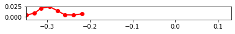

```python
%matplotlib inline
```


```python
#Set script to run optimization
run_fit = True
```

# Importing Libraries

Importing libraries for script


```python
import pynamics
from pynamics.frame import Frame
from pynamics.variable_types import Differentiable,Constant
from pynamics.system import System
from pynamics.body import Body
from pynamics.dyadic import Dyadic
from pynamics.output import Output,PointsOutput
from pynamics.output_points_3d import PointsOutput3D
from pynamics.constraint import AccelerationConstraint,KinematicConstraint
from pynamics.particle import Particle
import pynamics.integration
import numpy
import matplotlib.pyplot as plt
plt.ion()
from math import pi,sin
import sympy
from sympy import sqrt
import math
import logging
import scipy.optimize
import pynamics.integration
import pynamics.system
import numpy.random
import scipy.interpolate
import scipy.optimize
import cma
import pandas as pd
import idealab_tools.units
from matplotlib import animation, rc
from IPython.display import HTML


system = System()
pynamics.set_system(__name__,system)
```

# Constants of System

In this block of code we are defining all the constants of our system that we will use for our simulation


```python
#seg = segment, t = tail
seg_l = 0.02
t_l = 0.02
seg_h = 0.01
len_factor = 5.5

#Set segment lengths
l = Constant(seg_l,'l',system) #Segment Length, Formula:seg_len
lT = Constant(seg_l,'tail',system) #Tail Length, Formula:tail_len
lP = Constant(seg_l*len_factor,'lP',system) #Constrained length, Forumla:seg_len*constrainted_length_factor

#Set masses, 666.7 is density of laminate structure
m = Constant(666.7*seg_l*seg_h*0.001,'m',system) #Segment Mass, Formula:666.7*seg_len*seg_h*seg_th
mT = Constant(666.7*t_l*seg_h*0.001,'mT',system) #Tail Mass, Formula:666.7*tail_len*seg_h*seg_th

b = Constant(2.148e-6,'b',system)
k = Constant(1.599e-4,'k',system)
rho = Constant(998,'rho',system)
area_p = Constant(seg_l*seg_h,'area_p',system) #area of flat plates
area_f = Constant(seg_h*0.001,'area_f',system)

freq = Constant(1,'freq',system) #frequency of head oscilation
amp = Constant(40*pi/180,'amp',system) #maximum pitch angle of servo 

Ixx = Constant(1/12*(666.7*seg_l*seg_h*0.001)*(seg_h**2 + 0.001**2),'Ixx',system) #Formula: 1/12*666.7*seg_len*seg_h*seg_th*(seg_h**2 + seg_th**2
Iyy = Constant(1/12*(666.7*seg_l*seg_h*0.001)*(seg_h**2 + seg_l**2),'Iyy',system) #Formula: 1/12*(666.7*seg_len*seg_h*seg_th)*(seg_h**2 + seg_len**2)
Izz = Constant(1/12*(666.7*seg_l*seg_h*0.001)*(seg_l**2 + 0.001**2),'Izz',system) #Formula: 1/12*(666.7*seg_len*seg_h*seg_th)*(seg_len**2 + seg_th**2)
Ixx_T = Constant(1/12*(666.7*t_l*seg_h*0.001)*(seg_h*2 + 0.001**2),'Ixx_T',system) #Formula: 1/12*(666.7*tail_len*seg_h*seg_th)*(seg_h*2 + seg_th**2) 
Iyy_T = Constant(1/12*(666.7*t_l*seg_h*0.001)*(seg_h**2 + t_l**2),'Iyy_T',system) #Formula: 1/12*(666.7*tail_len*seg_h*seg_th)*(seg_h**2 + tail_len**2)
Izz_T = Constant(1/12*(666.7*t_l*seg_h*0.001)*(t_l**2 + 0.001**2),'Izz_T',system) #Formula: 1/12*(666.7*tail_len*seg_h*seg_th)*(tail_len**2 + seg_th**2)

```


```python
#Set integration tolerance
tol = 1e-12
```


```python
#Set simulation run time
fps = 30
tinitial = 0
tfinal = 2
tstep = 1/fps
t = numpy.r_[tinitial:tfinal:tstep]
```


```python
#Define derivatives of frames
qA,qA_d,qA_dd = Differentiable('qA',system)
qB,qB_d,qB_dd = Differentiable('qB',system)
qC,qC_d,qC_dd = Differentiable('qC',system)
qD,qD_d,qD_dd = Differentiable('qD',system)
qE,qE_d,qE_dd = Differentiable('qE',system)
qF,qF_d,qF_dd = Differentiable('qF',system)
qT,qT_d,qT_dd = Differentiable('qT',system)

x,x_d,x_dd = Differentiable('x',system)
y,y_d,y_dd = Differentiable('y',system)
```


```python
#set initial conditions
initialvalues = {}
initialvalues[qA]=40*pi/180
initialvalues[qA_d]=0*pi/180
initialvalues[qB]=20*pi/180
initialvalues[qB_d]=0*pi/180
initialvalues[qC]=10*pi/180
initialvalues[qC_d]=0*pi/180
initialvalues[qD]=0*pi/180
initialvalues[qD_d]=0*pi/180
initialvalues[qE]=-10*pi/180
initialvalues[qE_d]=0*pi/180
initialvalues[qF]=-40*pi/180
initialvalues[qF_d]=0*pi/180
initialvalues[qT]=0*pi/180
initialvalues[qT_d]=0*pi/180

initialvalues[x]=0*pi/180
initialvalues[x_d]=0*pi/180
initialvalues[y]=0*pi/180
initialvalues[y_d]=0*pi/180

statevariables = system.get_state_variables()
ini0 = [initialvalues[item] for item in statevariables]
```


```python
#Frames
N = Frame('N',system)
A = Frame('A',system)
B = Frame('B',system)
C = Frame('C',system)
D = Frame('D',system)
E = Frame('E',system)
F = Frame('F',system)
T = Frame('T',system)

system.set_newtonian(N)

A.rotate_fixed_axis(N,[0,0,1],qA,system)
B.rotate_fixed_axis(N,[0,0,1],qB,system)
C.rotate_fixed_axis(N,[0,0,1],qC,system)
D.rotate_fixed_axis(N,[0,0,1],qD,system)
E.rotate_fixed_axis(N,[0,0,1],qE,system)
F.rotate_fixed_axis(N,[0,0,1],qF,system)
T.rotate_fixed_axis(N,[0,0,1],qT,system)
```

# Defining Vectors

In this section of code we are defining all the position and center of mass vecotors. Additionally we are calculating angular velocity of each frame and the respective linear velocities at the center of mass. We also build each body of the system in this section.


```python
#Vectors

pNA=x*N.x + y*N.y + 0*N.z
pP = lP*N.x + pNA
    
pAB= pNA + l*A.x
pBC = pAB + l*B.x
pCD = pBC + l*C.x
pDE = pCD + l*D.x
pEF = pDE + l*E.x
pFT = pEF + l*F.x
pTtip = pFT + lT*T.x

#Center of Mass
pAcm=pNA+l/2*A.x
pBcm=pAB+l/2*B.x
pCcm=pBC+l/2*C.x
pDcm=pCD+l/2*D.x
pEcm=pDE+l/2*E.x
pFcm=pEF+l/2*F.x
pTcm=pFT+lT/2*T.x

#Angular Velocity
wNA = N.get_w_to(A)
wAB = A.get_w_to(B) 
wBC = B.get_w_to(C)
wCD = C.get_w_to(D) 
wDE = D.get_w_to(E)
wEF = E.get_w_to(F)
wFT = F.get_w_to(T)

#Velocities 
vA=pAcm.time_derivative()
vB=pBcm.time_derivative()
vC=pCcm.time_derivative()
vD=pDcm.time_derivative()
vE=pEcm.time_derivative()
vF=pFcm.time_derivative()
vTtip=pTtip.time_derivative()

#Interia and Bodys
IA = Dyadic.build(A,Ixx,Iyy,Izz)
IB = Dyadic.build(B,Ixx,Iyy,Izz)
IC = Dyadic.build(C,Ixx,Iyy,Izz)
ID = Dyadic.build(D,Ixx,Iyy,Izz)
IE = Dyadic.build(E,Ixx,Iyy,Izz)
IF = Dyadic.build(F,Ixx,Iyy,Izz)
IT = Dyadic.build(T,Ixx_T,Iyy_T,Izz_T)

BodyA = Body('BodyA',A,pAcm,m,IA,system)
BodyB = Body('BodyB',B,pBcm,m,IB,system)
BodyC = Body('BodyC',C,pCcm,m,IC,system)
BodyD = Body('BodyD',D,pDcm,m,ID,system)
BodyE = Body('BodyE',E,pEcm,m,IE,system)
BodyF = Body('BodyF',F,pFcm,m,IF,system)
BodyT = Body('BodyT',T,pTcm,mT,IT,system)
```

# Adding Forces

In this section of code we are adding the aerodynamic, spring, and damping forces in the system. The damping and spring values will be calculated experimentally.


```python
#Forces
#system.addforce(-torque*sympy.sin(freq*2*pi*system.t)*A.z,wNA) #setting motor parameter

#Aerodynamic Forces orthogonal to flat plates
f_aero_Ay = rho * vA.length()*(vA.dot(A.y)) * area_p * A.y
f_aero_By = rho * vB.length()*(vB.dot(B.y)) * area_p * B.y
f_aero_Cy = rho * vC.length()*(vC.dot(C.y)) * area_p * C.y
f_aero_Dy = rho * vD.length()*(vD.dot(D.y)) * area_p * D.y
f_aero_Ey = rho * vE.length()*(vE.dot(E.y)) * area_p * E.y
f_aero_Fy = rho * vF.length()*(vF.dot(F.y)) * area_p * F.y
f_aero_Ty = rho * vTtip.length()*(vTtip.dot(T.y)) * area_p * T.y

system.addforce(-f_aero_Ay,vA)
system.addforce(-f_aero_By,vB)
system.addforce(-f_aero_Cy,vC)
system.addforce(-f_aero_Dy,vD)
system.addforce(-f_aero_Ey,vE)
system.addforce(-f_aero_Fy,vF)
system.addforce(-f_aero_Ty,vTtip)

#Aerodynamic Forces against front of device
f_aero_Ax = rho * vA.length()*(vA.dot(A.x)) * area_f * A.x
system.addforce(-f_aero_Ax,vA)

#Damping Forces
system.addforce(-b*wAB,wAB)
system.addforce(-b*wBC,wBC)
system.addforce(-b*wCD,wCD)
system.addforce(-b*wDE,wDE)
system.addforce(-b*wEF,wEF)
system.addforce(-b*wFT,wFT)

#Spring Force (Torsion)
system.add_spring_force1(k,(qB-qA)*N.z,wAB)
system.add_spring_force1(k,(qC-qB)*N.z,wBC)
system.add_spring_force1(k,(qD-qC)*N.z,wCD) 
system.add_spring_force1(k,(qE-qD)*N.z,wDE)
system.add_spring_force1(k,(qF-qE)*N.z,wEF)
system.add_spring_force1(k,(qT-qF)*N.z,wFT)
```


    (<pynamics.force.Force at 0x150378186d0>,
     <pynamics.spring.Spring at 0x15037818730>)


# Initial Condition

Solving for initial condition constraints and using scipy to solve for initial states and setting initial states to system initial states.


```python
#Constraints for initial condition

eq = []

eq.append(pFT-pP)
    
eq_scalar = []
eq_scalar.append(eq[0].dot(N.x))
eq_scalar.append(eq[0].dot(N.y))
```


```python
#Solve for Intial Conditions

qi = [qA,x,y]

qd = [qB,qC,qD,qE,qF,qT]

eq_scalar_c = [item.subs(system.constant_values) for item in eq_scalar]
defined = dict([(item,initialvalues[item]) for item in qi])
eq_scalar_c = [item.subs(defined) for item in eq_scalar_c]

error = (numpy.array(eq_scalar_c)**2).sum()

f = sympy.lambdify(qd,error)

def function(args):
    return f(*args)

guess = [initialvalues[item] for item in qd]

result = scipy.optimize.minimize(function,guess)
if result.fun>1e-3:
    raise(Exception("out of tolerance"))
    
ini = []
for item in system.get_state_variables():
    if item in qd:
        ini.append(result.x[qd.index(item)])
    else:
        ini.append(initialvalues[item])
```

# Setting Dynamic Constraints

Solving for dynamic constraints of system to run simulation.


```python
#Adding Dynamic Constraints

#Position of motor limits
pos = amp*sympy.cos(freq*2*pi*system.t)

eq = []

eq.append(pFT-pP)
eq.append(pos*N.z-qA*A.z)

eq_d = []
eq_d = [item.time_derivative() for item in eq]

eq_dd = []
eq_dd = [item.time_derivative() for item in eq_d]

eq_dd_scalar = []
eq_dd_scalar.append(eq_dd[0].dot(N.x))
eq_dd_scalar.append(eq_dd[0].dot(N.y))
eq_dd_scalar.append(eq_dd[1].dot(N.z))

system.add_constraint(AccelerationConstraint(eq_dd_scalar))
```

# Solving for Simulation

Code to run simulation and plot motion, states, and total energy in system.


```python
#Solve model and plot angles

#Constraints and Plots

f,ma = system.getdynamics();

tol = 1e-12
points = [pNA,pAB,pBC,pCD,pDE,pEF,pFT,pTtip]

def run_sim(args):
    new_f = args[0] #Set to variables that optimizing
    
    #updating constant values affected by changing optimized values
    new_freq = new_f
    
    #Populate constants with new values, in case for optimizing length and height, all constants get updated
    constants = system.constant_values.copy()
    constants[freq] = new_f
    
    states=pynamics.integration.integrate(func1,ini,t,rtol=tol,atol=tol,hmin=tol, args=({'constants':constants},))
    return states

def measured_perf(args):
    print(args)
    try:
        states = run_sim(args)
        linear_disp = abs(states[-1,7])/seg_l #linear displacement relative to segment length, default seg_len = .02
        perf = (1/linear_disp)**2 #desired result is largest propulsion relative to size of device
        return perf
    except scipy.linalg.LinAlgError:
        return 1000


pynamics.system.logger.setLevel(logging.ERROR)

if run_fit:

    func1 = system.state_space_post_invert(f,ma)
    
    guess = [1] #Change depending on what factor you are optimizing 

    pynamics.system.logger.setLevel(logging.ERROR)
    
    sol = scipy.optimize.minimize(measured_perf,guess,bounds=[(0,10)]) #Change bounds depending on optimization parameter
    print(sol.fun)
    result = sol.x
```

    2022-04-26 21:27:16,538 - pynamics.system - INFO - getting dynamic equations
    2022-04-26 21:27:38,063 - pynamics.integration - INFO - beginning integration
    

    [1.]
    

    2022-04-26 21:31:01,480 - pynamics.integration - INFO - finished integration
    2022-04-26 21:31:01,480 - pynamics.integration - INFO - beginning integration
    

    [1.00000001]
    

    2022-04-26 21:34:19,043 - pynamics.integration - INFO - finished integration
    2022-04-26 21:34:19,063 - pynamics.integration - INFO - beginning integration
    

    [1.04380728]
    

    2022-04-26 21:37:30,705 - pynamics.integration - INFO - finished integration
    2022-04-26 21:37:30,721 - pynamics.integration - INFO - beginning integration
    

    [1.04380729]
    

    2022-04-26 21:40:43,730 - pynamics.integration - INFO - finished integration
    2022-04-26 21:40:43,730 - pynamics.integration - INFO - beginning integration
    

    [1.43063314]
    

    2022-04-26 21:45:04,007 - pynamics.integration - INFO - finished integration
    2022-04-26 21:45:04,023 - pynamics.integration - INFO - beginning integration
    

    [1.43063315]
    

    2022-04-26 21:49:25,626 - pynamics.integration - INFO - finished integration
    2022-04-26 21:49:25,641 - pynamics.integration - INFO - beginning integration
    

    [1.53568948]
    

    2022-04-26 21:54:20,285 - pynamics.integration - INFO - finished integration
    2022-04-26 21:54:20,288 - pynamics.integration - INFO - beginning integration
    

    [1.53568949]
    

    2022-04-26 22:00:05,263 - pynamics.integration - INFO - finished integration
    2022-04-26 22:00:05,267 - pynamics.integration - INFO - beginning integration
    

    [2.2837036]
    

    2022-04-26 22:07:21,604 - pynamics.integration - INFO - finished integration
    2022-04-26 22:07:21,607 - pynamics.integration - INFO - beginning integration
    

    [2.28370361]
    

    2022-04-26 22:14:52,899 - pynamics.integration - INFO - finished integration
    2022-04-26 22:14:52,903 - pynamics.integration - INFO - beginning integration
    

    [1.55046261]
    

    2022-04-26 22:19:35,643 - pynamics.integration - INFO - finished integration
    2022-04-26 22:19:35,645 - pynamics.integration - INFO - beginning integration
    

    [1.55046262]
    

    2022-04-26 22:24:20,802 - pynamics.integration - INFO - finished integration
    2022-04-26 22:24:20,804 - pynamics.integration - INFO - beginning integration
    

    [2.03440166]
    

    2022-04-26 22:30:21,156 - pynamics.integration - INFO - finished integration
    2022-04-26 22:30:21,162 - pynamics.integration - INFO - beginning integration
    

    [2.03440167]
    

    2022-04-26 22:36:12,323 - pynamics.integration - INFO - finished integration
    2022-04-26 22:36:12,326 - pynamics.integration - INFO - beginning integration
    

    [2.17285252]
    

    2022-04-26 22:42:21,704 - pynamics.integration - INFO - finished integration
    2022-04-26 22:42:21,708 - pynamics.integration - INFO - beginning integration
    

    [2.17285253]
    

    2022-04-26 22:48:30,532 - pynamics.integration - INFO - finished integration
    2022-04-26 22:48:30,535 - pynamics.integration - INFO - beginning integration
    

    [2.09026749]
    

    2022-04-26 22:54:17,791 - pynamics.integration - INFO - finished integration
    2022-04-26 22:54:17,793 - pynamics.integration - INFO - beginning integration
    

    [2.0902675]
    

    2022-04-26 23:00:01,449 - pynamics.integration - INFO - finished integration
    2022-04-26 23:00:01,452 - pynamics.integration - INFO - beginning integration
    

    [2.16347631]
    

    2022-04-26 23:06:09,397 - pynamics.integration - INFO - finished integration
    2022-04-26 23:06:09,399 - pynamics.integration - INFO - beginning integration
    

    [2.16347632]
    

    2022-04-26 23:12:17,131 - pynamics.integration - INFO - finished integration
    2022-04-26 23:12:17,133 - pynamics.integration - INFO - beginning integration
    

    [2.11820558]
    

    2022-04-26 23:18:16,812 - pynamics.integration - INFO - finished integration
    2022-04-26 23:18:16,815 - pynamics.integration - INFO - beginning integration
    

    [2.11820559]
    

    2022-04-26 23:24:08,785 - pynamics.integration - INFO - finished integration
    2022-04-26 23:24:08,787 - pynamics.integration - INFO - beginning integration
    

    [2.15830527]
    

    2022-04-26 23:30:16,108 - pynamics.integration - INFO - finished integration
    2022-04-26 23:30:16,110 - pynamics.integration - INFO - beginning integration
    

    [2.15830528]
    

    2022-04-26 23:36:29,072 - pynamics.integration - INFO - finished integration
    2022-04-26 23:36:29,075 - pynamics.integration - INFO - beginning integration
    

    [2.13334855]
    

    2022-04-26 23:42:33,808 - pynamics.integration - INFO - finished integration
    2022-04-26 23:42:33,811 - pynamics.integration - INFO - beginning integration
    

    [2.13334856]
    

    2022-04-26 23:48:39,990 - pynamics.integration - INFO - finished integration
    2022-04-26 23:48:39,998 - pynamics.integration - INFO - beginning integration
    

    [2.13389765]
    

    2022-04-26 23:53:31,114 - pynamics.integration - INFO - finished integration
    2022-04-26 23:53:31,117 - pynamics.integration - INFO - beginning integration
    

    [2.13389766]
    

    2022-04-26 23:59:40,079 - pynamics.integration - INFO - finished integration
    2022-04-26 23:59:40,082 - pynamics.integration - INFO - beginning integration
    

    [2.13609406]
    

    2022-04-27 00:06:38,408 - pynamics.integration - INFO - finished integration
    2022-04-27 00:06:38,411 - pynamics.integration - INFO - beginning integration
    

    [2.13609407]
    

    2022-04-27 00:12:47,498 - pynamics.integration - INFO - finished integration
    2022-04-27 00:12:47,501 - pynamics.integration - INFO - beginning integration
    

    [2.13452987]
    

    2022-04-27 00:19:21,998 - pynamics.integration - INFO - finished integration
    2022-04-27 00:19:22,003 - pynamics.integration - INFO - beginning integration
    

    [2.13452988]
    

    2022-04-27 00:26:07,667 - pynamics.integration - INFO - finished integration
    2022-04-27 00:26:07,667 - pynamics.integration - INFO - beginning integration
    

    [2.13403029]
    

    2022-04-27 00:32:09,637 - pynamics.integration - INFO - finished integration
    2022-04-27 00:32:09,637 - pynamics.integration - INFO - beginning integration
    

    [2.1340303]
    

    2022-04-27 00:38:09,041 - pynamics.integration - INFO - finished integration
    2022-04-27 00:38:09,056 - pynamics.integration - INFO - beginning integration
    

    [2.13203198]
    

    2022-04-27 00:44:07,431 - pynamics.integration - INFO - finished integration
    2022-04-27 00:44:07,431 - pynamics.integration - INFO - beginning integration
    

    [2.13203199]
    

    2022-04-27 00:50:04,410 - pynamics.integration - INFO - finished integration
    2022-04-27 00:50:04,410 - pynamics.integration - INFO - beginning integration
    

    [2.13359316]
    

    2022-04-27 00:55:57,381 - pynamics.integration - INFO - finished integration
    2022-04-27 00:55:57,381 - pynamics.integration - INFO - beginning integration
    

    [2.13359317]
    

    2022-04-27 01:01:43,375 - pynamics.integration - INFO - finished integration
    2022-04-27 01:01:43,375 - pynamics.integration - INFO - beginning integration
    

    [2.13394062]
    

    2022-04-27 01:07:33,277 - pynamics.integration - INFO - finished integration
    2022-04-27 01:07:33,277 - pynamics.integration - INFO - beginning integration
    

    [2.13394063]
    

    2022-04-27 01:13:29,785 - pynamics.integration - INFO - finished integration
    2022-04-27 01:13:29,785 - pynamics.integration - INFO - beginning integration
    

    [2.13401317]
    

    2022-04-27 01:19:27,483 - pynamics.integration - INFO - finished integration
    2022-04-27 01:19:27,498 - pynamics.integration - INFO - beginning integration
    

    [2.13401318]
    

    2022-04-27 01:25:24,101 - pynamics.integration - INFO - finished integration
    2022-04-27 01:25:24,101 - pynamics.integration - INFO - beginning integration
    

    [2.13403029]
    

    2022-04-27 01:31:23,742 - pynamics.integration - INFO - finished integration
    2022-04-27 01:31:23,742 - pynamics.integration - INFO - beginning integration
    

    [2.1340303]
    

    2022-04-27 01:37:21,566 - pynamics.integration - INFO - finished integration
    2022-04-27 01:37:21,566 - pynamics.integration - INFO - beginning integration
    

    [2.13180321]
    

    2022-04-27 01:43:20,538 - pynamics.integration - INFO - finished integration
    2022-04-27 01:43:20,553 - pynamics.integration - INFO - beginning integration
    

    [2.13180322]
    

    2022-04-27 01:49:18,248 - pynamics.integration - INFO - finished integration
    2022-04-27 01:49:18,248 - pynamics.integration - INFO - beginning integration
    

    [2.13369226]
    

    2022-04-27 01:55:17,474 - pynamics.integration - INFO - finished integration
    2022-04-27 01:55:17,474 - pynamics.integration - INFO - beginning integration
    

    [2.13369227]
    

    2022-04-27 02:01:12,766 - pynamics.integration - INFO - finished integration
    2022-04-27 02:01:12,766 - pynamics.integration - INFO - beginning integration
    

    [2.13392308]
    

    2022-04-27 02:07:08,333 - pynamics.integration - INFO - finished integration
    2022-04-27 02:07:08,349 - pynamics.integration - INFO - beginning integration
    

    [2.13392309]
    

    2022-04-27 02:13:04,481 - pynamics.integration - INFO - finished integration
    2022-04-27 02:13:04,481 - pynamics.integration - INFO - beginning integration
    

    [2.13399578]
    

    2022-04-27 02:19:05,810 - pynamics.integration - INFO - finished integration
    2022-04-27 02:19:05,826 - pynamics.integration - INFO - beginning integration
    

    [2.13399579]
    

    2022-04-27 02:24:59,160 - pynamics.integration - INFO - finished integration
    2022-04-27 02:24:59,175 - pynamics.integration - INFO - beginning integration
    

    [2.13401688]
    

    2022-04-27 02:30:49,535 - pynamics.integration - INFO - finished integration
    2022-04-27 02:30:49,535 - pynamics.integration - INFO - beginning integration
    

    [2.13401689]
    

    2022-04-27 02:36:47,926 - pynamics.integration - INFO - finished integration
    2022-04-27 02:36:47,926 - pynamics.integration - INFO - beginning integration
    

    [2.13402676]
    

    2022-04-27 02:42:40,144 - pynamics.integration - INFO - finished integration
    2022-04-27 02:42:40,144 - pynamics.integration - INFO - beginning integration
    

    [2.13402677]
    

    2022-04-27 02:48:28,283 - pynamics.integration - INFO - finished integration
    2022-04-27 02:48:28,283 - pynamics.integration - INFO - beginning integration
    

    [2.13402921]
    

    2022-04-27 02:54:25,242 - pynamics.integration - INFO - finished integration
    2022-04-27 02:54:25,242 - pynamics.integration - INFO - beginning integration
    

    [2.13402922]
    

    2022-04-27 03:00:24,064 - pynamics.integration - INFO - finished integration
    2022-04-27 03:00:24,064 - pynamics.integration - INFO - beginning integration
    

    [2.13402998]
    

    2022-04-27 03:06:17,658 - pynamics.integration - INFO - finished integration
    2022-04-27 03:06:17,658 - pynamics.integration - INFO - beginning integration
    

    [2.13402999]
    

    2022-04-27 03:12:14,136 - pynamics.integration - INFO - finished integration
    2022-04-27 03:12:14,136 - pynamics.integration - INFO - beginning integration
    

    [2.13403024]
    

    2022-04-27 03:18:09,842 - pynamics.integration - INFO - finished integration
    2022-04-27 03:18:09,842 - pynamics.integration - INFO - beginning integration
    

    [2.13403025]
    

    2022-04-27 03:23:59,402 - pynamics.integration - INFO - finished integration
    2022-04-27 03:23:59,402 - pynamics.integration - INFO - beginning integration
    

    [2.13403027]
    

    2022-04-27 03:29:46,719 - pynamics.integration - INFO - finished integration
    2022-04-27 03:29:46,719 - pynamics.integration - INFO - beginning integration
    

    [2.13403028]
    

    2022-04-27 03:35:44,831 - pynamics.integration - INFO - finished integration
    2022-04-27 03:35:44,831 - pynamics.integration - INFO - beginning integration
    

    [2.13403026]
    

    2022-04-27 03:41:37,779 - pynamics.integration - INFO - finished integration
    2022-04-27 03:41:37,779 - pynamics.integration - INFO - beginning integration
    

    [2.13403027]
    

    2022-04-27 03:47:33,432 - pynamics.integration - INFO - finished integration
    

    0.0032902224833889445
    


```python
#Constraint Forces
if run_fit:
    states2 = run_sim(result)
    points_output = PointsOutput(points,system)
    y2 = points_output.calc(states2,t)

    fig = plt.figure()
    ax1 = plt.subplot(2,1,2)
    ax1.plot(t,states2[:,:7])
    ax1.legend(['qA','qB','qC','qD','qE','qF','qT'])
    ax1.set_title('State Positions')
    ax1.set_xlabel('Time (s)')
    ax1.set_ylabel('Position (mm)')

    ax2 = plt.subplot(2,1,1)
    ax2.plot(y2[:,0,0],y2[:,0,1])
    ax2.axis('equal')
    ax2.set_title('Position of Head')
    ax2.set_xlabel('Position X (m)')
    ax2.set_ylabel('Position Y (m)')

    fig.tight_layout()

    print(result)
    
else:
    
    func1,lambda1 = system.state_space_post_invert(f,ma,return_lambda = True)
    states=pynamics.integration.integrate(func1,ini,t,rtol=tol,atol=tol,hmin=tol, args=({'constants':system.constant_values},))

    points_output = PointsOutput(points,system) 
    y = points_output.calc(states,t)

    fig = plt.figure(figsize=(8, 6), dpi=80)

    ax1 = plt.subplot(2,1,1)
    ax1.plot(y[:,7,0],y[:,7,1])
    ax1.axis('equal')
    ax1.set_title('Position of Tail Tip')
    ax1.set_xlabel('Position X (m)')
    ax1.set_ylabel('Position Y (m)')

    ax2 = plt.subplot(2,1,2)
    ax2.plot(y[:,0,0],y[:,0,1])
    ax2.axis('equal')
    ax2.set_title('Position of Head')
    ax2.set_xlabel('Position X (m)')
    ax2.set_ylabel('Position Y (m)')
    
    
    fig.tight_layout()
    
    lambda2 = numpy.array([lambda1(item1,item2,system.constant_values) for item1,item2 in zip(t,states)])
    plt.figure()
    plt.plot(t, lambda2)
    
    points_output = PointsOutput(points,system)
    y = points_output.calc(states,t)
    points_output.plot_time(20)
```

    2022-04-27 03:47:33,589 - pynamics.integration - INFO - beginning integration
    2022-04-27 03:53:25,810 - pynamics.integration - INFO - finished integration
    2022-04-27 03:53:26,013 - pynamics.output - INFO - calculating outputs
    2022-04-27 03:53:26,021 - pynamics.output - INFO - done calculating outputs
    

    [2.13403026]
    


```python
points_output.animate(fps = fps,movie_name = 'dynamics_free_swimming_opt.mp4',lw=2,marker='o',color=(1,0,0,1),linestyle='-')
    
HTML(points_output.anim.to_html5_video())
```


<video width="432" height="288" controls autoplay loop>
  <source type="video/mp4" src="data:video/mp4;base64,AAAAIGZ0eXBNNFYgAAACAE00ViBpc29taXNvMmF2YzEAAAAIZnJlZQAAPQ1tZGF0AAACoAYF//+c
3EXpvebZSLeWLNgg2SPu73gyNjQgLSBjb3JlIDE2MSAtIEguMjY0L01QRUctNCBBVkMgY29kZWMg
LSBDb3B5bGVmdCAyMDAzLTIwMjAgLSBodHRwOi8vd3d3LnZpZGVvbGFuLm9yZy94MjY0Lmh0bWwg
LSBvcHRpb25zOiBjYWJhYz0xIHJlZj0zIGRlYmxvY2s9MTowOjAgYW5hbHlzZT0weDM6MHgxMTMg
bWU9aGV4IHN1Ym1lPTcgcHN5PTEgcHN5X3JkPTEuMDA6MC4wMCBtaXhlZF9yZWY9MSBtZV9yYW5n
ZT0xNiBjaHJvbWFfbWU9MSB0cmVsbGlzPTEgOHg4ZGN0PTEgY3FtPTAgZGVhZHpvbmU9MjEsMTEg
ZmFzdF9wc2tpcD0xIGNocm9tYV9xcF9vZmZzZXQ9LTIgdGhyZWFkcz05IGxvb2thaGVhZF90aHJl
YWRzPTEgc2xpY2VkX3RocmVhZHM9MCBucj0wIGRlY2ltYXRlPTEgaW50ZXJsYWNlZD0wIGJsdXJh
eV9jb21wYXQ9MCBjb25zdHJhaW5lZF9pbnRyYT0wIGJmcmFtZXM9MyBiX3B5cmFtaWQ9MiBiX2Fk
YXB0PTEgYl9iaWFzPTAgZGlyZWN0PTEgd2VpZ2h0Yj0xIG9wZW5fZ29wPTAgd2VpZ2h0cD0yIGtl
eWludD0yNTAga2V5aW50X21pbj0yNSBzY2VuZWN1dD00MCBpbnRyYV9yZWZyZXNoPTAgcmNfbG9v
a2FoZWFkPTQwIHJjPWNyZiBtYnRyZWU9MSBjcmY9MjMuMCBxY29tcD0wLjYwIHFwbWluPTAgcXBt
YXg9NjkgcXBzdGVwPTQgaXBfcmF0aW89MS40MCBhcT0xOjEuMDAAgAAABz9liIQAN//+9vD+BTY7
mNCXEc3onTMfvxW4ujQ3vc4AAAMAADfc5kT+ypMG5sAAAuAACeERTV3NWo+RxyIeTV7MAQYqzcjK
SflYE2Bxj8R0D5FJbLXpadyEKvd4gTQ7PiwZ7juF0oNmSWOgg38LaErAcq02bXvH0NeSlXt0g73e
xwjbwVXdLAoxC53K/8XI2jR/qzbgdML2TV93WgNnTSyuhwAmn0GbbyRIvRR6QkCh1uokWp4RlD7R
qf3jhuYHFkjroiP2DEy5ZoS/4mTFbMQTKSJs/GrFTuPIAYaWx0+fPtD7weHv+l3XCbSYqxfsEeVX
4tVRSz4GwZQGyrT4BoEWnFIYtMib7GxtpYTxs8AkcCrSsx/R5kZboinCkQKBgINra9x/TnfbExIP
pUMjHgZfBcE9bjvez/sEadPkv1Eqe4RGXXy8u17e5GsddmeiEBkPP2EihWqokPjquyWPupRsgUpm
LqnvOR3tiDvq6oKTlTwGLhj853wTZ+fVrZrifLvwsXWj7Y/I8sm5Bf9UrxF7W2Amsb2jyVIM7Gz6
ZQMOwQo+Uo3Lwd2dLqHUWkdUXKjrfVIcmta6t952twsN0ifakej40QxptC2pzerSc4Drsp5F3ybT
cLyv8sQNfPs1uPb7h53rF9bEchCDVFiFKg9zO2ww3WdsvC6Lyp1+gshy3jg4sKicdw8u1TxZIMm9
yc3Y6q4SZrqbMTUelRF0PCLzL1b3bMzj5KH62Vpv8INkTVv+JwmlnCKpJUBqd5/3Cf1WyAAz9Phc
DWdWMKleaYt8UlxYWY7AgO77sZ06PswSe6kuhjz6kv1+rTDz+aYDge/qrdxuNxQutSt8H/K5P+IM
9+dxvux7Uc1TnKXvT2dUyCj1ZzFkPMcCrEgXYWL1td7Xk6zFYBbDFHacI3IEijtfBHEQ0aFplSUh
Un6sAVkiMJAL97/ybcY9Ej7AHDPsflQ4gGxbQwolSkIMuB0mELX00473qbnWgowZMqkiP5bzAK5T
YyNSY2p/V6Zis+7xyYFqBB7giy8MnrH+/h33GIf3MyJlvRnVFCHp2qar5P7hyFrrQtNo8YsHKPXu
E3IpJG3PkJOGmrcGZfloIHIHMAkPVDacg2br9gIqyCtoJIrWvPHDzTzPbpOog0b5RuSzSvHZ+hKH
LJcDi9ll3mFdgJ2iSj8y4Q5y9PPhr9aMqKjUorkqUsjgJOCWx+L8YzRW+qimW1EzxXGz7qKrq6eT
01zuOPZUnf6bdcSZc82TUbNujNG8PwxqUYpoE1y5gwRuBZjJ9+/YGBoLNfZRJxQRGjK6ALuphHhP
HBXTMXKGW6P9qlaVXS6JW0E8wK6IVpD3wK2Q1DCIvlEwVUPm9GRF0VJLnefw+xH+2omewjQO+qCG
ytFmDBVLutGX6y9TfpD6Dy3MSNAWyn9QO/V+G5J9OltJjBzqt+24QUHBQafAt6NCES5FygoclKSO
RLgNiMEIrNG0mVmVk02nVbPhkDH47vhPjzIxcOHSNHU9oHQpUSt/4b5QP8Fx8SAnwNKfVqyOpXpb
RhBRu/koWB9jAmJgmKJl8zieAPHJEfYb+MboWfbCtFZxwQZYTRaLKOJlpfomF0a7OttK50hHUajW
UiC6TaVfcyYp5q347t9TN7UlYlzexLq2X5tUEZHjZBpwiHeB+1seT6vsKLFvRLAAJNIarO/Gx/iS
WQYXHtJ1COcGurREGVK/CfVocdoMXS3SMP5nrLTuIeLbtubQRmvEU0LWue2IX0+ZFjBm4aM76ndA
TkIchDsBQaVLn06A+kr8/z4WwN82Jd5qfDFoI0MpyFHegxh8pyvLb2MEdUJrHpZXmvDu7B0izy6i
GihvZf9REsycdqS+LX73a1M10QFRI682gl8tOnJ26BDj1MYwRF+k5F4LhLnQFTYLS2e6meaYrU/5
Cf/+EI7E3teu47gE9wcsPdOTghaXu4UcF2TIdeHSSSTKNINLuPJmTVZK4DMr0QHQ+WhNXPF1irws
XZt46BIwWZyyPCHCbXb4jPbRgLH3ULP9j5XfLEpxmZu6jT7+hYntNAU78ViOtt8cBv82/uGPigwv
42C3Br/Trd8N98AXWbffNlP/dmOPJz/5io8dKVHAjcGaLJxOLoZpyES5eRIuFQbfnJNk203zCqCj
znxfhosoBH+Bde3MKLDp7ODCuNqz+6u7VXTtY7WE3pbjZ4IBDnZ+PrRh4o5uctIGyBlW6xpKQ3Db
VAkeNIwbaLxPpFNY24aPX9xU6zai/aBt253mk4cGcFWOHeo2BQGzzPFQm1zmMbboKuwLbIqEipBZ
6Sk4ZjMjI7wB/OWhRjzdkqPQlooD/eXKy/zQaqi+kMHwQfLJy0aAhTntu2+MJvYXgRVaik8H1Qzx
P+zFqm+LsD6UGFQVYplmkFf9N3MKIniEdhQBMKsAD3qB07SBWS/9/C4KMlhQc5J1q0X/sV5EspAb
uvjZxAgKUHUAAAMAAAMAAAk5AAACH0GaJGxDf/6nhAAEu433w5t1YAD+kH6L2ooXTXI9CDIBMS3q
qAwsn30MYF5XXDSIN+G1Dg7YgFKMBvzE1fRw0k7CDiZVc/pct38y8WrTL19RlZHioc40sb7y7Dvc
JoOyoeY+JwfEYvXXBlbcm15gHHGzhrNFUSK8fb/cZw4lDzdlqUGuOohaQhWL+haqh5T0OxhsUdl7
ZA9gqOEAykQ8abpC+0X4XHjlHun0T8YPoWd7VlK9/LBKzgv+CBIJLgQDZ39uvRS5L3NSU0WrI6dc
qmHOtt6NI0T2N5PufyUKC1YW2v4mTeqDKAyFStTC5qazg4O+RrRXhXLMMMoUuqsQxLCTP4Yxicej
e1SAfuQo8gckwal/LBlATqQaoCWYQIjv2Pl8zV4FNxny2xdzCDImYw+2LGEl9kDOMwSravkWB3nW
ACG7mc0nqmNcxI3guh+UxWyQOPVVbEvt9kRlJg/1GwaAFcGAzx+8nD4th1Nco2EwGJIflVV77EB5
KXBXVpD5HEIrcKFlJnVxsig428fcWNG151EpR6DNsmnoQQlE3FB3Q2pz+HqrWfIiujUCmB9aJzqP
xN0WP62X+L5PDY7KylviIH+pXDzaxZivM+IeY3l6m9/6NkX/bObcOBgEn6Sl6as86pTprR5Pof6x
tyT5K6y+WkGkT6MN1kG1Wn8lFUb1XoTiN51qPk7kC+MTsiIIVIV7v5DkkDBJWOSB+52ouAAAAQlB
nkJ4hX8AA8KxTg0ylo6MAIfJkBOTXwHff5NLvsu8xDBA21kKrVAxNAOvNz0pcHj/4LVIx0aXBC2Z
rLdEySCSnlRBhCSvumLAhuxRLRNpyJHjlvDkdfSrovLSFBt3TX33f8pwMcUD6REq/Fk1dbKKU6Oi
drhqfqg7aa+jXKPPqpvmKYAkjJRZn/1NCY/LC4GemcUcx7GzWv+uvM1OaWn2tzANNkoVOznYNzmF
7pg2hUrNOwYfiGnKjZUB3/0S/q/jXlUDp9mlz4floSSjezxjuCM2XXRKR8Xg4x5lNoug4f5EJvu5
0wP+V446A0L8mFWZZkgKNJvQxpciniJkFXfp9SiJX9s0UxvRAAAAkgGeYXRCfwAE+QsHD7Qnv8gf
3SAAacVF3xPCzH6xXkngkGe65hAvYtvf+H8ka9fEsgC2JU+T0Wan8hbBUYZ0XOWGGDiNoYQmXJ01
CVt4muNfheGAzWy2gMsg3ScCNpMcdmE0CgcLLa/8c/8olsd94F5Z6QTDZpOzu8+0NL+sQbo+7mU5
9aReK1uub23uXs+/YN6AAAAAqQGeY2pCfwAE+tNdfUrZQCkRTQAmnS2T6XYyosHTutuIwCAp5dUk
mE0fVmH0Bx8jZNo7lJGNYhoHcOmKxBlHGY5mazLHcphAH5Bl372xwiEIFK9vOZ85ewBPfl8X15LG
dmAyS3n7Mu86gDCDQ1bhiH7NhizGwxRU2hPZJMiebXVrhN42CvJfUTWVIzlYdCydblXHvLdKiNGh
Z0GeUyXuSfp+6YbsZPAahhUAAAGXQZpoSahBaJlMCG///qeEAAT3pC8AVAJKklpZ7eHw9/5RF993
/z9Bkad+iOSYw7Nxz/voNoix5zwfvlWNFOM2Snk4Rsj2KyhJtjU5J0h9IRb5h7pG1sgm+u/YbQYp
K6Z3zfthTC+JIW1dI4J6fjMn3kjCW5a716Jt/e0PNPb07YuKjOFweX+LJ8lr/kkDVIEimMxUDKnn
DRsu15YGq9H4sM43QSBVoe+IAc85Z91IfXML6p4jyNkiAXCH1++beNVoB6mjFjeBC9B1Ojf6IpLp
4fDzMDrSRlg1KhI7j5yBjfZdevGmSGbB4gta5evhRCWDytAfM+7zHmS+p9Oid8ZxdQSDBH8Prn6i
lyWa6b6uRc9ZMUPKrLMw6hXkaUSXTa9tkHKFxFF1VFgBMq76ogN8Tn5ksI4Sb66tYJD/cxJR1UZ0
lVo8CVGD9CO37pyC2A3PXTwhZgMh7qYTIuoHxSuoPcCeNl+AfHHsBJRI9cD3oM3HaqW2E08lPb/5
d9bOOth9SgIqxszkwG4jFdd15vQKXoYCUM6dumEAAAEEQZ6GRREsK/8AA9lZ7wRcyYAPxSruoGfg
6OAhyKSEt0oiOZNDhnRS7m1OVAWHxd5eB2mjUl3XZkjXTvAO/mtQ7h5cridojY2g/C9Hk+tYHFlD
UoLcAokao6CsESl6rOanF0PRADhL29RQ2bpFb6uyejFa3tG512XrVPXyj7kz17Ed8GmkafJs6t8F
lQf2Krc1TxaJIKPd57eOIQqedUa/OBUh6k6uOyaXIf1L85yGp8sSx2MsIlAfJXHcdzkOjmeSHP1P
+JO5dCg7GA6xvGrSIfzsWzRrGvbhVEtI0gNtNNOs0wK14CBCTOH9gtrurPTlW3aDlgmv3by1qK0U
MTb6MypcRMEAAACjAZ6ldEJ/AAUfN76UGXuEMrfJXVWlZVuO3onfeAEJjsUXvgIiF0ldqWce+C4u
OnvEutS7pkrlCvg6+ujQrzUf/kuwtuVJbISx2nBEjgnDmZYry+lmDQRZl8TSUrFFyopgv7P8b8XO
Us9kGuKNgXGnENHh9LMm50HmX2JBMj6eZ6TNec0cTgeapp/NFK6/f1ubKqbEolv9rXCvG1pjWNiW
u80D5wAAAJoBnqdqQn8ABRTsUHWaDe4AGyts3KaNV0LSlhRvvCEgUtVd0ljkWpzSEj7MaeFBmOL6
873+LUAi6GNqCFSwqxsi9Or4JLDF/W8sRzP+t/uqsVP+6NkX35E7E2KUg8v+gMEb+a2eU0oarfkc
vDRXgCTw1koGGgCxlKIxT1QTvNCu7+VNu5Hoys30OhSgh2UL4Z6cvZlRb5YQC7FxAAABIEGaq0mo
QWyZTAhv//6nhAAE/3z1Fi5X2SgAy73mThrWenLACCHqK9ilPGQ9Y2RDfV9/h5/0ZoYppivZE52Q
S8l9xGhGL6fv6e8udERAdnL86lQFVy86EQ+HaC3RHcluFOlBCNRM+qxHTH2fhprpcIQaxNs5UjQJ
dVj4vNPk/MFrsY0pwXY2VdI2Mv+zsIFxxZh+WwyVHjxUB5dfxKLd9+KtuF8+sP4nvDfBKVy36VaE
1KCOe6X8/C6P/X7yU2Ni7OzooFmmgq47T24T24CiSwDy8vv3+KE0G0sdhJ2+3H5uGs+8I4ZSIkQu
gqWrG5/UUgu37LesU6TtLBtIPxBMng0VtQMwTsz30g8uQRGt3CNilDV2c1lmKf0lmLe2XIc9IAAA
AI1BnslFFSwr/wAD+MSJBaGhEJ0sbeSbEADsLWZ1mMq1O+KvW5BTH5fg4fWbTJQz8OggcvfbMBjE
2twZI+0c27hXWw4nbccw2j1EyQrMR5oCETLe12KwIh+oZ3xLPEO9S62b9X1HuAb9TC7CyWRY/APy
fAIAeFsnQkWxj9hZCVCIu2F7D2P+CVrbEahnmFEAAACtAZ7qakJ/AAVCpOAA7bgUnrD/hawplXF2
u2PAAhR6+pTrdoiEZQRbwkyCWpZ/VeB5knmU3OBNma3dMKVx95wZ6279RbxAAaszYJ5njhvyzIMd
rUUZR3+98AfSU91cPojINAITvFw6S9aA0xfga0lQ97cSQM2LSaw9k/9tvzd2J4V12BMz4Utt0/I6
HuHGhFu5vwmj4WtiN05e0AOX0ZpbBrijOIX/Ne3fhA/lSggAAAFIQZrvSahBbJlMCG///qeEAAWH
pC8AoISVJLTCHXafB2IpVUg+9OBxibB6HdnRT+E85ohWfcxAO4iD9mC09u04E4sL26dZKq1n7wKX
uTytpSBoPPRfnKeDTwbdmvBlgM5s2n4otBu5ZOO6ltIY4wtamFSua4GV+jzRSGeMAeNv7ShGsSez
I9VVIlIQHvglWYpmWovFCD/idw3eccGNQV8HtJegzj4lUvlejqAoksdEsC0y5oJQAyjEsFEbmEjE
zsA5u9GS4AWDoWprUWO+5Pa+l/DlfXVkTq63E3XKy20xAYsNiQ6CXoXMIOOhnjx8TCfq4AliDGQt
AkmtSzZvHF2a5kDEjR5sqPSnbfwQ9DkgG9523R0BesPfbgRiU4rIWo3P143GHmT2zUDQ27LWgyhw
RmTZuU271USJsDFPi/q4Qa6xU2NVN/N5BAAAALZBnw1FFSwr/wAEFGEU4UxyR7/cKAA2griW8Fot
ZxFz+nlSD3UhUNIqTmxivhSqulaNBAptCZfK4uVuS0qwJew2zf76/d2sxT9XXqbzEOrUCesVBB7d
aWbTU7hW568WQTKlMH3UaiGSbVq70DZdaYi885GFIB/fEd56gyAsblkXBbQxi5dfWBc4Vl9T06Ud
xzabFSwDsvsitDIiPBwyUdKAPs3roveWnf8Y/AZZSnoR53p6qlDwDQAAAKkBnyx0Qn8ABWc3LCdr
xcOTB4tVgaAEKNkq8QuXLfk1tSCw6OqjVQ5c9o3NODeM/NfRRxVJMF2k3RYZhnqJcav9JPfwW521
wrHOUoBDFMmVQhTmngtjGBg7MhQnYnEALaSHe9GmhMTHOnofYyA3EdwKs+ECBZLQt0QiorUb0wk8
G17CcaxmMuuTomcQFZLMceKEHWe+X1tTsc4ie+GTXSIVll8lJq3Hgr0FAAAAcgGfLmpCfwAFYyg2
eDjZMfpABECO6TjjT3SkycPAfMVcHxcU1khaPNHxRax+eLOxAShweSNvk+rVo/fn41cJUd9+6W4P
+FyGuzJgOUrc7iWwmuj+vAitP/zrHIz9KcuEz9PyH7txqd+Uhc9TCX2X1GifAwAAAX1BmzNJqEFs
mUwIb//+p4QABawBqQkPYyfEEJZgAL695p7YftIMjRlD1OfPpnhYZKFCitUuMfjCAkPUTewne26D
pr9TAp1cLvbLqStJ/sDb64exYJAswyr2ftkaK4OKIuz+oXl3aDYKdtr1fBsyFCvi8sMyUOVFjWyW
mesvANSEwyld3avrU6N5g/YF8cEK3iS6GWHcKljAINhZ7Pp13xvTwGv8zZJoeaC36Usw7p1fly7G
u8o2pyauXWFMmZ8Q6+HLJcbHQLYVO1qCDqXx86R/dMAp/vufz9t+2IuYgiLoGq3BYzf2HcdxqP9U
CCsoXpd8v+91t/tALEcIEB66qIakAJufGfNd8vQXwam0sVpXBOnSMVtAD698WRcdgREUVqkl/8ec
Si1uqKlCq791d+b/c7dcJAiNkGQzFUTv6Jdlg/AOaE1Ki6zpeRklnCJkNiUYB571jz9CPcWT5Rtu
GnwS5XfyVBYVEvSVllj9YTpGgqve1jopYzy1KeRNLGgAAADaQZ9RRRUsK/8ABDXk1sRAC3joY+OZ
3vY10xOBXbLUVyhNnCasqWDgcHlZNebAFhbpP/UhMMRaPpuzIvFyeTQud4SwemHd6xUA79pM896H
TVOKLJJAgA8gXH+YsemxTAUWtFSpKK1ymASsN3lTwMaP5SGGr5loC4JR+rTSMRw73aZCTxDRg16a
MqkqR+wpHsYOmMvONIYVPITFsFcjjF+4UHw9Gjkdbu/epEDNjvrWAX8VsddD8EzNgeVnnftZLqa8
aRvbZlkEpcwMtcW3PhG5LPjgI7XqxR1osoAAAACmAZ9wdEJ/AAWLN8Fu6bK4YAAmp+mhaj4xRlAU
MNVueakvalKFV3SWw7DAuYKeHjF9qp+XTGbi8ISqZU732NwiDkEzd78ivnul0N7URjNe5JEkIkpB
NSlnd1mqinxRwMob1mEmPbRa6MlZTo+fQ0/RNqa0VsArTmp620yt3vSq4XG3FSvOzHN3KaO/jFFX
aoy+52O4yFW2d7YWnCyhPxpiHlxlpjAdgQAAAKkBn3JqQn8ABYcoNoiitOxXZS6Ea3tik6ACH4pm
gJQaNxvEb+FvWY2bdssu1zQmOkyEa5UMVFYD5uLpMJv/bVQfqgb/fzbqkX25Fd2xTCDZ9QABp1qS
KRzERRVCz4KgKcM8pTtgo9u9htyd0qDv9XPigfMQ4X1crOjXjOVTL1svw8iebn84y6DVYbsn4L7v
I9JCTCxEBt6qpowyMs1CReN5oaqEEzMdE93AAAABgEGbd0moQWyZTAhv//6nhAAFzxWkJD2MkYur
BncDAAvmhoCsXfR3oWXm8HJqgezu4t4zt0YXefgmnW6sGMbKZTeHCXWJijUP2xAfV9XixXcBDQ7h
bXhasTkRNxCTlWIfwE3vcB1hyOcl7K118+MM+DRBnfnHwslQV1unFllb3Fo37rjoC3r+yN/8PkwZ
0WjuaQO4cExnBvKfHTWopaXHVdMtMzBmHVg0yzK3xnBJBWTrp0KUhdyxOYhVtzw5dRjnL1DmHyLm
xS/8WSDToW65Fm32kC/1Wwz3BdI6HMf286lssZAAoziql9wZFNptfwElyKi65OJV//jHR3+Hytyq
8YYv2vaSFnLR2Y0fJM2xnenuf31MGxxX6RRGWqUsvXz+Ltk/8BIpCDPOzs2ppxBSeUBo0xckGgra
lFJwG4veP4dDCNzB+kJOtndOSQw64KG/Vm1HMYqjQ03H8+UTkT8gAWicheRvLPNMvbpa6zZ4yoHy
0ZLnDuBf04TrWDyNRWQjWAAAAL5Bn5VFFSwr/wAETbpJ4mRRCaAC+svMLG6goe/uyyqmwGUME3sC
St2HobHyulioYezL7nNhMt70M+uTpgHPhJ4ukU7Trb/fP6Jwr+reV6cnXA7ZA0pm/VUBlB3qUvoh
wAwq1xBdFAmzmYxKm3F0Ur663/8n/IppX5CLFqX6ejmHqexLRHAg+FTCZyJFUID39HrxuW2SJpDV
KmgCVJ4frbfiDmM9pRuTs+3Q92gCKH9JBGAJIZ421hMgObPxNJRRAAAAuQGftHRCfwAFn1L+CDvU
ABOOd2cQ2dWZRc2kraH72Rh0VFoYBY6h+RN1CmEunu+o7cTCgIvWX6f+WN4ZfHWt48Udby2MdJZl
OD4BmQb5ZFS1Jbw3P2NUBQzYN+u4dCGxp9DGxN1Rcs1mT7C+a9YWl+UZ85z3UzUe4ndkWrpbJid+
8EsYMyY8GSmasw7TNUgLuhVYKshOnGgR9LjIUq0XIRkTvsFB9cgoRzl+LB5odI3yiWRzvdgab8+A
AAAAnwGftmpCfwAFmpFVt5BHMwYsyzcIAIetMfBu8XdOfBdtwOSVlv9jb/si9Y+Gt6Pw2fs2qI89
ncExE0brKslAyYX2EAzHKaXXlDhFFCu2rQI7RJAAYIgeiDZE0tuWKlshqsudGCnpD+oD8PM0zvKF
MLZ4AZ+gdBwkJTSKhdoujJZSFVA/iXU4QD2hgz1WC0wZd2wV5kA81BD7504APxg2YQAAAWhBm7tJ
qEFsmUwIb//+p4QABf1D3monf9g+fLSQAc2eNJagZyz4z/x0pdYQH8zNNFId+pfHtNTCnprdz7Dz
smx5jdeuRG00jTQtWe8iBl/0ZzFiHLuWeE9lSVO0wU/2q+o5CxVUpg1+5B2ZxVXai8eLuLqcRkFX
XIaBNMJmxh0rrThjnNJiBzwN7/vI/G4DHd5YeX6jnaWj23NlQ+jms4Il9AQi6TIndV0CEJJgGDJA
xLTSYXWevQxFh51QaHnxrum7jpAMlrk8xDI7+PxsNp5KdLcoZExBYxH81IvqDHuZ5A6NNu5bZZGD
mHKZBqcgtMjEbgFLnWeTNNuS38d5MaVk8U4C518EywaCURCVcT4S+PPRmym+AqN3kIFTWH86QWGu
nuVLOD0uaZ1IzYQKmu77Gob8pOIF1XwA/zzVsw1apxi0SIWw9R8SIachFIO8ohkMCLS8nt9vQAol
Oqk8wzPjw/1IQETUqrkAAADaQZ/ZRRUsK/8ABG8p4jlV8lMaADajZGwwLrbWlHjQrtpLFtzDusXp
ETYEUT5JBzSXpragryeIvSILfPUIJVRNgzTk+Hzzkx3Kr3A4PzBc3SyTgxZF/0ubCxxIzjNe7as/
zsx4QmYyEZlMpStZAUhw4E6H39i3JiVmHrxFzUTAJiGjKxE2wclTapiICLQWDDrk8DjriuztH7tP
8kcOnqGiaVId9kYU8hADr92oHqFQJfDjXkmBYVhlCdIWI+tIogfML6tmrs0IZ5iHrOA6DZl4G3kX
WgO2KdrDzYAAAACrAZ/4dEJ/AAXS6YKhQd9nom2IgACFDh+Fq0t75yWbwLnTZkkydK6RttamxkSd
Tcat4D95VYWI4R5T8TVaXaTSmBjfhQYqbIGk2cPxsH6/rWIZvDt62KHYyGyD0IsgrfkUV615CJXB
mglNfmOtpiJgoPNDWVf2MBctH2dofeYF4EnWicHEVM8SFU/OLxUxLJAWROyi7ecdZdHktBjKh/z5
lt1aaDwfLqDL0lqhAAAAtwGf+mpCfwAFzv81E9BcGABEHkU8XlGKtZ/kC/Or3PSrLlNR4nlDm5Kv
jYR4jYSW4/OHPEWsz9TcOYVOYmHwgvIhxFTqs6a+/cCD0Jf0OajHcJrB9fsFmztRiZrd6d9h2N+b
RyOSs74a7g0stqr4IjCUikzJqYaHl3/AgQY+4IuKu3iUSQCyvTtTXjPtDVTOnexj+Swq8nFz/JAY
89H0u35hW5LJvR3uOPthaIK8pNeUffqX7E/oQAAAAUlBm/9JqEFsmUwIb//+p4QABh3WxgkL/iry
yQAOLWfiWwv9/VJ4gLO+3bXltuBKFU69m7pvCNtRBPSAgR0tt8e6P1MvWdejMHd1TutF90wG9oD/
OdwD822jiOZFv3JInzl9REdHNdDqTC+7h2OOqhPZFelCR/XEUekxipnJ9nRLhkEnmXKvi2NeR3pv
0jZAtz2Ypqh1OMC+xJ7eUP2lAh3WKemsk7Avh9ODmF+suRNoknvOz7mPDC5y+BtwWT6fcqUUnCRF
vtwQlTBLVFjMu1NEByaCZstRPfs4oQ+vJeiiQBqzusyiH2PrZp9Ka51iSCO862WW3+q9cxpA7fi3
/tf8R4o5YvX+FAuwDLfvegcwf+UklW+bJhs2nP5AL4JAXUjldL9lZ48CqCibb4MGlIKCeatH4Ojs
SAczfVle6cDk1Rs1ilK7zh6TKQAAALNBnh1FFSwr/wAEhthZ6ALABcuhB+0ZMrdWsOyy3NJCU5Lc
EuI/0tKg3/elWS9Qjby14U051XdfYoJAHJPF9Y7NM2SEcibiFuwBydGSi34ign4SNX6NwmhK4wAg
osyQK0O6HN88wAh8oqzu0VVZyOmC2TABaMKMB316ee4VnbfKMmkyFnBt6ZoIoMiZoAL7+t/hfVc4
qsW8lHQkCDmxCttzkPBJ4olA44lvDH5c5ZrL2HZSQQAAAGwBnjx0Qn8ABfQdUGQEOjdHJO2OXgAb
IOyki1KixS5UIezdYHIwW9U5TcSJx2ym5cQ5srW3iTCS6lQEJnBxs1r17PAxfURz3sHH5O1jfZtd
/FeicAZhTYL4ix9uYKtyPRSS9fbUrEvCxQU6HMoAAACOAZ4+akJ/AAX2y8reAA/njiaWDdpqIEeg
hNaMeFhTs1NT/iaZeTS0/ykwTyGSAjoLgAmdyAOeOoVCekYdiEbRYcwMooRW2HGL4DCXq65Kj7Hf
fO/MZDuyn1+KyEPKNORh8hRNAIc20mDXGEs1ZaXNDesB1U1IwtGTMQd3lSUQ2mW52BchVD+vyeYA
oS8EkgAAAZNBmiNJqEFsmUwIb//+p4QABk1D3vV4nxfI2QAC+vd9M0CwrawE37BVPVE9FVpoEkZ/
5q19xL7BUAr0DNI6eM1M0rusd+xe4LfijlG4NMh6qV5on/23v7GBJX3PQ+ENH6UjdH6gnvp30Ehb
5swFTv2Tv1jlkOutJAzqog+s2V6hXw79vTvDBz2QLrrCJgtSIByV7g4s8iJRCHAa3d8RewBlWdbc
04Oq+DcOnphjbgSUzkGklT0HA8TF7GcEbv7kTqWQ0ddPYRqXpFJBKBPPWFutscTQbPAUc30C66vO
GdBSOh2tlFoj3jaTIPZSIvqrY5dH+5KIFKE94dMGrampmNLyrtkxg4rQdhUyXq+Mzunz3KlagnuT
AVHQmDs4G8GJB6D2F0fYIkd4MbWFw5vRq6ITbUK1cFrt1O8tIJ/eDOiwGmCIfNFjXkq2P4015eDH
9wdkOTomQBq21lcNTjpmI67XCuh388faD6j4zu1Aj+mpBzAhdb51LKhKafCbRP5XdPEzy03yV0AM
kPlnL7pBw+dX1qpBAAAA5EGeQUUVLCv/AATXVX5VSIj+tgANqO5F1OeC8HfdNbNrmMUe/s4F+2CI
8T/awEDVc2TC0nJ4vOnE3+iP/xbW02koAv9nOwljSYDnRjJE0Z0TsidOkhelG9CInjMVU9tjsbpy
I0/D4mLCh6Aq76yHL+h6/gX2t7OB8zNUCD3KDELF4FbAf1N5cK6W2qaSyuRChBvjWJt78Rn4ogJV
blT9kjIFfo9Mt3VsfTDvH13FzkgpwRQuejNqGZKjGkuLqqzehaCpzdepbw12RuQrGSZ36yxPzoDv
9zxhL6Ic4eji8OEFffiN6AAAALYBnmB0Qn8ABh+EfWzAAnbyveoEvNCfqr1cCRy+5Nbqq5Ov5IdZ
z5ZWul57b9pNDFe+MW2yWA5WcCrKe9vlhYOSADAs6oRYSvVmRlOigWYVFlXAIkD1Yn/gtaimeSZQ
l5Gda6lGlXYOUQW3g45Bhc6UbqjvMNp3eBv66fBfxBZVDgqz9FhhNCT9/Z7LzRc+A/Zbo9o+ZSgQ
tjA1lxo1w4/1DLlBl91jzSYLu7PKPUBekumsYxi0uQAAAMABnmJqQn8ABkr1NQaIcKsHDdUQATs/
XoGyMKomb3OwG8q9ytIfZoX6NZq3S0clgIPKWWTAVrbPJ5exDg5HaV9sb4HOvrMkqdYTWQynX9CL
KQiyoLiqD55EzXHpxKyHLDKOghBVTJsExavNSSqmeLeQ3gNRucFt4gkTtn5HlojMxfqTSulimkMc
rr6IaIBa54Qx1iRW52ypU3nkVMNvqL4f8/QEVP9jO1LelMmCxru1Aj2+nZltb3GPFSqQJijOusoA
AAEZQZpmSahBbJlMCG///qeEAAZt1qNJD2UC8fUfnGADLay4Q1tKrLGb2JrSxvirQ1FvC6ecj5Pp
1pRtqYhgouAWMLySkrTD66sqrVqP/jPybJcz4hkfH5Ik3wXOkWskRxr0y/jc6C2dX9Q3rKSlT4gN
4IZ5oi31Y7+VBXEgtY5q3LDF5CFLBt1ETsMuPjYOwnaiH5SOyZSiDwTR9C1/QdmlKzzGSPqtZhOn
b9QJeQ9+3TVzttw4VuQ5Q1v2Q/qDQ6slVIYYDbLJEl1/Jebe00DpXHBlZOcCyJ8A1yESWGLu9nCl
i+EH/3IsK8Jd69JexzpyZLT6Km0WOtCB/OTW9NSLEw48u2BkrnAb6njMVluLeK3SluLN1kNyczEA
AACyQZ6ERRUsK/8ABNTVMsFfMTQAXzPW4rC7LBJEUy/lvc0xHlHa+S4hxpHdCGfdHH6PnJpC8NXO
QN7CwzoqSJRwDRcoYSrPbZ4GJG8rXLYVgSS3+XcqeKUa0bQ3lENGaQdFE/jp4ZXPI1uqx00+tqGV
O5kx6E/OeCOcKUy0Hfx/DbEqq5+PcXJBF6D6/pDzhAetSFhAJ0oq85IVYS0lkyZXgFznUQ5NeNdd
xk+mL1fQ0F8WwQAAAJ4BnqVqQn8ABjNyLQFc+dVNVC9aSACHgSMbfXteZlaebQK38gXjWHfz3Fr+
cYcCCeZpEc9k7QQvB3jJ4zsyCYcVmlE/N8r74GHC8JZDlRspxJwSJQSSkWJx3CjARqrcMSKs0IP0
Mo/F3HIam2h9Td9HUsmv5n+ZCcZqmK7tBlW6BOlZSAGLNAtkttejEXQpqdrnLnWOcjRw9zXwwCue
YQAAAVFBmqpJqEFsmUwIb//+p4QABp1D3sWlkAE7eb2327G1OzTVM7U6ySJDM2Wnhayz62OOg4Ej
t40x1AJURjGqLPIyOB8FgNQ6O/iSDaDsxkDFHwm7qQ53jBuRKP9U7A9eYlmKvzYIQvyGvtg1aDk5
7WnVmKyWeF3K/AwuZkdLf0Jn8CcTKqbiz26Bb1B9P+3SjWq1iOdb3DSCdVv2SkaQkwdscgNhNxnV
dBIw9qnuPoLVL7cPNEOtDh1eHbvmS1sOlnprxWvQ1OmzPiovwOGEx0/dFDrG/Mpcnafg8urQZFiQ
NxegrH/Vs0wVxyEVIZGxAWaQd06pb4QfZspNgtgFDcNb/8bScw60L7Vaz3KegZcTPd/r25RoMRww
2JuVqmiiV3IPMflzCcTRUVaLqSCyvC1Yqxiq/MbLn0YhPEvHYK+AGGFSMSN3YZko98ENqbfUv5Ah
AAAA00GeyEUVLCv/AAUetdObQCk40gAh+UtbdUd6Ok2TFFgWjgZ7pkBP6gk7oF6C/OxVdJiPBicW
IYLgplxhq6oe1YYjxqnrDOKeaxjNOKIhwBRDRZ72bfE4ANh+q7JIGKpniivgkYz8Bkhvosnf+RwC
BzaWCx4ayZMXBkX0mkxyoezmdGsOKwtDPo9mMpw3KKRQDs2KqnSb/ve9xcJ9XSFAxQVBu42izKz0
xdUmByVZ4WnWqvvTcEpWHwjy9q1Sm48BJklL2u9NPKa85i80j4pB/6MQAekAAACXAZ7ndEJ/AAZu
Z7+zTxpFtwKm3Zlab40ABsy9w13MCFlND1AEh6qaOroAeK2kvcgQj2PAc/n2sfV+iMTax9zLlGI+
OoygUlcKXTuHZtWq5+K7OmXxyuwmzU8Obs3gmhBrP9ReBo027KrH0VoaVZlU/LJQhKIe0l04VXQK
XAoDkRDCKhyhTd3Y7Ar0aDiU+sqReT4kyR81NwAAALMBnulqQn8ABpnU4pfGGBnwIqclAA2odis2
K3cul3ulHHusOrG3vgR/FIVIbqF3kBE/LXr7IbdH7AlFDhs+qoDfQXzsCxCZV55NGO9wweR+GRn2
EQGxuJpuTCN5P/QRuKBg7/txNF+7N+XeF50HZezJ8ONdU3TGqG31suLTiMcV4zYYr83StSbih9fV
8PO3Dy0nzfhwj9t0ND01qLsBnOwzMgBeoEXdTf90IwQ7CdMafOOWqQAAAWlBmu5JqEFsmUwIb//+
p4QABr3Wyy5L7bcAF9e2o1ce6SHnXQ4GeJhkbX+7PQVzmAMZRRFln/8PlT2pVDFqKuZuQy84g3Kr
X0rgWZSR1sPpQGfjl49USwCCS72iamzYzceLxURKoLeC4N1RUNJ9HTOdJH0AFkVy4uKEC2BDmXLI
IeCeKansJBpiUHkMOfDxZHiuF22innc/LQFH5K+cmuJsZw12TlG5N0TklXMqTQ6CCyFKakEzALm4
Wd4F0pyrtqlW+sVyosMK2s5xcbtAcK5JDYQpi1U29ejHrShKVl73f/eH13BMzWzu5gRMjRqIA8nG
I8CIAgAkoWJ1VRYkGAhJNucUvvzmewJRh+g3R+zbbFKxQ9Kp/YM1Kun1LF3QNa8vUP84cUlx+JDB
jveFLFPEUaKpTmItPc56zMKyUl6RnyVr5KiOKLdcTFqEvn+KhuFENV2ZADXWMkeFBW7/K3atb4ze
BmcxppXcAAAAkUGfDEUVLCv/AAVCu5vSGeAAurh5ZAFj0dtbNVO7Az230UraQdQa3O0u5XaDjgJ4
PItkuC0I3mB0yFk1VYYJEbobsoaAbCBtLpVStsViViNHyBfyXYLwFMNzemIqcK1fn3MrYEpm34K0
/9MTTbBtacZ1UFnkDvzroZRAVsbzGSiAAQIr0yxjeiZ1IBXD3q+tGroAAACfAZ8rdEJ/AAadegAE
7P3C+axGo5ss7mP9bTTs3nCZ7V/bCdY9PwsLzfI7aTJztP+W8KMREqf+IbtXUMpvmHuzHKUZZkOX
045BwEL+QnuNbO2eBVa6o3jA5i1ofOTfMX5sESzTlgaluUC7Z1fDaaPoSdKJhFnhT3SXIKjEodY1
FpWC6T79S5MQP/+W0dOp8R8gvZk2X2cUAUGMXSXgfpXdAAAAcAGfLWpCfwAGwd/8K8UehEnBBf5w
AGzJ3fTsVDSRLeAOHr2HdkGJl7Ed3Bhf9VnbIHFBpJi6l8KyvczMe13i6EA/bHCpZ8QbM7rre9eG
gM0ywMNZ7tpEHHaQoyglr3B1Qhi47uak47/sAgcM1+ucgfEAAAETQZsxSahBbJlMCG///qeEAAaf
W3/CU5PAAunIygFtwOQbGcMTbdng5Sp1AV5NN3vmhwPoxpEPl2veHb+oUCB2pi1f6xhFV9C1nE9u
tc3qQela1uVgjzItSvWTEr0sxqtPmjeBKLqWPIugGlyAts9yhEsSXdOvgc1j8/9XtxzMpzP8CrNm
apjMlr6ri9IsvxjioK8LSDC9B6zvGRxR66n0NRp5K1PgO1eSBBq/quEh5sjwLasXPogMNcCmsIWj
LCpD3r7wRpekr8b8+LO0t75CJvc+9WpZF5531OE7xVmunsGMPtxCvaU7U0mPM3An6bfUMTuiXPVY
gYk7ZfcuOS9WLEQeVV9U5ULme/NOFgFkjoDu0m8AAACiQZ9PRRUsK/8ABWa8ZkBHxdYATV5hm5tr
dYAZxBdPtEaUDQuS6qvN9KtJQQ2Hq7dJDT+494SFgGcmJZHOA+5aJ4AvyKSMetA5Kn9ZkR3Lm9Ey
tS7G0ETD141mlAF++hSVRlKcVtJero7REMMImZejdM1IP0BzLWJFSNHy53KY7rLYYlj5XuvgXGri
h/6fKykeBc7bjU6tLwr5IVTAgM6Ra4lIAAAAowGfcGpCfwAG6dvBaGyWM/039ft2HFVsACH5pkiZ
vU3vbJrcCKbLtLuaL+wis/hHAG46BbYDTe4WQC3zmrWZQR/UHTc58MXOnhQcbrtGVYwR8IXkXd3d
T8tmy328rzZFU1NffLnYfavZDCIh87XzoVsvGd3Qyn4IRdNYpcmIfHSP5gp3aRN+Nlz8MXONcWV9
t2SwDCCzrA/Mpac6UgE90X5BTW0AAAFWQZt1SahBbJlMCGf//p4QABp9Xb8Ta0cAGXeuK8y07TNt
XQUJdIKr9qBpk4sjF+cpe7eJR1/KdDmZSm4eG7WvnnIsMo7/dW4fKuLXN9Nz3msqpJGHiR8/GyrN
uSa0bY7/QT4YVV4YWf8+DXL7weH/VJs7MgTNqhP4rknNUd73iWFB4OpppENieD6sHYKso3PIKola
UQkRKBvVvkufeEMv02iFWDJFlSSk42tJ7IhfKX74s+rsaHaIVoPuKA2VTnQkd2ocbkxFzHGuOLaq
1f2WquOnRGLSRiVOjPkhtI1JWRbQOypF5HIWml8uX7P6lVs8L5/2bXyEh7WQEk3Ia26lnE7LiIe3
dpd5YcuEel+EMIFNYZfuGqjBl2XmWOMd20iKPecSopT/JlAivEEbDbhIt4sAw4/4mqZJA+5l68xb
sYMM1Y7E8FRu06oi0MsrYOzwD870ExeRAAAAwEGfk0UVLCv/AAWKtXgL3uNpMl/7sAB/POYMRec9
M0z73PNoOKtwzJQNvBEeJfn2TEjeJKrgV0edVVsgCSWSYJtD2gFlTW6snmHlzAG0L5+TMxnzoGo7
4HOwLhzj4XwtbvZ0rvwRgSLEcmEJCg9EWA1lJoQAKKjhpgGrSqSTW0nqcRqQqFljltmaur/lfBZt
BajN+xkqdQv0DhMc2WtYtTAfidE1kRuQROvEV+HATWvIC3yMP3chHkzq5k+eHqck9AAAAHwBn7J0
Qn8ABuOj4aclJOF754Fg7axbUun3HCfAY+LQANpcMGjO2iP4yLdzKoW4kYjAeL0RcNAN3McR2Jpc
TOBDvEUQ0lNnxfi8qAXGmYdKMTd93d7zWWwt3QfF8TTqKNc7iTFv1kOvzA0dfwOlrWw0qDi0UQuI
r+HWOOFWAAAAbgGftGpCfwAHFdRobrMORMAACE50wtwXaFm8kVNj5oSrazaFJSVtINGmco0A1NBa
gWkIqOgzc56oNL9KWe/jrj6ypG+TFj7WnnkvszbUp6bS09PXRmKHjXL2tks8DBIlzUHmFkHqxVri
36HXghw9AAABTEGbuUmoQWyZTAhf//6MsAAbJ3bYAW8d9hA251KRkOPmn+6ztsranBINkNWRDk68
+7e6a3yEh9nZbcJG2gmaDL1W/V9KFDGRAueqscOTB5SMxWnh5psKOrthBFQPmCQCqFSUA3IJN6LT
jsFY+MEWBp/+Fgzuab0xntwQQ8pFobzvf8ha3unJNcLaV30aWoy+znGdp+72HInyOCKfnpaHvZ1U
TIcGanFKAs3Y+U+gDgesUqLZubQszA4xJgAxbQdOR6/PoKXe0uV/TmKbElM/v6x0eeHu9Rb7WcKy
QQBrfVosefi1mwHFH26+n5MJOICtVng5Dd5wvF+zhgWS/v+zySu8oYemmAAZbRjdgAwLZ6eXf5G/
+GBH8LFSwR0Jergz0LPatIZ6FW5zpTGOEHEY1EGHCoKIUcqXOGZn0Sdx1p4ROIoGjheB5TA85FQ+
AAAAk0Gf10UVLCv/AAWutXgL32sJ5gV067GgBAqETJd8ctqQBxIbNr5nlODwrdY+/UHif4y2iorO
x7pxpqnDxI33OPMhDz2hpJsSiMW6J06KnIdv+O5Ui+431dQ26JPMKSAyBj3KntshbCo1qQFKPNhT
gSFhvYa6BC3G82ut4t5N29sjKuS75asJw4TpphMcgmDAj+PZmQAAALwBn/Z0Qn8ABvvgsoFS13qO
ABtBPf2GqxkI+2U48uQ2fWEzhcE1fNeb25flHGMEjIoET/sPwCwucoacp6Dazp5beDCeLXU4CnuV
hHvFwI4irwz4Y61wbxyqTYltG+o9NG8QkPPbp5TVtlJElBnDfl9uPvruAFifFpMjDUMyM/DkKfV9
MnGp2pT/9Xlmizq568wQW2zYQXysHxIh9CCHM6/RXsxti6m76CASeyJaVYe2ZoDik0MeHup+ylrS
cQAAAIoBn/hqQn8AB0HdWbwEQ4XQAaxNRrRGP6iJ1E5PhLs/W/J+hbA2m/PIg7B5HoDv3dCZqtyR
LVhVsSKtOAm0cffg13bEj704U2OPd/UsyfgWV5+e29RE5vFAAtozwInEMRD6iSulmVE6Rbpn25IT
EQljNG7lRJtNoe9K0LNsUeW/NhO5gR5ryRsU71QAAADOQZv7SahBbJlMFEwn//3xAAD+ekxdeE67
SX2cADagrs/EogaYVeihg2lCBokeefLPuO+bkfSxPJGLWSLwBLRH37osS1dSbfVwcsvklqzGAoCc
QA50ngMfD2kUBNq29q8Sja/Cny5yEJncMbHZlfJCjfxEu2ORwlJsAN76xjI+CMumiO0VSUFmjxOg
hVkPvowFydKDiKF+SvzDgP5uCtxpYPiVqhMzQIRCL66d3+TuIsAnbtHchvzFu0mXqQfDt9dwjYc5
iD3UXWIKrv27fjkAAACWAZ4aakJ/AAdB1I4zJhS1tKABtP8i/cCNLB1pJt4oU065ZZnwQO+RAI2l
6EUVX9bADtKVij9VB/js6J98sJxyfp6UH5hQUk1ThTP0PiJUtWXP64cv0UGtHOxzsrR2GRvoEbDL
jbhUHt8rzzWUAnBuWFLrrKnSBglNIsf7BTM1bkqn9ya91onX3coCi9RJNk8CyzHxGkZBAAAF6m1v
b3YAAABsbXZoZAAAAAAAAAAAAAAAAAAAA+gAAAfQAAEAAAEAAAAAAAAAAAAAAAABAAAAAAAAAAAA
AAAAAAAAAQAAAAAAAAAAAAAAAAAAQAAAAAAAAAAAAAAAAAAAAAAAAAAAAAAAAAAAAAAAAAIAAAUU
dHJhawAAAFx0a2hkAAAAAwAAAAAAAAAAAAAAAQAAAAAAAAfQAAAAAAAAAAAAAAAAAAAAAAABAAAA
AAAAAAAAAAAAAAAAAQAAAAAAAAAAAAAAAAAAQAAAAAGwAAABIAAAAAAAJGVkdHMAAAAcZWxzdAAA
AAAAAAABAAAH0AAABAAAAQAAAAAEjG1kaWEAAAAgbWRoZAAAAAAAAAAAAAAAAAAAPAAAAHgAVcQA
AAAAAC1oZGxyAAAAAAAAAAB2aWRlAAAAAAAAAAAAAAAAVmlkZW9IYW5kbGVyAAAABDdtaW5mAAAA
FHZtaGQAAAABAAAAAAAAAAAAAAAkZGluZgAAABxkcmVmAAAAAAAAAAEAAAAMdXJsIAAAAAEAAAP3
c3RibAAAALdzdHNkAAAAAAAAAAEAAACnYXZjMQAAAAAAAAABAAAAAAAAAAAAAAAAAAAAAAGwASAA
SAAAAEgAAAAAAAAAAQAAAAAAAAAAAAAAAAAAAAAAAAAAAAAAAAAAAAAAAAAAABj//wAAADVhdmND
AWQAFf/hABhnZAAVrNlBsJaEAAADAAQAAAMA8DxYtlgBAAZo6+PLIsD9+PgAAAAAHHV1aWRraEDy
XyRPxbo5pRvPAyPzAAAAAAAAABhzdHRzAAAAAAAAAAEAAAA8AAACAAAAABRzdHNzAAAAAAAAAAEA
AAABAAAB2GN0dHMAAAAAAAAAOQAAAAEAAAQAAAAAAQAACgAAAAABAAAEAAAAAAEAAAAAAAAAAQAA
AgAAAAABAAAKAAAAAAEAAAQAAAAAAQAAAAAAAAABAAACAAAAAAEAAAgAAAAAAgAAAgAAAAABAAAK
AAAAAAEAAAQAAAAAAQAAAAAAAAABAAACAAAAAAEAAAoAAAAAAQAABAAAAAABAAAAAAAAAAEAAAIA
AAAAAQAACgAAAAABAAAEAAAAAAEAAAAAAAAAAQAAAgAAAAABAAAKAAAAAAEAAAQAAAAAAQAAAAAA
AAABAAACAAAAAAEAAAoAAAAAAQAABAAAAAABAAAAAAAAAAEAAAIAAAAAAQAACgAAAAABAAAEAAAA
AAEAAAAAAAAAAQAAAgAAAAABAAAIAAAAAAIAAAIAAAAAAQAACgAAAAABAAAEAAAAAAEAAAAAAAAA
AQAAAgAAAAABAAAKAAAAAAEAAAQAAAAAAQAAAAAAAAABAAACAAAAAAEAAAgAAAAAAgAAAgAAAAAB
AAAKAAAAAAEAAAQAAAAAAQAAAAAAAAABAAACAAAAAAEAAAoAAAAAAQAABAAAAAABAAAAAAAAAAEA
AAIAAAAAAQAABgAAAAABAAACAAAAABxzdHNjAAAAAAAAAAEAAAABAAAAPAAAAAEAAAEEc3RzegAA
AAAAAAAAAAAAPAAACecAAAIjAAABDQAAAJYAAACtAAABmwAAAQgAAACnAAAAngAAASQAAACRAAAA
sQAAAUwAAAC6AAAArQAAAHYAAAGBAAAA3gAAAKoAAACtAAABhAAAAMIAAAC9AAAAowAAAWwAAADe
AAAArwAAALsAAAFNAAAAtwAAAHAAAACSAAABlwAAAOgAAAC6AAAAxAAAAR0AAAC2AAAAogAAAVUA
AADXAAAAmwAAALcAAAFtAAAAlQAAAKMAAAB0AAABFwAAAKYAAACnAAABWgAAAMQAAACAAAAAcgAA
AVAAAACXAAAAwAAAAI4AAADSAAAAmgAAABRzdGNvAAAAAAAAAAEAAAAwAAAAYnVkdGEAAABabWV0
YQAAAAAAAAAhaGRscgAAAAAAAAAAbWRpcmFwcGwAAAAAAAAAAAAAAAAtaWxzdAAAACWpdG9vAAAA
HWRhdGEAAAABAAAAAExhdmY1OC40NS4xMDA=
">
  Your browser does not support the video tag.
</video>





```python
linear_disp_final = abs(states2[-1,7])/seg_l  #relative length of segment
print(linear_disp_final)
```

    17.433611637412202
    

### Discussion

### Simulation: 
We ran optimization on different constants of the system. I was assigned to optimize the frequency of the cosine wave that is the oscillation frequency. We used scipy.optimize.minimize to optimize the parameters and used the velocity in the x-direction as the performance measure. The performance measure can also be optimized by considering energy of the system that includes the energy used by the motor and the body of the tail. The tail and segment size was optimized based purely on the velocity in the x-direction and thus the displacement can vary with respect to the size of the whole system size.

### Experimental Validation
We manufactured the tail using the optimized parameters and tested it under water. The test results show that the materials used and parameters chosen did not give us the expected results. We believe that the performance measure used while optimizing the parameters should consider not just x-directional velocity but also other factors such as energy used, joint stiffness so that the output would be more close to our expected results.


