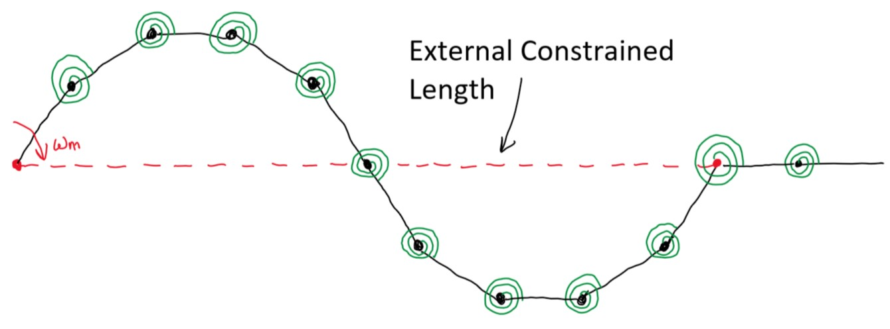

## Biomechanics Background and Initial Specifications
### Bryan Carlton1, Aniruddha Anand Damle1, Anson Kwan1, Jacob Yoshitake1
### Team 2: Swimming
### 1Ira A. Fulton Schools of Engineering

### I. Bio Inspiration

The organism that we will draw inspiration from for our research question and system are eels.
Eels exhibit a form of undulatory motion called 
anguilliform locomotion which propagates
waves along their spines [1]. The five most
relevant sources about eels and fish based
undulatory motion are as follows:

I. Hydrodynamics of undulatory
propulsion [1]*
II. Muscles, elastic energy, and the
dynamics of body stiffness in swimming
eels [2]*
III. The hydrodynamics of Eel Swimming
[3]
IV. The hydrodynamics of eel swimming II.
effect of swimming speed [4]*
V. Interactions between internal forces,
body stiffness, and fluid environment in
a neuromechanical model of lamprey
swimming [5]

Of these sources, we will discuss I, II, and IV
since they are the most relevant to our research
question.

Hydrodynamics of undulatory propulsion
discusses the history of existing work conducted
on different forms of undulating locomotion and
propulsion [1]. This is particularly helpful for
our research question because it provides
context and basis of knowledge as we start to
explore anguilliform locomotion. Additionally,
from this paper, we are able to extract critical
information about the gait cycle and time
duration of a single oscillation for eels.
Muscles, elastic energy, and the dynamics of
body stiffness in swimming eels analyzes the
kinematic and dynamic properties of eels to
derive generalized values regarding muscle
activation, work, and stiffness along the body of
eels [2]. This research is pertinent to our
research discussion because it gives us
information regarding how to link kinematic
properties of eels to the foldable system that we
are interested in developing. The most relevant
values include the weight, length, and body
cross sectional area. These values are important
to deriving the linear velocity of eels as well as
provide a method of comparing these elements
of our device against an eel.
The hydrodynamics of eel swimming II. Effect of
swimming speed discusses the kinematics and
hydrodynamics of eels but goes into further
detail regarding dynamic conditions that eels
swim under [4]. Through the method of using
two synchronized high speed cameras, the
researchers were able to calculate frequency,
wave speed, velocities of the system, and jet
speeds produced by the eels [2]. This
information is valuable to us because it allows
us to approximate the linear velocity of eels as
well as the power needed to sustain this form of
locomotion. We are then able to specify the
requirements needed for a servo motor to power
our system.

### II. Other bio-inspired robots

Although the team has already decided on an eel
inspired design, it is also important to look at
other similar designs and other sources of
biological sources. Below are five different
sources that detail different bio-inspired robots.
I. Kinematic Evaluation of a Series of Soft
Actuators in Designing and Eel-inspired
Robot [6]*
II. How the Body Contributes to The Wake
in Undulatory Fish Swimming: Flow
Fields of a Swimming Eel [7]*
III. Thrust generation during Steady
Swimming and Acceleration from Rest
in Anguilliform Swimmers [8]
IV. Development and Motion Control of
Biomimetic Underwater Robots: A
Survey [9]
V. Flow patterns of Larval fish: Undulatory
Swimming in the Intermediate Flow
Regime [10]*
Kinematic Evaluation of a Series of Soft
Actuators in Designing and Eel-inspired Robot
This paper discusses the motion generated
through soft actuators in an eel inspired robot
[6]. Despite this being a soft robot, it provides an
in depth analysis and data on the locomotion of
an eel like robot design. As well this paper
provides information on the manufacturing of
their actuator which can guide the team's design.
How the Body Contributes to The Wake in
Undulatory Fish Swimming: Flow Fields of a
Swimming Eel
This paper discusses the body mechanics, and
how that affects the thrust of the robot [7]. This
paper provides the kinematics of an eel like
robot. It also provides helpful analysis of the
undulatory movement that eels and similar fish
use to move through water
Flow patterns of Larval fish: Undulatory
Swimming in the Intermediate Flow Regime
This paper focuses on fish larvae designs, and
the forces between the body of the larvae and the
water [10]. This paper provides helpful force
analysis between water and submerged
undulatory robots. Having these force
interactions helps the team understand how the
water affects movement and stabilization of the
robot system.

### III. Table

| Parameter | Unit | Value Range | Reference |
| Length | m | .024-.033| [2] |
| Weight | kg | 0.037-0.057 | [2] |
| Frequency | Hz | 1.3 +/- 0.10 | [4] |
| Wave Speed | L/s | 0.39 +/- 0.02 | [4] | 
| Slip | L/L | 0.784 +/-0.002 | [4] | 
| Max Area | 𝑚2 | 0.0001018 | [2] | 
| Gait Time | s | 0.26 | [1] | 

### IV. Other Assumptions

Using the data that was found in Table 1, we can
now calculate the velocity and energy consumed
for anguilliform motion. The slip ratio is defined
as the swimming speed of the body (U) over the
wave speed (V).
𝑆𝑙𝑖𝑝 = 𝑈 (1)
𝑉
From equation 1, we were able to calculate the
body speed to be 0.3058 or . In order to find 𝐿
𝑠
the linear speed, we first had to convert the flow
rate to and got a value of 𝑚3
𝑠 3. 058 × 10−4
. Then using the volumetric flow equation: 𝑚3
𝑠
𝑄 = 𝐴 𝑣 (2)
where Q is the volumetric flow, A is the cross
sectional area, and v is the linear velocity. Using
equation 2, we get a linear velocity of 3.003 . 𝑚
𝑠
From this we can now deduce the approximate
energy and power used during the gait cycle.
Using the kinetic energy formula:
𝐾𝐸 = 1 (3)
2 𝑚𝑣2
Where KE is the kinetic energy, m is the mass,
and v is the velocity. We calculated the kinetic
energy as 0.213 Joules. With this we can now
calculate the approximate power consumption of
the gait since we know both the energy and
duration of the gait cycle. Using the power
equation:
𝑃 = 𝑊 (4)
Δ𝑡
where P is power, W is work or energy, and Δ𝑡 is
the change in time, we are able to calculate the
power of a single gait phase of anguilliform
locomotion is 0.819 W.

### V. Figures

Figure 1. Four main categories of fish
undulatory motion. The top figures denote the
phases of a single gait phase and the lower
visualize the midline movement of each motion
[1].

Figure 2. Flow of water generated from eel
motion. Red represents clockwise motion and
blue represents counter clockwise flow [3].

### VI. Engineering Representation

Figure 3. Engineering representation of
proposed system

As seen in Fig 3 the proposed system will
consist of twelve rigid links connected through
eleven joints which will be acting as the
torsional spring in the system. All the links will
be represented with their own respective masses
so in order to properly model the dynamics of
this system, inertias will need to be included for
all twelve links. The main actuator for this
system will be a servo input on the first link
(farthest left on Fig 3). This servo will be run
using position control so that we can tune and
control the maximum and minimum position of
the output shaft.

### VII. Discussion

#### Discuss / defend your rationale for the size animal you selected.
We selected the eel as inspiration for our
research question because anguilliform
locomotion is one of the few undulatory motions
that only requires a singular input for the entire
system. Traditional fish locomotion has multiple
fins in conjunction with an oscillatory motion.
This would require additional pieces and
increased complexity in order to create an
aquatic robot. By gaining inspiration from eels
and understanding how to precisely tune a
segmented spine, it is possible to create
locomotion through a single motorized actuator.
This would greatly reduce the cost and
complexity of the system and allow us the
flexibility to replicate or draw inspiration from
anguilliform locomotion by simply tuning the
joint stiffness.

#### Find a motor and battery that can supply the mechanical power needs obtained above.
From section IV, we calculated that the total
power of the gait cycle is 0.819 Watts. Using
this and the weight of an eel from Table 1, we
calculated a power/weight ratio of 16.38 W/kg.
Using this information, we selected two
perspective servo motors for our system. The
first choice is the SG90 Micro Servo Motor[11]
due to its low cost, light weight and relatively
high power output. However, it does not appear
to be waterproof, so additional measures will
need to be taken to ensure that it does not
succumb to water damage. On the other end, the
WEISE DS3218 Servo Motor[12] is heavier, but
has much higher power output and is
waterproof. Though it is more expensive and
heavier, the waterproofing is much appreciated
and the higher torque allows the system more
power to operate in the water. We will purchase
the SG90 initially, and if the robot needs more
torque or there are problems with water damage,
the DS3218 will be purchased as a replacement.
For a battery, a Blomiky 6V 2200mAh
battery[13] will be able to operate either of the
servos and meet power requirements. This will
be encased in a waterproof housing along with
the microcontroller to reduce chance of water
damage.

### VIII. Bibliography
#### [1] G. V. Lauder and E. D. Tytell,
#### “Hydrodynamics of undulatory propulsion,”
#### Fish Physiology, pp. 425–468, 2005.
#### [2] J. Long, “Muscles, elastic energy, and the
#### dynamics of body stiffness in swimming eels,”
#### American Zoologist, vol. 38, no. 4, pp. 771–792,
#### 1998.
#### [3] E. D. Tytell and G. V. Lauder, “The
#### hydrodynamics of Eel Swimming,” Journal of
#### Experimental Biology, vol. 207, no. 11, pp.
#### 1825–1841, 2004.
#### [4] E. D. Tytell, “The hydrodynamics of EEL
#### swimming II. effect of swimming speed,”
#### Journal of Experimental Biology, vol. 207, no.
#### 19, pp. 3265–3279, 2004.
#### [5] E. D. Tytell, C.-Y. Hsu, T. L. Williams, A. H.
#### Cohen, and L. J. Fauci, “Interactions between
#### internal forces, body stiffness, and fluid
#### environment in a neuromechanical model of
#### lamprey swimming,” Proceedings of the
#### National Academy of Sciences, vol. 107, no. 46,
#### pp. 19832–19837, 2010.
#### [6] D. Q. Nguyen and V. A. Ho, “Kinematic
#### Evaluation of a Series of Soft Actuators in
#### Designing and Eel-inspired Robot.”
#### International Symposium, Honolulu,
#### 12-Jan-2020.
#### [7]K. T. Du Clos and J. O. Dabiri, “Thrust
#### generation during steady swimming and
#### acceleration from rest in anguilliform
#### swimmers.” The Company of Biologists Ltd,
#### 2019.
#### [8] R. Wang and Y. Wang, “Development and
#### Motion Control of Biomimetic Underwater
#### Robots: A Survey.” Carleton University.
#### [9]U. K. Müller and J. Smit, “How the body
#### contributes to the wake in undulatory fish
#### swimming.” University of Groningen, 2001.
#### [10] U. K. Müller and J. van den Boogaart and
#### Johan, “Flow patterns of larval fish: undulatory
#### swimming in the intermediate flow regime.” The
#### Company of Biologists, 2008.
#### [11] “2Pack SG90 Micro Servo Motor Mini
#### Servo SG90 9g Servo Kit for RC Helicopter
#### Airplane Car Boat Robot
#### Arm/Hand/Walking/Servo Door Lock Control
#### with Cable,” Amazon. [Online]. Available:
#### https://www.amazon.com/Sipytoph-Helicopter-
#### Airplane-Walking-Control/dp/B09185SC1W/ref
#### =sr_1_20?crid=BQUQ0Y72FCVM&keywords=
#### servo%2Bmotor&qid=1644791963&sprefix=ser
#### vo%2Bmotor%2Caps%2C135&sr=8-20&th=1.
#### [Accessed: 13-Feb-2022].
#### [12] “Blomiky 6V 2200mAh Ni-MH 5 AA
#### Rechargeable Battery Pack with SM-2P Black 2
#### Pin Connector Plug and USB Charger Cable for
#### RC Truck Cars Vehicles 6V NiMh,” Amazon.
#### [Online]. Available:
#### https://www.amazon.com/Blomiky-2200mAh-R
#### echargeable-Battery-Vehicles/dp/B07PY8R3F4/r
#### ef=sr_1_4?crid=121SI0NEQQXMU&amp;keyw
#### ords=rechargeable+hobby+battery+pack+6v&a
#### mp;qid=1644794867&amp;sprefix=rechargable
#### +hobby+battery+pack+6v%2Caps%2C110&am
#### p;sr=8-4. [Accessed: 13-Feb-2022].
#### [13] “WEISE DS3218 Control Angle 180 High
#### Torque Update Servo 20KG Full Metal Gear
#### Digital Servo Baja Servo Waterproof Servo
#### Mechanical arm Fittings RC Baja Cars,”
#### Amazon. [Online]. Available:
#### https://www.amazon.com/WEISE-Control-Water
#### proof-Mechanical-Fittings/dp/B073M3X86S/ref
#### =sr_1_43?crid=13Y92KBF7JR2M&keywords=s
#### ervo+motor+50g&qid=1644791971&sprefix=se
#### rvo+motor+50g%2Caps%2C121&sr=8-43.
#### [Accessed: 13-Feb-2022].
